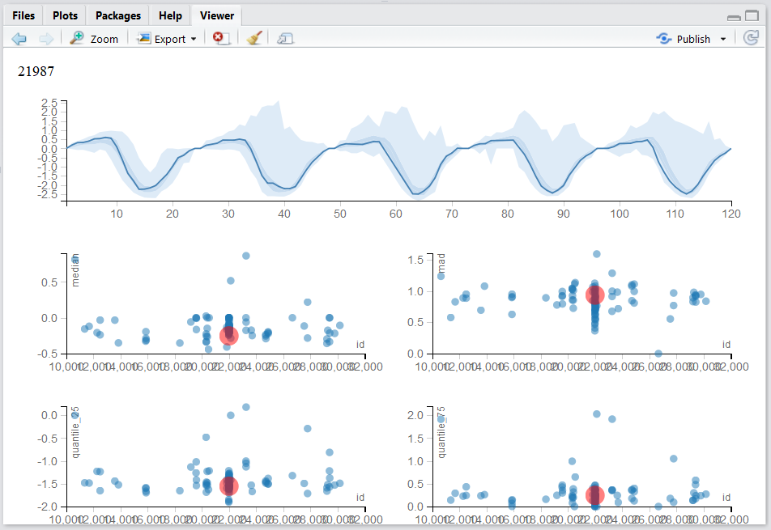
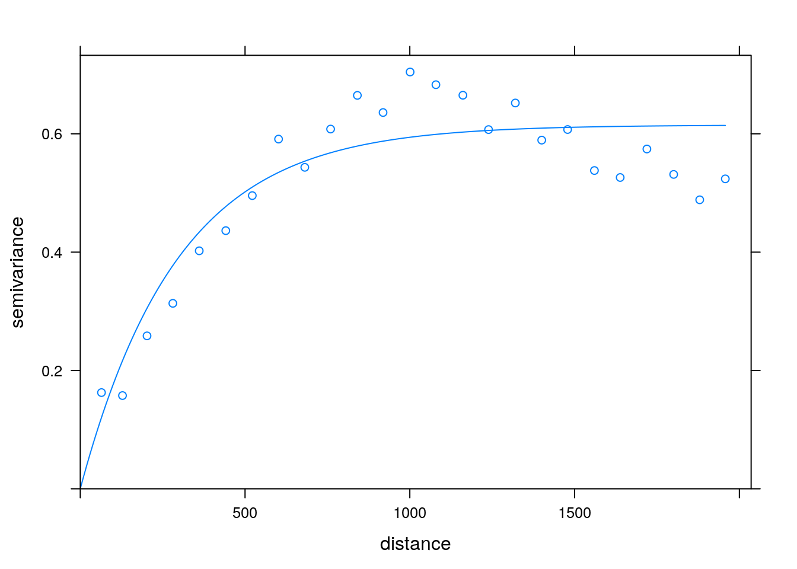

--- 
title: "R (BGU course)"
author: "Jonathan D. Rosenblatt"
date: '`r Sys.Date()`'
bibliography: bib.bib
description: Class notes for the R course at the BGU MGMT faculty.
documentclass: book
keywords: "Rstats, Statistics"
link-citations: yes
biblio-style: apalike
always_allow_html: yes
---

```{r knitr defaults, echo=FALSE}
knitr::opts_chunk$set(out.width='50%')
knitr::opts_chunk$set(cache = TRUE)
set.seed(1)
```


## Notation Conventions

In this text we use the following conventions:
Lower case $x$ may be a vector or a scalar, random of fixed, as implied by the context. 
Upper case $A$ will stand for matrices. 
Equality $=$ is an equality, and $:=$ is a definition.
Norm functions are denoted with $\Vert x \Vert$ for vector norms, and $\Vert A \Vert$ for matrix norms. 
The type of norm is indicated in the subscript; e.g. $\Vert x \Vert_2$ for the Euclidean ($l_2$) norm.
Tag, $x'$ is a transpose. 
The distribution of a random vector is $\sim$.


## Acknowledgements

I have consulted many people during the writing of this text.
I would like to thank [Yoav Kessler](https://kesslerlab.wordpress.com/), [Lena Novack](http://fohs.bgu.ac.il/research/profileBrief.aspx?id=VeeMVried), Efrat Vilenski, Ron Sarafian, and Liad Shekel in particular, for their valuable inputs. 

<!--chapter:end:index.Rmd-->

---
output: html_document
editor_options: 
  chunk_output_type: console
---

# Introduction {#intro}


## What is R? {#what-r}

R was not designed to be a bona-fide programming language. 
It is an evolution of the S language, developed at Bell labs (later Lucent) as a wrapper for the endless collection of statistical libraries they wrote in Fortran.

As of 2011, half of R's libraries are [actually written in C](https://wrathematics.github.io/2011/08/27/how-much-of-r-is-written-in-r/). 


## The R Ecosystem {#ecosystem}

A large part of R's success is due to the ease in which a user, or a firm, can augment it. 
This led to a large community of users, developers, and protagonists. 
Some of the most important parts of R's ecosystem include:

- [CRAN](https://cran.r-project.org/): 
a repository for R packages, mirrored worldwide.

- [R-help](https://www.r-project.org/mail.html): 
an immensely active mailing list. 
Noways being replaced by StackExchange meta-site. 
Look for the R tags in the [StackOverflow](http://stackoverflow.com/) and [CrossValidated](http://stats.stackexchange.com/) sites.

- [Task Views](https://cran.r-project.org/web/views/): 
part of CRAN that collects packages per topic. 

- [Bioconductor](https://www.bioconductor.org/): 
A CRAN-like repository dedicated to the life sciences. 

- [Neuroconductor](https://www.neuroconductor.org/):
A CRAN-like repository dedicated to neuroscience, and neuroimaging. 

- [Books](https://www.r-project.org/doc/bib/R-books.html): 
An insane amount of books written on the language. Some are free, some are not. 

- [The Israeli-R-user-group](https://groups.google.com/forum/#!forum/israel-r-user-group): 
just like the name suggests.

- Commercial R: being open source and lacking support may seem like a problem that would prohibit R from being adopted for commercial applications. 
This void is filled by several very successful commercial versions such as [Microsoft R](https://mran.microsoft.com/open/), with its accompanying CRAN equivalent called [MRAN](https://mran.microsoft.com/),  [Tibco's Spotfire](http://spotfire.tibco.com/discover-spotfire/what-does-spotfire-do/predictive-analytics/tibco-enterprise-runtime-for-r-terr), and [others](https://en.wikipedia.org/wiki/R_(programming_language)#Commercial_support_for_R).

- [RStudio](https://www.rstudio.com/products/rstudio/download-server/): since its earliest days R came equipped with a minimal text editor. 
It later received plugins for major integrated development environments (IDEs) such as Eclipse, WinEdit and even [VisualStudio](https://www.visualstudio.com/vs/rtvs/). 
None of these, however, had the impact of the RStudio IDE. 
Written completely in JavaScript, the RStudio IDE allows the seamless integration of cutting edge web-design technologies, remote access, and other killer features, making it today's most popular IDE for R.

- [CheatSheets](https://www.rstudio.com/resources/cheatsheets/) Rstudio curates a list of CheatSheets. Very useful to print some, and have them around when coding.

- [RStartHere](https://github.com/rstudio/RStartHere/blob/master/README.md#import): a curated list of useful packages. 


## Bibliographic Notes
For more on the history of R see 
[AT&T's site](http://www.research.att.com/articles/featured_stories/2013_09/201309_SandR.html?fbid=Yxy4qyQzmMa), 
John Chamber's talk at [UserR!2014](https://www.youtube.com/watch?v=_hcpuRB5nGs), 
Nick Thieme's [recent report](https://rss.onlinelibrary.wiley.com/doi/10.1111/j.1740-9713.2018.01169.x) in Significance, or 
[Revolution Analytics'](https://blog.revolutionanalytics.com/2017/10/updated-history-of-r.html) blog.

You can also consult the Introduction chapter of the MASS book [@venables2013modern].

<!--chapter:end:10-intro.Rmd-->

---
output: html_document
editor_options: 
  chunk_output_type: console
---
# R Basics {#basics}

We now start with the basics of R. 
If you have any experience at all with R, you can probably skip this section.

First, make sure you work with the RStudio IDE.
Some useful pointers for this IDE include:

- Ctrl+Return(Enter) to run lines from editor.
- Alt+Shift+k for RStudio keyboard shortcuts.
- Ctrl+r to browse the command history.
- Alt+Shift+j to navigate between code sections
- tab for auto-completion
- Ctrl+1 to skip to editor. 
- Ctrl+2 to skip to console.
- Ctrl+8 to skip to the environment list.
- Ctrl + Alt + Shift + M to select all instances of the selection (for refactoring).
- Code Folding:
    - Alt+l collapse chunk.
    - Alt+Shift+l unfold chunk.
    - Alt+o collapse all.
    - Alt+Shift+o unfold all.
- Alt+"-" for the assignment operator `<-`.


### Other IDEs
Currently, I recommend RStudio, but here are some other IDEs:

1. Jupyter Lab: a very promising IDE, originally designed for Python, that also supports R. 
At the time of writing, it seems that RStudio is more convenient for R, but it is definitely an IDE to follow closely. 
See [Max Woolf's](http://minimaxir.com/2017/06/r-notebooks/) review.

1. Eclipse: If you are a Java programmer, you are probably familiar with Eclipse, which does have an R plugin: [StatEt](http://www.walware.de/goto/statet).

1. Emacs: If you are an Emacs fan, you can find an R plugin: [ESS](http://ess.r-project.org/).

1. Vim: [Vim-R](https://github.com/vim-scripts/Vim-R-plugin).

1. Visual Studio also [supports R](https://www.visualstudio.com/vs/features/rtvs/). 
If you need R for commercial purposes, it may be worthwhile trying Microsoft's R, instead of the usual R. See [here](https://mran.microsoft.com/documents/rro/installation) for installation instructions. 

1. Online version (currently alpha): [R Studio Cloud](https://rstudio.cloud).


## File types

The file types you need to know when using R are the following:

- __.R__: An ASCII text file containing R scripts only. 
- __.Rmd__: An ASCII text file. If opened in RStudio can be run as an R-Notebook or compiled using knitr, bookdown, etc. 


## Simple calculator
R can be used as a simple calculator.
Create a new R Notebook (.Rmd file) within RStudio using File-> New -> R Notebook, and run the following commands. 

```{r}
10+5 
70*81
2**4
2^4
log(10)       					
log(16, 2)    					
log(1000, 10)   				
```


## Probability calculator 
R can be used as a probability calculator. 
You probably wish you knew this when you did your Intro To Probability classes.

The Binomial distribution function:
```{r}
dbinom(x=3, size=10, prob=0.5) 	# Compute P(X=3) for X~B(n=10, p=0.5) 
```
Notice that arguments do not need to be named explicitly
```{r}
dbinom(3, 10, 0.5)
```
The Binomial cumulative distribution function (CDF):
```{r}
pbinom(q=3, size=10, prob=0.5) # Compute P(X<=3) for X~B(n=10, p=0.5)  	
```
The Binomial quantile function:
```{r}
qbinom(p=0.1718, size=10, prob=0.5) # For X~B(n=10, p=0.5) returns k such that P(X<=k)=0.1718
```
Generate random variables:
```{r}
rbinom(n=10, size=10, prob=0.5)
```

R has many built-in distributions. 
Their names may change, but the prefixes do not:

- __d__ prefix for the _distribution_ function.
- __p__ prefix for the _cummulative distribution_ function (CDF).
- __q__ prefix for the _quantile_ function (i.e., the inverse CDF).
- __r__ prefix to generate random samples. 

Demonstrating this idea, using the CDF of several popular distributions:

- `pbinom()` for the Binomial CDF.
- `ppois()` for the Poisson CDF.
- `pnorm()` for the Gaussian CDF.
- `pexp()` for the Exponential CDF.

For more information see `?distributions`.


## Getting Help
One of the most important parts of working with a language, is to know where to find help. 
R has several in-line facilities, besides the various help resources in the R [ecosystem](#ecosystem).


Get help for a particular function.
```{r, eval=FALSE}
?dbinom 
help(dbinom)
```
If you don't know the name of the function you are looking for, search local help files for a particular string:
```{r, eval=FALSE}
??binomial
help.search('dbinom') 
```
Or load a menu where you can navigate local help in a web-based fashion:
```{r, eval=FALSE}
help.start() 
```


## Variable Asignment
Assignment of some output into an object named "x":
```{r}
x = rbinom(n=10, size=10, prob=0.5) # Works. Bad style.
x <- rbinom(n=10, size=10, prob=0.5) 
```
If you are familiar with other programming languages you may prefer the `=` assignment rather than the `<-` assignment. 
We recommend you make the effort to change your preferences. 
This is because thinking with `<-` helps to read your code, distinguishes between assignments and function arguments: think of `function(argument=value)` versus `function(argument<-value)`. 
It also helps understand special assignment operators such as `<<-` and `->`. 


```{remark}
__Style__:
We do not discuss style guidelines in this text, but merely remind the reader that good style is extremely important. When you write code, think of other readers, but also think of future self.
See [Hadley's style guide](http://adv-r.had.co.nz/Style.html) for more. 
```

To print the contents of an object just type its name
```{r}
x
```
which is an implicit call to 
```{r}
print(x)  
```
Alternatively, you can assign and print simultaneously using parenthesis.
```{r}
(x <- rbinom(n=10, size=10, prob=0.5))  # Assign and print.
```

Operate on the object
```{r}
mean(x)  # compute mean
var(x)  # compute variance
hist(x) # plot histogram
```

R saves every object you create in RAM^[S and S-Plus used to save objects on disk. Working from RAM has advantages and disadvantages. More on this in Chapter \@ref(memory).]. 
The collection of all such objects is the __workspace__ which you can inspect with 
```{r}
ls()
```
or with Ctrl+8 in RStudio. 

If you lost your object, you can use `ls` with a text pattern to search for it
```{r}
ls(pattern='x')
```


To remove objects from the workspace:
```{r}
rm(x) # remove variable
ls() # verify
```
You may think that if an object is removed then its memory is freed. 
This is almost true, and depends on a negotiation mechanism between R and the operating system. 
R's memory management is discussed in Chapter \@ref(memory). 


## Missing
Unlike typically programming, when working with real life data, you may have __missing__ values: measurements that were simply not recorded/stored/etc.
_R_ has rather sophisticated mechanisms to deal with missing values. 
It distinguishes between the following types:

1. `NA`: Not Available entries. 
1. `NaN`: Not a number. 

_R_ tries to defend the analyst, and return an error, or `NA` when the presence of missing values invalidates the calculation:
```{r}
missing.example <- c(10,11,12,NA)
mean(missing.example)
```

Most functions will typically have an inner mechanism to deal with these. In the `mean` function, there is an `na.rm` argument, telling _R_ how to Remove `NA`s.
```{r}
mean(missing.example, na.rm = TRUE)
```

A more general mechanism is removing these manually:
```{r}
clean.example <- na.omit(missing.example)
mean(clean.example)
```

## Piping 
Because R originates in Unix and Linux environments, it inherits much of its flavor.
[Piping](http://ryanstutorials.net/linuxtutorial/piping.php) is an idea taken from the Linux shell which allows to use the output of one expression as the input to another.
Piping thus makes code easier to read and write. 

```{remark}
Volleyball fans may be confused with the idea of spiking a ball from the 3-meter line, also called [piping](https://www.youtube.com/watch?v=DEaj4X_JhSY). 
So:
(a) These are very different things.
(b) If you can pipe, [ASA-BGU](http://in.bgu.ac.il/sport/Pages/asa.aspx) is looking for you!
```

Prerequisites:
```{r}
library(magrittr) # load the piping functions
x <- rbinom(n=1000, size=10, prob=0.5) # generate some toy data
```

Examples
```{r, eval=FALSE}
x %>% var() # Instead of var(x)
x %>% hist()  # Instead of hist(x)
x %>% mean() %>% round(2) %>% add(10) 
```


The next example^[Taken from  http://cran.r-project.org/web/packages/magrittr/vignettes/magrittr.html] demonstrates the benefits of piping.
The next two chunks of code do the same thing.
Try parsing them in your mind:
```{r, eval=FALSE}
# Functional (onion) style
car_data <- 
  transform(aggregate(. ~ cyl, 
                      data = subset(mtcars, hp > 100), 
                      FUN = function(x) round(mean(x, 2))), 
            kpl = mpg*0.4251)
```

```{r, eval=FALSE}
# Piping (magrittr) style
car_data <- 
  mtcars %>%
  subset(hp > 100) %>%
  aggregate(. ~ cyl, data = ., FUN = . %>% mean %>% round(2)) %>%
  transform(kpl = mpg %>% multiply_by(0.4251)) %>%
  print
```

Tip: RStudio has a keyboard shortcut for the `%>%` operator. Try Ctrl+Shift+m.

## Vector Creation and Manipulation 
The most basic building block in R is the __vector__.
We will now see how to create them, and access their elements (i.e. subsetting).
Here are three ways to create the same arbitrary vector:
```{r, eval=FALSE}
c(10, 11, 12, 13, 14, 15, 16, 17, 18, 19, 20, 21) # manually
10:21 # the `:` operator 							
seq(from=10, to=21, by=1) # the seq() function
```

Let's assign it to the object named "x":
```{r}
x <- c(10, 11, 12, 13, 14, 15, 16, 17, 18, 19, 20, 21) 	
```


Operations usually work element-wise:
```{r}
x+2
x*2    
x^2    
sqrt(x)  
log(x)   
```


## Search Paths and Packages
R can be easily extended with packages, which are merely a set of documented functions, which can be loaded or unloaded conveniently.
Let's look at the function `read.csv`. 
We can see its contents by calling it without arguments:
```{r}
read.csv
```
Never mind what the function does. 
Note the `environment: namespace:utils` line at the end. 
It tells us that this function is part of the __utils__ package.
We did not need to know this because it is loaded by default.
Here are some packages that I have currently loaded:
```{r}
search()
```
Other packages can be loaded via the `library` function, or downloaded from the internet using the `install.packages` function before loading with `library`. 
R's package import mechanism is quite powerful, and is one of the reasons for R's success. 


## Simple Plotting 
R has many plotting facilities as we will further detail in the Plotting Chapter \@ref(plotting).
We start with the simplest facilities, namely, the `plot` function from the __graphics__ package, which is loaded by default. 
```{r basic-scatter-plot}
x<- 1:100
y<- 3+sin(x) 
plot(x = x, y = y) # x,y syntax  						
```

Given an `x` argument and a `y` argument, `plot` tries to present a scatter plot.
We call this the `x,y` syntax.
R has another unique syntax to state functional relations.
We call `y~x` the "tilde" syntax, which originates in works of @wilkinson1973symbolic and was adopted in the early days of S.
```{r}
plot(y ~ x, type='l') # y~x syntax 
```

The syntax `y~x` is read as "y is a function of x".
We will prefer the `y~x` syntax over the `x,y` syntax since it is easier to read, and will be very useful when we discuss more complicated models. 


Here are some arguments that control the plot's appearance.
We use `type` to control the plot type, `main` to control the main title.
```{r}
plot(y~x, type='l', main='Plotting a connected line') 
```

We use `xlab` for the x-axis label, `ylab` for the y-axis.
```{r axis-labels}
plot(y~x, type='h', main='Sticks plot', xlab='Insert x axis label', ylab='Insert y axis label') 
```

We use `pch` to control the point type (pch is acronym for Plotting CHaracter). 
```{r}
plot(y~x, pch=5) # Point type with pcf
```

We use `col` to control the color,  `cex` (Character EXpansion) for the point size, and `abline` (y=Bx+A) to add a straight line.
```{r, results='hold'}
plot(y~x, pch=10, type='p', col='blue', cex=4) 
abline(3, 0.002) 
```


For more plotting options run these
```{r, eval=FALSE}
example(plot)
example(points)
?plot
help(package='graphics')
```

When your plotting gets serious, go to Chapter \@ref(plotting).


## Object Types
We already saw that the basic building block of R objects is the vector.
Vectors can be of the following types:

- __character__ Where each element is a string, i.e., a sequence of alphanumeric symbols.
- __numeric__ Where each element is a [real number](https://en.wikipedia.org/wiki/Real_number) in [double precision](https://en.wikipedia.org/wiki/Double-precision_floating-point_format) floating point format.
- __integer__ Where each element is an [integer](https://en.wikipedia.org/wiki/Integer). 
- __logical__ Where each element is either TRUE, FALSE, or NA^[R uses a [__three__ valued logic](https://en.wikipedia.org/wiki/Three-valued_logic) where a missing value (NA) is neither TRUE, nor FALSE.]
- __complex__ Where each element is a complex number. 
- __list__ Where each element is an arbitrary R object.
- __factor__ Factors are not actually vector objects, but they feel like such. 
They are used to encode any finite set of values. 
This will be very useful when fitting linear model because they include information on contrasts, i.e., on the encoding of the factors levels. 
You should always be alert and recall when you are dealing with a factor or with a character vector. They have different behaviors. 

Vectors can be combined into larger objects. 
A `matrix` can be thought of as the binding of several vectors of the same type. 
In reality, a matrix is merely a vector with a dimension attribute, that tells R to read it as a matrix and not a vector.

If vectors of different types (but same length) are binded, we get a `data.frame` which is the most fundamental object in R for data analysis. 
Data frames are brilliant, but a lot has been learned since their invention.
They have thus been extended in recent years with the `tbl` class, pronounced [Tibble] (https://cran.r-project.org/web/packages/tibble/vignettes/tibble.html), and the `data.table` class.  
The latter is discussed in Chapter \@ref(datatable), and is strongly recommended.


## Data Frames 

Creating a simple data frame:
```{r}
x<- 1:10
y<- 3 + sin(x) 
frame1 <- data.frame(x=x, sin=y)	
```

Let's inspect our data frame:
```{r}
head(frame1)
```

Now using the RStudio Excel-like viewer:
```{r, eval=FALSE}
View(frame1) 
```

We highly advise against editing the data this way since there will be no documentation of the changes you made.
Always transform your data using scripts, so that everything is documented.

Verifying this is a data frame:
```{r}
class(frame1) # the object is of type data.frame
```

Check the dimension of the data
```{r}
dim(frame1)  							
```

Note that checking the dimension of a vector is different than checking the dimension of a data frame.
```{r}
length(x)
```

The length of a `data.frame` is merely the number of columns.
```{r}
length(frame1) 
```


## Exctraction
R provides many ways to subset and extract elements from vectors and other objects. 
The basics are fairly simple, but not paying attention to the "personality" of each extraction mechanism may cause you a lot of headache. 

For starters, extraction is done with the `[` operator. 
The operator can take vectors of many types. 

Extracting element with by integer index:
```{r}
frame1[1, 2]  # exctract the element in the 1st row and 2nd column.
```

Extract __column__ by index:
```{r}
frame1[,1]      						
```

Extract column by name:
```{r}
frame1[, 'sin']
```

As a general rule, extraction with `[` will conserve the class of the parent object. 
There are, however, exceptions.
Notice the extraction mechanism and the class of the output in the following examples. 

```{r}
class(frame1[, 'sin'])  # extracts a column vector
class(frame1['sin'])  # extracts a data frame
class(frame1[,1:2])  # extracts a data frame
class(frame1[2])  # extracts a data frame
class(frame1[2, ])  # extract a data frame
class(frame1$sin)  # extracts a column vector
```

The `subset()` function does the same
```{r, eval=FALSE}
subset(frame1, select=sin) 
subset(frame1, select=2)
subset(frame1, select= c(2,0))
```

If you want to force the stripping of the class attribute when extracting, try the `[[` mechanism instead of `[`.
```{r}
a <- frame1[1] # [ extraction
b <- frame1[[1]] # [[ extraction
class(a)==class(b) # objects have differing classes
a==b # objects are element-wise identical 
```

The different types of output classes cause different behaviors. Compare the behavior of `[` on seemingly identical objects. 
```{r}
frame1[1][1]
frame1[[1]][1]
```

If you want to learn more about subsetting see [Hadley's guide](http://adv-r.had.co.nz/Subsetting.html).


## Augmentations of the data.frame class

As previously mentioned, the `data.frame` class has been extended in recent years. 
The best known extensions are the `data.table` and the `tbl`. 
For beginners, it is important to know R's basics, so we keep focusing on data frames. 
For more advanced users, I recommend learning the (amazing) `data.table` syntax.


## Data Import and Export 

For any practical purpose, you will not be generating your data manually. 
R comes with many importing and exporting mechanisms which we now present.
If, however, you do a lot of data "munging", make sure to see Hadley-verse Chapter \@ref(hadley).
If you work with MASSIVE data sets, read the Memory Efficiency Chapter \@ref(memory).


### Import from WEB 
The `read.table` function is the main importing workhorse.
It can import directly from the web.
```{r, eval=FALSE}
URL <- 'http://statweb.stanford.edu/~tibs/ElemStatLearn/datasets/bone.data'
tirgul1 <- read.table(URL)
```

```{r, echo=FALSE}
tirgul1 <- read.table('data/bone.data')
```


Always look at the imported result!
```{r}
head(tirgul1)
```

Oh dear. 
`read.,table` tried to guess the structure of the input, but failed to recognize the header row. Set it manually with `header=TRUE`:
```{r, eval=FALSE}
tirgul1 <- read.table('data/bone.data', header = TRUE) 
head(tirgul1)
```

```{r, echo=FALSE}
tirgul1 <- read.table('data/bone.data', header = TRUE)
```


### Import From Clipboard

TODO:[datapasta](https://github.com/MilesMcBain/datapasta)


### Export as CSV 
Let's write a simple file so that we have something to import
```{r}
head(airquality) #  examine the data to export
temp.file.name <- tempfile() # get some arbitrary file name
write.csv(x = airquality, file = temp.file.name) # export
```
Now let's import the exported file. Being a .csv file, I can use `read.csv` instead of `read.table`. 
```{r}
my.data<- read.csv(file=temp.file.name) # import
head(my.data) # verify import
```


```{remark}
Windows users may need to use "\\" instead of "/".
```

### Export non-CSV files
You can export your R objects in endlessly many ways:
If instead of the comma delimiter in .csv you want other column delimiters, look into `?write.table`.
If you are exporting only for R users, you can consider exporting as binary objects with `saveRDS`, `feather::write_feather`, or `fst::write.fst`. 
See (http://www.fstpackage.org/) for a comparison.


### Reading From Text Files 

Some general notes on importing text files via the `read.table` function.
But first, we need to know what is the active directory.
Here is how to get and set R's active directory:
```{r, eval=FALSE}
getwd() #What is the working directory?
setwd() #Setting the working directory in Linux
```

We can now call the `read.table` function to import text files. 
If you care about your sanity, see `?read.table` before starting imports.
Some notable properties of the function:

- `read.table` will try to guess column separators (tab, comma, etc.)
- `read.table` will try to guess if a header row is present.
- `read.table` will convert character vectors to factors unless told not to using the `stringsAsFactors=FALSE` argument.
- The output of `read.table` needs to be explicitly assigned to an object for it to be saved. 


### Writing Data to Text Files

The function `write.table` is the exporting counterpart of `read.table`.


### .XLS(X) files 
Strongly recommended to convert to .csv in Excel, and then import as csv. 
If you still insist see the __xlsx__ package. 


### Massive files 

The above importing and exporting mechanisms were not designed for massive files. 
See the section on the __data.table__ package (\@ref(datatable)), Sparse Representation (\@ref(sparse)), and Out-of-Ram Algorithms (\@ref(memory)) for more on working with massive data files.  


### Databases 
R does not need to read from text files; it can read directly from a database.
This is very useful since it allows the filtering, selecting and joining operations to rely on the database's optimized algorithms.
Then again, if you will only be analyzing your data with R, you are probably better of by working from a file, without the databases' overhead. 
See Chapter \@ref(memory) for more on this matter.


## Functions
One of the most basic building blocks of programming is the ability of writing your own functions.
A function in R, like everything else, is an object accessible using its name.
We first define a simple function that sums its two arguments
```{r functionFirst}
my.sum <- function(x,y) {
  return(x+y)
}
my.sum(10,2)
```

From this example you may notice that:

- The function `function` tells R to construct a function object.

- Unlike some programming languages, a period (`.`) is allowed as part of an object's name.

- The arguments of the `function`, i.e. `(x,y)`, need to be named but we are not required to specify their class. This makes writing functions very easy, but it is also the source of many bugs, and slowness of R compared to type declaring languages (C, Fortran,Java,...).

- A typical R function does not change objects^[This is a classical _functional programming_ paradigm. If you want an object oriented flavor of R programming, see Hadley's [Advanced R book](http://adv-r.had.co.nz/OO-essentials.html).] but rather creates new ones. 
To save the output of `my.sum` we will need to assign it using the `<-` operator.


Here is a (slightly) more advanced function:
```{r functionSecond}
my.sum.2 <- function(x, y , absolute=FALSE) {
  if(absolute==TRUE) {
    result <- abs(x+y)
  }
  else{
    result <- x+y
  } 
  result
}
my.sum.2(-10,2,TRUE)
```

Things to note:

- `if(condition){expression1} else{expression2}` does just what the name suggests.

- The function will output its last evaluated expression. You don't need to use the `return` function explicitly.

- Using `absolute=FALSE` sets the default value of `absolute` to `FALSE`. This is overridden if `absolute` is stated explicitly in the function call.


An important behavior of R is the _scoping rules_. 
This refers to the way R seeks for variables used in functions. 
As a rule of thumb, R will first look for variables inside the function and if not found, will search for the variable values in outer environments^[More formally, this is called [Lexical Scoping](https://darrenjw.wordpress.com/2011/11/23/lexical-scope-and-function-closures-in-r/).].
Think of the next example.

```{r scoping}
a <- 1
b <- 2
x <- 3
scoping <- function(a,b){
  a+b+x
}
scoping(10,11)
```


## Looping 
The real power of scripting is when repeated operations are done by iteration.
R supports the usual `for`, `while`, and `repated` loops. 
Here is an embarrassingly simple example
```{r looping}
for (i in 1:5){
    print(i)
    }
```

A slightly more advanced example, is vector multiplication
```{r, eval=FALSE}
result <- 0
n <- 1e3
x <- 1:n
y <- (1:n)/n
for(i in 1:n){
  result <- result+ x[i]*y[i]
}
```

```{remark}
__Vector Operations__:
You should NEVER write your own vector and matrix products like in the previous example. Only use existing facilities such as `%*%`, `sum()`, etc.
```

```{remark}
__Parallel Operations__:
If you already know that you will be needing to parallelize your work, get used to working with `foreach` loops in the __foreach__ package, rather then regular `for` loops. 
```


## Apply 
For applying the same function to a set of elements, there is no need to write an explicit loop.
This is such an elementary operation that every programming language will provide some facility to __apply__, or __map__ the function to all elements of a set.
R provides several facilities to perform this. 
The most basic of which is `lapply` which applies a function over all elements of a list, and return a list of outputs:
```{r lapply}
the.list <- list(1,'a',mean) # a list of 3 elements from different classes
lapply(X = the.list, FUN = class) # apply the function `class` to each elements
sapply(X = the.list, FUN = class) # lapply with cleaned output
```

What is the function you are using requires some arguments?
One useful trick is to create your own function that takes only one argument:

```{r lapply-wrapper}
quantile.25 <- function(x) quantile(x,0.25)
sapply(USArrests, quantile.25)
```

What if you are applying the same function with __two__ lists of arguments? Use __mapply__.
The following will compute a different quantile to each column in the data:
```{r mapply}
quantiles <- c(0.1, 0.5, 0.3, 0.2)
mapply(quantile, USArrests, quantiles)
```


R provides many variations on `lapply` to facilitate programming. 
Here is a partial list:

- `sapply`: The same as `lapply` but tries to arrange output in a vector or matrix, and not an unstructured list.
- `vapply`: A safer version of `sapply`, where the output class is pre-specified.
- `apply`: For applying over the rows or columns of matrices.
- `mapply`: For applying functions with more than a single input. 
- `tapply`: For splitting vectors and applying functions on subsets. 
- `rapply`: A recursive version of `lapply`.
- `eapply`: Like `lapply`, only operates on `environments` instead of lists. 
- `Map`+`Reduce`: For a [Common Lisp](https://en.wikipedia.org/wiki/Common_Lisp) look and feel of `lapply`.
- `parallel::parLapply`: A parallel version of `lapply` from the package __parallel__.
- `parallel::parLBapply`: A parallel version of `lapply`, with load balancing from the package __parallel__.


## Recursion 
The R compiler is really not designed for recursion, and you will rarely need to do so.  
See the RCpp Chapter \@ref(rcpp) for linking C code, which is better suited for recursion. 
If you really insist to write recursions in R, make sure to use the `Recall` function, which, as the name suggests, recalls the function in which it is place. 
Here is a demonstration with the Fibonacci series. 
```{r recusrion, cache=TRUE}
fib<-function(n) {
    if (n <= 2) fn<-1 
    else fn <- Recall(n - 1) + Recall(n - 2) 
    return(fn)
} 
fib(5)
```


## Strings

Note: this section is courtesy of Ron Sarafian.

Strings may appear as character vectors,files names, paths (directories), graphing elements, and more.

Strings can be concatenated with the super useful `paste` function.

```{r}
a <- "good"
b <- "morning"
is.character(a)
paste(a,b)
(c <- paste(a,b, sep = "."))
paste(a,b,1:3, paste='@@@', collapse = '^^^^')
```

Things to note:

- `sep` is used to separate strings.
- `collapse` is used to separate results. 

The `substr` function extract or replace substrings in a character vector:

```{r}
substr(c, start=2, stop=4)
substr(c, start=6, stop=12) <- "evening"
```

The `grep` function is a very powerful tool to search for patterns in text. 
These patterns are called [regular expressions](https://en.wikipedia.org/wiki/Regular_expression)

```{r}
(d <- c(a,b,c))
grep(pattern = "good",x = d) 
grep("good",d, value=TRUE, ignore.case=TRUE) 
grep("([a-zA-Z]+)\\1",d, value=TRUE, perl=TRUE) 
```

Things to note:

- Use `value=TRUE` to return the string itself, instead of its index.
- `([a-zA-Z]+)\\1` is a regular expression to find repeating characters. `perl=TRUE` to activate the [Perl](https://en.wikipedia.org/wiki/Perl) "flavored" regular expressions.

Use `gsub` to replace characters in a string object:
```{r}
gsub("o", "q", d) # replace the letter "o" with "q".
gsub("([a-zA-Z]+)\\1", "q", d, perl=TRUE) # replace repeating characters with "q".
```

The `strsplit` allows to split string vectors to list:
```{r}
(x <- c(a = "thiszis", b = "justzan", c = "example"))
strsplit(x, "z") # split x on the letter z
```


Some more examples:
```{r}
nchar(x) #  count the nuber of characters in every element of a string vector.

toupper(x) # translate characters in character vectors to upper case
tolower(toupper(x)) # vice verca

letters[1:10] # lower case letters vector
LETTERS[1:10] # upper case letters vector

cat("the sum of", 1, "and", 2, "is", 1+2) #  concatenate and print strings and values
```

If you need more than this, look for the [stringr](https://r4ds.had.co.nz/strings.html) package that provides a set of internally consistent tools.


## Dates and Times

Note: This Section is courtesy of [Ron Sarafian](https://www.linkedin.com/in/ron-sarafian-4a5a95110/).

### Dates

R provides several packages for dealing with date and date/time data. 
We start with the `base` package. 

R needs to be informed explicitly that an object holds dates. 
The `as.Date` function convert values to dates. 
You can pass it a `character`, a `numeric`, or a `POSIXct` (we'll soon explain what it is).

```{r}
start <- "1948-05-14"
class(start)
start <- as.Date(start)
class(start)
```

But what if our date is not in the yyyy-mm-dd format? 
We can tell R what is the character date's format.

```{r}
as.Date("14/5/1948", format="%d/%m/%Y")
as.Date("14may1948", format="%d%b%Y")
```

Things to note:

- The format of the date is specified with the `format=` argument. 
`%d` for day of the month, `/` for separation, `%m` for month, and `%Y` for year in four digits. See `?strptime` for more available formatting.
- If it returns NA, then use the command `Sys.setlocale("LC_TIME","C")`

Many functions are content aware, and adapt their behavior when dealing with dates:
```{r}
(today <- Sys.Date()) # the current date

today + 1 # Add one day
today - start # Diffenrece between dates
min(start,today)
```

### Times
Specifying times is similar to dates, only that more formatting parameters are required. 
The `POSIXct` is the object class for times.
It expects strings to be in the format YYYY-MM-DD HH:MM:SS. 
With `POSIXct` you can also specify the timezone, e.g., `"Asia/Jerusalem"`. 
```{r}
time1 <- Sys.time()
class(time1)
time2 <- time1 + 72*60*60 # add 72 hours
time2-time1
class(time2-time1)
```

Things to note:

- Be careful about DST, because `as.POSIXct("2019-03-29 01:30")+3600` will not add 1 hour, but 2 with the result: `[1] "2019-03-29 03:30:00 IDT"`

Compute differences in your unit of choice:
```{r}
difftime(time2,time1, units =  "hour")
difftime(time2,time1, units =  "week")
```

Generate sequences:
```{r}
seq(from = time1, to = time2, by = "day") 
seq(time1, by = "month", length.out = 12)
```

### lubridate Package

The __lubridate__ package replaces many of the __base__ package functionality, with a more consistent interface. 
You only need to specify the order of arguments, not their format:

```{r}
library(lubridate)
ymd("2017/01/31")
mdy("January 31st, 2017")
dmy("31-Jan-2017")
ymd_hms("2000-01-01 00:00:01")
ymd_hms("20000101000001")
```

Another nice thing in __lubridate__, is that periods can be created with a number of friendly constructor functions that you can combine time objects. E.g.: 

```{r}
seconds(1)
minutes(c(2,3))
hours(4)
days(5)
months(c(6,7,8))
weeks(9)
years(10)

(t <- ymd_hms("20000101000001"))
t + seconds(1)
t + minutes(c(2,3)) + years(10)
```

And you can also extract and assign the time components:

```{r}
t
second(t)
second(t) <- 26
t
```

Analyzing temporal data is different than actually storing it. 
If you are interested in time-series analysis, try the __tseries__, __forecast__ and __zoo__ packages.


## Complex Objects
Say you have a list with many elements, and you want to inspect this list.
You can do it using the _Environment_ pane in RStudio (Ctrl+8), or using the __str__ function:

```{r str}
complex.object <- list(7, 'hello', list(a=7,b=8,c=9), FOO=read.csv)
str(complex.object)
```

Some (very) advanced users may want a deeper look into object.
Try the [lobstr](https://github.com/r-lib/lobstr/blob/master/README.md) package, or the __.Internal(inspect(...))__ function described [here](https://www.brodieg.com/2019/02/18/an-unofficial-reference-for-internal-inspect/).

```{r}
x <- c(7,10)
.Internal(inspect(x))
```


## Vectors and Matrix Products
This section is courtesy of Ron Sarafian. 

If you are operating with numeric vectors, or matrices, you may want to compute products. 
You can easily write your own R loops, but it is much more efficient to use the built-in operations. 

```{definition, label="matrix-product", name="Matrix Product"}
The matrix-product between matrix $n \times m$ matrix $A$, and 
$m \times p$ matrix $B$, is a $n \times p$ matrix $C$, where:
$$c_{i,j}:=\sum_{k=1}^m a_{i,k} b_{k,j}$$
```

Vectors can be seen as single row/column matrices. 
We can thus use matrix products to define the following:

```{definition, label="dot-product", name="Dot Product"}
The dot-product, a.k.a. scalar-product, or inner-product, between row-vectors $x:=(x_1,\dots,x_n)$ and $y:=(y_1,\dots,y_n)$ is defined as the matrix product between the $1 \times n$ matrix $x'$, and the $n \times 1$ matrix y:
$$x'y:= \sum_i x_i y_i$$
```

```{definition, label="outer-product", name="Outer Product"}
The outer product between row-vectors $x:=(x_1,\dots,x_n)$ and $y:=(y_1,\dots,y_n)$ is defined as the matrix product between the $n \times 1$ matrix $x$, and the $1 \times n$ matrix $y'$:
$$(xy')_{i,j}:=x_i \, y_j$$
```


Matrix products are computed with the `%*%` operator:
```{r}
x <- rnorm(4) 
y <- exp(-x) 
t(x) %*% y # Dot product.
x %*% y # Dot product.
crossprod(x,y) # Dot product.
crossprod(t(x),y) # Outer product.
crossprod(t(x),t(y)) # Outer product.
x %*% t(y) # Outer product
x %o% y # Outer product
outer(x,y) # Outer product
```

Things to note:

- The definition of the matrix product has to do with the view of a matrix as a linear operator, and not only a table with numbers. Pick up any linear algebra book to understand why it is defined this way. 
- Vectors are matrices. The dot product, is a matrix product where $m=1$.
- `*` is an element-wise product, whereas `%*%` is a dot product.
- While not specifying whether the vectors are horizontal or vertical, R treats the operation as $(1 \times n) * (n \times 1)$. 
- `t()` is the vector/ matrix transpose.

Now for matrix multiplication:
```{r}
(x <- rep(1,5))
(A <- matrix(data = rep(1:5,5), nrow = 5, ncol = 5, byrow = TRUE)) # 

x %*% A # (1X5) * (5X5) => (1X5)
A %*% x # (5X5) * (5X1) => (1X5)
0.5 * A 
A %*% t(A) # Gram matrix
t(x) %*% A %*% x # Quadratic form
```

Can I write these functions myself? Yes!
But a pure-R implementation will be much slower than `%*%`:
```{r product-benchmark}
my.crossprod <- function(x,y){
  result <- 0
  for(i in 1:length(x)) result <- result + x[i]*y[i]
  result
}
x <- rnorm(1e8)
y <- rnorm(1e8)
system.time(a1 <- my.crossprod(x,y))
system.time(a2 <- sum(x*y))
system.time(a3 <- c(x%*%y))
all.equal(a1,a2)
all.equal(a1,a3)
all.equal(a2,a3)
```


## Bibliographic Notes

There are endlessly many introductory texts on R.
For a list of free resources see [CrossValidated](http://stats.stackexchange.com/questions/138/free-resources-for-learning-r).
I personally recommend the official introduction @venables2004introduction, [available online](https://cran.r-project.org/doc/manuals/r-release/R-intro.pdf), or anything else Bill Venables writes. 

For Importing and Exporting see  (https://cran.r-project.org/doc/manuals/r-release/R-data.html).
For working with databases see (https://rforanalytics.wordpress.com/useful-links-for-r/odbc-databases-for-r/).
For a little intro on time-series objects in R see [Cristoph Sax's blog](http://www.christophsax.com/2018/05/15/tsbox/).
For working with strings see [Gaston Sanchez's book](http://www.gastonsanchez.com/r4strings/). 
For advanced R programming see @wickham2014advanced, [available online](http://adv-r.had.co.nz/),  or anything else Hadley Wickham writes. For a curated list of recommended packages see [here](https://github.com/rstudio/RStartHere/blob/master/README.md).


## Practice Yourself

1. Load the package __MASS__. That was easy. Now load __ggplot2__, after looking into `install.pacakges()`.

1. Save the numbers 1 to 1,000,000 (`1e6`)  into an object named `object`.

1. Write a function that computes the mean of its input. 
Write a version that uses `sum()`, and another that uses a `for` loop and the summation `+`. 
Try checking which is faster using `system.time`. 
Is the difference considerable? Ask me about it in class. 

1. Write a function that returns `TRUE` if a number is divisible by 13, `FALSE` if not, and a nice warning to the user if the input is not an integer number. 

1. Apply the previous function to all the numbers in `object`. Try using a `for` loop, but also a mapping/apply function.

1. Make a matrix of random numbers using `A <- matrix(rnorm(40), ncol=10, nrow=4)`. 
Compute the mean of each column. 
Do it using your own loop and then do the same with `lapply` or `apply`.

1. Make a data frame (`dataA`) with three columns, and 100 rows.
The first column with 100 numbers generated from the $\mathcal{N}(10,1)$ distribution, second column with samples from $Poiss(\lambda=4)$. 
The third column contains only `1`.  
Make another data frame (`dataB`) with three columns and 100 rows. 
Now with $\mathcal{N}(10,0.5^2)$, $Poiss(\lambda=4)$ and `2`. 
Combine the two data frames into an object named `dataAB` with `rbind`.
Make a scatter plot of `dataAB` where the x-axes is the first column, the y-axes is the second and define the shape of the points to be the third column.

1. In a sample generated of 1,000 observations from the $\mathcal{N}(10,1)$ distribution: 
    1. What is the proportion of samples smaller than $12.4$ ?
    1. What is the $0.23$ percentile of the sample?

1. Nothing like cleaning a dataset, to practice your R basics. Have a look at [RACHAEL TATMAN](https://makingnoiseandhearingthings.com/2018/04/19/datasets-for-data-cleaning-practice/) collected several datasets which BADLY need some cleansing. 

You can also self practice with DataCamp's [Intoroduction to R](https://www.datacamp.com/courses/free-introduction-to-r) course, or go directly to exercising with [R-exercises](https://www.r-exercises.com/start-here-to-learn-r/).

<!--chapter:end:25-r-basics.Rmd-->

---
output: html_document
editor_options: 
  chunk_output_type: console
---
# data.table {#datatable}

`data.table` is an excellent extension of the `data.frame` class.
If used as a `data.frame` it will look and feel like a data frame.
If, however, it is used with it's unique capabilities, it will prove faster and easier to manipulate. 
This is because `data.frame`s, like most of R objects, make a copy of themselves when modified. 
This is known as [passing by value](https://stackoverflow.com/questions/373419/whats-the-difference-between-passing-by-reference-vs-passing-by-value), and it is done to ensure that object are not corrupted if an operation fails (if your computer shuts down before the operation is completed, for instance). 
Making copies of large objects is clearly time and memory consuming.
A `data.table` can make changes in place. 
This is known as [passing by reference](https://stackoverflow.com/questions/373419/whats-the-difference-between-passing-by-reference-vs-passing-by-value), which is considerably faster than passing by value. 

Let's start with importing some freely available car sales data from [Kaggle](https://www.kaggle.com/orgesleka/used-cars-database).
```{r}
library(data.table)
library(magrittr)
auto <- fread('data/autos.csv')
```

```{r, eval=FALSE}
View(auto)
```

```{r}
dim(auto) #  Rows and columns
names(auto) # Variable names
class(auto) # Object class
file.info('data/autos.csv') # File info on disk
gdata::humanReadable(68439217)
object.size(auto) %>% print(units = 'auto') # File size in memory
```

Things to note:

- The import has been done with `fread` instead of `read.csv`. This is more efficient, and directly creates a `data.table` object.
- The import is very fast. 
- The data after import is slightly larger than when stored on disk (in this case). The extra data allows faster operation of this object, and the rule of thumb is to have 3 to 5 times more [RAM](https://en.wikipedia.org/wiki/Random-access_memory) than file size (e.g.: 4GB RAM for 1GB file)
- `auto` has two classes. It means that everything that expects a `data.frame` we can feed it a `data.table` and it will work.

Let's start with verifying that it behaves like a `data.frame` when expected.
```{r}
auto[,2] %>% head
auto[[2]] %>% head
auto[1,2] %>% head
```

But notice the difference between `data.frame` and `data.table` when subsetting multiple rows. Uhh!
```{r}
auto[1:3] %>% dim # data.table will exctract *rows*
as.data.frame(auto)[1:3] %>% dim # data.frame will exctract *columns*
```
Just use columns (`,`) and be explicit regarding the dimension you are extracting...


Now let's do some `data.table` specific operations.
The general syntax has the form `DT[i,j,by]`.
SQL users may think of `i` as `WHERE`, `j` as `SELECT`, and `by` as `GROUP BY`.
We don't need to name the arguments explicitly.
Also, the `Tab` key will typically help you to fill in column names.

```{r}
auto[,vehicleType,] %>% table # Exctract column and tabulate
auto[vehicleType=='coupe',,] %>% dim # Exctract rows 
auto[,gearbox:model,] %>% head # exctract column range
auto[,gearbox,] %>% table
auto[vehicleType=='coupe' & gearbox=='automatik',,] %>% dim # intersect conditions
auto[,table(vehicleType),] # uhh? why would this even work?!?
auto[, mean(price), by=vehicleType] # average price by car group
```


The `.N` operator is very useful if you need to count the length of the result. 
Notice where I use it:
```{r}
auto[.N,,] # will exctract the *last* row
auto[,.N] # will count rows
auto[,.N, vehicleType] # will count rows by type
```


You may concatenate results into a vector:
```{r}
auto[,c(mean(price), mean(powerPS)),]
```

This `c()` syntax no longer behaves well if splitting:
```{r}
auto[,c(mean(price), mean(powerPS)), by=vehicleType]
```

Use a `list()` instead of `c()`, within `data.table` commands:
```{r}
auto[,list(mean(price), mean(powerPS)), by=vehicleType]
```

You can add names to your new variables:
```{r}
auto[,list(Price=mean(price), Power=mean(powerPS)), by=vehicleType]
```

You can use `.()` to replace the longer `list()` command:
```{r}
auto[,.(Price=mean(price), Power=mean(powerPS)), by=vehicleType]
```

And split by multiple variables:
```{r}
auto[,.(Price=mean(price), Power=mean(powerPS)), by=.(vehicleType,fuelType)] %>% head
```

Compute with variables created on the fly:
```{r}
auto[,sum(price<1e4),] # Count prices lower than 10,000
auto[,mean(price<1e4),] # Proportion of prices lower than 10,000
auto[,.(Power=mean(powerPS)), by=.(PriceRange=price>1e4)] 
```

Things to note:

- The term `price<1e4` creates *on the fly* a binary vector of TRUE=1 / FALSE=0 for prices less than 10k and then sums/means this vector, hence `sum` is actually a count, and `mean` is proportion=count/total
- Summing all prices lower than 10k is done with the command `auto[price<1e4,sum(price),]`

You may sort along one or more columns
```{r}
auto[order(-price), price,] %>% head # Order along price. Descending
auto[order(price, -lastSeen), price,] %>% head# Order along price and last seen . Ascending and descending.
```


You may apply a function to ALL columns using a Subset of the Data using `.SD`
```{r}
count.uniques <- function(x) length(unique(x))
auto[,lapply(.SD, count.uniques), vehicleType]
```

Things to note:

- `.SD` is the data subset after splitting along the `by` argument. 
- Recall that `lapply` applies the same function to all elements of a list. In this example, to all columns of `.SD`.

If you want to apply a function only to a subset of columns, use the `.SDcols` argument
```{r}
auto[,lapply(.SD, count.uniques), by=vehicleType, .SDcols=price:gearbox]
```

## Make your own variables

It is very easy to compute new variables
```{r}
auto[,log(price/powerPS),] %>% head # This makes no sense
```

And if you want to store the result in a new variable, use the `:=` operator
```{r}
auto[,newVar:=log(price/powerPS),]
```

Or create multiple variables at once. 
The syntax `c("A","B"):=.(expression1,expression2)`is read "save the __list__ of results from expression1 and expression2 using the __vector__ of names A, and B".
```{r}
auto[,c('newVar','newVar2'):=.(log(price/powerPS),price^2/powerPS),]
```


## Join

__data.table__ can be used for joining.
A _join_ is the operation of aligning two (or more) data frames/tables along some index.
The index can be a single variable, or a combination thereof.

Here is a simple example of aligning age and gender from two different data tables:
```{r}
DT1 <- data.table(Names=c("Alice","Bob"), Age=c(29,31))
DT2 <- data.table(Names=c("Alice","Bob","Carl"), Gender=c("F","M","M"))
setkey(DT1, Names)
setkey(DT2, Names)
DT1[DT2,,] 
DT2[DT1,,] 
```

Things to note:

- A join with `data.tables` is performed by indexing one `data.table` with another. Which is the outer and which is the inner will affect the result.
- The indexing variable needs to be set using the `setkey` function.

There are several types of joins:

- __Inner join__: Returns the rows along the intersection of keys, i.e., rows that appear in __all__ data sets.
- __Outer join__: Returns the rows along the union of keys, i.e., rows that appear in __any__ of the data sets. 
- __Left join__: Returns the rows along the index of the "left" data set.
- __Right join__: Returns the rows along the index of the "right" data set.

Assuming `DT1` is the "left" data set, we see that `DT1[DT2,,]` is a right join, and `DT2[DT1,,]` is a left join.
For an inner join use the `nomath=0` argument:
```{r}
DT1[DT2,,,nomatch=0]
DT2[DT1,,,nomatch=0]
```


## Reshaping data

Data sets (i.e. frames or tables) may arrive in a "wide" form or a "long" form.
The difference is best illustrated with an example. 
The `ChickWeight` data encodes the weight of various chicks. It is "long" in that a variable encodes the time of measurement, making the data, well, simply long:
```{r}
ChickWeight %>%  head
```

The `mtcars` data encodes 11 characteristics of 32 types of automobiles. It is "wide" since the various characteristics are encoded in different variables, making the data, well, simply wide.

```{r}
mtcars %>% head
```

Most of _R_'s functions, with exceptions, will prefer data in the long format. 
There are thus various facilities to convert from one format to another. 
We will focus on the `melt` and `dcast` functions to convert from one format to another.

### Wide to long

`melt` will convert from wide to long. 

```{r}
dimnames(mtcars)
mtcars$type <- rownames(mtcars)
melt(mtcars, id.vars=c("type")) %>% head
```


Things to note:

- The car type was originally encoded in the rows' names, and not as a variable. We thus created an explicit variable with the cars' type using the `rownames` function.
- The `id.vars` of the `melt` function names the variables that will be used as identifiers. All other variables are assumed to be measurements. These can have been specified using their index instead of their name.
- If not all variables are measurements, we could have names measurement variables explicitly using the `measure.vars` argument of the `melt` function. These can have been specified using their index instead of their name.
- By default, the molten columns are automatically named `variable` and `value`.

We can replace the automatic namings using `variable.name` and `value.name`:
```{r}
melt(mtcars, id.vars=c("type"), variable.name="Charachteristic", value.name="Measurement") %>% head
```

### Long to wide

`dcast` will convert from long to wide:
```{r}
dcast(ChickWeight, Chick~Time, value.var="weight")
```

Things to note:

- `dcast` uses a formula interface (`~`) to specify the row identifier and the variables. The LHS is the row identifier, and the RHS for the variables to be created. 
- The measurement of each LHS at each RHS, is specified using the `value.var` argument.


## Bibliographic Notes
`data.table` has excellent online documentation. 
See  [here](https://cran.r-project.org/web/packages/data.table/vignettes/datatable-intro.html).
See [here](https://rstudio-pubs-static.s3.amazonaws.com/52230_5ae0d25125b544caab32f75f0360e775.html) for __joining__. 
See [here](https://cran.r-project.org/web/packages/data.table/vignettes/datatable-reshape.html) for more on __reshaping__.
See [here](https://www.r-bloggers.com/intro-to-the-data-table-package/) for a comparison of the `data.frame` way, versus the `data.table` way.
For some advanced tips and tricks see [Andrew Brooks' blog](http://brooksandrew.github.io/simpleblog/articles/advanced-data-table/).

## Practice Yourself

1. Create a matrix of ones with `1e5` rows and `1e2` columns. Create a `data.table` using this matrix. 
    1. Replace the first column of each, with the sequence $1,2,3,\dots$. 
    1. Create a column which is the sum of all columns, and a $\mathcal{N}(0,1)$ random variable. 

2. Use the cars dataset used in this chapter from kaggle [Kaggle](https://www.kaggle.com/orgesleka/used-cars-database). 
    1. Import the data using the function `fread`. What is the class of your object? 
    1. Use `system.time()` to measure the time to sort along "seller". Do the same after converting the data to `data.frame`. Are data tables faster?


Also, see DataCamp's [Data Manipulation in R with data.table](https://www.datacamp.com/courses/data-manipulation-in-r-with-datatable), by Matt Dowle, the author of _data.table_ for more self practice.

<!--chapter:end:26-datatable.Rmd-->

---
output: html_document
editor_options: 
  chunk_output_type: console
---
# Exploratory Data Analysis {#eda}


Exploratory Data Analysis (EDA) is a term coined by [John W. Tukey](https://en.wikipedia.org/wiki/John_Tukey) in his seminal book [@tukey1977exploratory].
It is also (arguably) known as _Visual Analytics_, or _Descriptive Statistics_.
It is the practice of inspecting, and exploring your data, before stating hypotheses, fitting predictors, and other more ambitious inferential goals.
It typically includes the computation of simple _summary statistics_ which capture some property of interest in the data, and _visualization_.
EDA can be thought of as an assumption free, purely algorithmic practice.

In this text we present EDA techniques along the following lines:

- How we explore: with summary-statistics, or visually?
- How many variables analyzed simultaneously: univariate, bivariate, or multivariate?
- What type of variable: categorical or continuous?


## Summary Statistics

### Categorical Data
Categorical variables do not admit any mathematical operations on them. 
We cannot sum them, or even sort them. 
We can only __count__ them. 
As such, summaries of categorical variables will always start with the counting of the frequency of each category.

#### Summary of Univariate Categorical Data

```{r}
# Make some data
gender <- c(rep('Boy', 10), rep('Girl', 12))
drink <- c(rep('Coke', 5), rep('Sprite', 3), rep('Coffee', 6), rep('Tea', 7), rep('Water', 1))  
age <-  sample(c('Young', 'Old'), size = length(gender), replace = TRUE)
# Count frequencies
table(gender)
table(drink)
table(age)
```

If instead of the level counts you want the proportions, you can use `prop.table`

```{r}
prop.table(table(gender))
```


#### Summary of Bivariate Categorical Data

```{r}
library(magrittr)
cbind(gender, drink) %>% head # bind vectors into matrix and inspect (`c` for column)
table1 <- table(gender, drink) # count frequencies of bivariate combinations
table1										
```

#### Summary of Multivariate Categorical Data
You may be wondering how does R handle tables with more than two dimensions.
It is indeed not trivial to report this in a human-readable way. 
R offers several solutions: `table` is easier to compute with, and `ftable` is human readable.

```{r}
table2.1 <- table(gender, drink, age) # A machine readable table. 
table2.1
table.2.2 <- ftable(gender, drink, age) # A human readable table (`f` for Flat).
table.2.2
```

If you want proportions instead of counts, you need to specify the denominator, i.e., the margins. 
Think: what is the margin in each of the following outputs?

```{r}
prop.table(table1, margin = 1) # every *row* sums to to 1
prop.table(table1, margin = 2) # every *column* sums to 1
```


### Continous Data
Continuous variables admit many more operations than categorical.
We can compute sums, means, quantiles, and more.

#### Summary of Univariate Continuous Data
We distinguish between several types of summaries, each capturing a different property of the data.

#### Summary of Location
Capture the "location" of the data. These include:

```{definition, name="Average"}
The mean, or average, of a sample $x:=(x_1,\dots,x_n)$, denoted $\bar x$ is defined as 
$$ \bar x := n^{-1} \sum x_i. $$
```

The sample mean is __non robust__. 
A single large observation may inflate the mean indefinitely.
For this reason, we define several other summaries of location, which are more robust, i.e., less affected by "contaminations" of the data.

We start by defining the sample quantiles, themselves __not__ a summary of location.

```{definition, name="Quantiles"}
The $\alpha$ quantile of a sample $x$, denoted $x_\alpha$, is (non uniquely) defined as a value above $100 \alpha \%$ of the sample, and below $100 (1-\alpha) \%$.
```

We emphasize that sample quantiles are non-uniquely defined. See `?quantile` for the 9(!) different definitions that R provides. 

Using the sample quantiles, we can now define another summary of location, the __median__.

```{definition, name="Median"}
The median of a sample $x$, denoted $x_{0.5}$ is the $\alpha=0.5$ quantile of the sample.
```

A whole family of summaries of locations is the __alpha trimmed mean__.

```{definition, name="Alpha Trimmed Mean"}
The $\alpha$ trimmed mean of a sample $x$, denoted $\bar x_\alpha$ is the average of the sample after removing the $\alpha$ proportion of largest and $\alpha$ proportion of smallest observations.
```

The simple mean and median are instances of the alpha trimmed mean: $\bar x_0$ and $\bar x_{0.5}$ respectively.

Here are the R implementations:

```{r}
x <- rexp(100) # generate some (assymetric) random data
mean(x) # simple mean
median(x) # median
mean(x, trim = 0.2) # alpha trimmed mean with alpha=0.2
```


#### Summary of Scale
The _scale_ of the data, sometimes known as _spread_, can be thought of its variability. 

```{definition, name="Standard Deviation"}
The standard deviation of a sample $x$, denoted $S(x)$, is defined as 
$$ S(x):=\sqrt{(n-1)^{-1} \sum (x_i-\bar x)^2} . $$
```

For reasons of robustness, we define other, more robust, measures of scale.

```{definition, name="MAD"}
The Median Absolute Deviation from the median, denoted as $MAD(x)$, is defined as
$$MAD(x):= c \: |x-x_{0.5}|_{0.5} . $$
```

where $c$ is some constant, typically set to $c=1.4826$ so that MAD and $S(x)$ have the same large sample limit.

```{definition, name="IQR"}
The Inter Quartile Range of a sample $x$, denoted as $IQR(x)$, is defined as 
$$ IQR(x):= x_{0.75}-x_{0.25} .$$
```

Here are the R implementations

```{r}
sd(x) # standard deviation
mad(x) # MAD
IQR(x) # IQR
```


#### Summary of Asymmetry
Summaries of asymmetry, also known as _skewness_, quantify the departure of the $x$ from a symmetric sample.

```{definition, name="Yule"}
The Yule measure of assymetry, denoted $Yule(x)$ is defined as 
$$Yule(x) := \frac{1/2 \: (x_{0.75}+x_{0.25}) - x_{0.5} }{1/2 \: IQR(x)} .$$
```

Here is an R implementation

```{r yule}
yule <- function(x){
  numerator <- 0.5 * (quantile(x,0.75) + quantile(x,0.25))-median(x) 
  denominator <- 0.5* IQR(x)
  c(numerator/denominator, use.names=FALSE)
}
yule(x)
```

Things to note:

- A perfectly symmetric vector will return 0 because the median will be exactly on the midway.
- It is bounded between -1 and 1 because of the denominator


#### Summary of Bivariate Continuous Data
When dealing with bivariate, or multivariate data, we can obviously compute univariate summaries for each variable separately. 
This is not the topic of this section, in which we want to summarize the association __between__ the variables, and not within them.

```{definition, name="Covariance"}
The covariance between two samples, $x$ and $y$, of same length $n$, is defined as 
$$Cov(x,y):= (n-1)^{-1} \sum (x_i-\bar x)(y_i-\bar y)  $$
```

We emphasize this is not the covariance you learned about in probability classes, since it is not the covariance between two _random variables_ but rather, between two _samples_. 
For this reasons, some authors call it the _empirical covariance_, or _sample covariance_.

```{definition, name="Pearson's Correlation Coefficient"}
Peasrson's correlation coefficient, a.k.a. Pearson's moment product correlation, or simply, the correlation, denoted `r(x,y)`, is defined as 
$$r(x,y):=\frac{Cov(x,y)}{S(x)S(y)}. $$
```

If you find this definition enigmatic, just think of the correlation as the covariance between $x$ and $y$ after transforming each to the unitless scale of z-scores.

```{definition, name="Z-Score"}
The z-scores of a sample $x$ are defined as the mean-centered, scale normalized observations:
$$z_i(x):= \frac{x_i-\bar x}{S(x)}.$$ 
```

We thus have that $r(x,y)=Cov(z(x),z(y))$. 

Here are the R implementations

```{r}
y <- rexp(100) # generate another vector of some random data
cov(x,y) # covariance between x and y
cor(x,y) # correlation between x and y (default is pearson)
scale(x) %>% head # z-score of x
```


#### Summary of Multivariate Continuous Data

The covariance is a simple summary of association between two variables, but it certainly may not capture the whole "story" when dealing with more than two variables. 
The most common summary of multivariate relation, is the __covariance matrix__, but we warn that only the simplest multivariate relations are fully summarized by this matrix. 

```{definition, name="Sample Covariance Matrix"}
Given $n$ observations on $p$ variables, denote $x_{i,j}$ the $i$'th observation of the $j$'th variable. 
The _sample covariance matrix_, denoted $\hat \Sigma$ is defined as 
$$\hat \Sigma_{k,l}=(n-1)^{-1} \sum_i [(x_{i,k}-\bar x_k)(x_{i,l}-\bar x_l)],$$
where $\bar x_k:=n^{-1} \sum_i x_{i,k}$. 
Put differently, the $k,l$'th entry in $\hat \Sigma$ is the sample covariance between variables $k$ and $l$.
```

```{remark}
$\hat \Sigma$ is clearly non robust.
How would you define a robust covariance matrix?
```


## Visualization
Summarizing the information in a variable to a single number clearly conceals much of the story in the sample. 
This is like inspecting a person using a caricature, instead of a picture. 
Visualizing the data, when possible, is more informative. 

### Categorical Data
Recalling that with categorical variables we can only count the frequency of each level, the plotting of such variables are typically variations on the _bar plot_.

#### Visualizing Univariate Categorical Data

```{r, barplot}
barplot(table(age))
```


#### Visualizing Bivariate Categorical Data
There are several generalizations of the barplot, aimed to deal with the visualization of bivariate categorical data. 
They are sometimes known as the _clustered bar plot_ and the _stacked bar plot_.
In this text, we advocate the use of the _mosaic plot_ which is also the default in R.
```{r}
plot(table1, main='Bivariate mosaic plot')
```

Things to note:

- The proportion of each category is encoded in the width of the bars (more girls than boys here)
- Zero observations are marked as a line. 

#### Visualizing Multivariate Categorical Data 
The _mosaic plot_ is not easy to generalize to more than two variables, but it is still possible (at the cost of interpretability).

```{r}
plot(table2.1, main='Trivaraite mosaic plot')
```

When one of the variables is a (discrete) time variable, then the plot has a notion dynamics in time. For this see the Alluvial plot \@ref(alluvial).

If the variables represent a hierarchy, consider a __Sunburst Plot__:
```{r sunburst}
library(sunburstR)
# read in sample visit-sequences.csv data provided in source
# https://gist.github.com/kerryrodden/7090426#file-visit-sequences-csv
sequences <- read.csv(
  system.file("examples/visit-sequences.csv",package="sunburstR")
  ,header=F
  ,stringsAsFactors = FALSE
)
sunburst(sequences) # In the HTML version of the book this plot is interactive.
```


### Continuous Data

#### Visualizing Univariate Continuous Data
Unlike categorical variables, there are endlessly many ways to visualize continuous variables. 
The simplest way is to look at the raw data via the `stripchart`.

```{r}
sample1 <- rexp(10) 							
stripchart(sample1)
```

Clearly, if there are many observations, the `stripchart` will be a useless line of black dots. 
We thus bin them together, and look at the frequency of each bin; this is the _histogram_.
R's `histogram` function has very good defaults to choose the number of bins.
Here is a histogram showing the counts of each bin.
```{r}
sample1 <- rexp(100) 							
hist(sample1, freq=T, main='Counts')      	
```

The bin counts can be replaced with the proportion of each bin using the `freq` argument.
```{r}
hist(sample1, freq=F, main='Proportion') 	
```

Things to note:

- The bins' proportion summary is larger than 1 because it considers each bin's width, which in this case has a constant width of 0.5, hence the total proportion sum is 1/0.5=2.

The bins of a histogram are non overlapping.
We can adopt a sliding window approach, instead of binning. 
This is the _density plot_ which is produced with the `density` function, and added to an existing plot with the `lines` function.
The `rug` function adds the original data points as ticks on the axes, and is strongly recommended to detect artifacts introduced by the binning of the histogram, or the smoothing of the density plot. 

```{r, results='hold'}
hist(sample1, freq=F, main='Frequencies') 	
lines(density(sample1))                   	
rug(sample1)
```

```{remark}
Why would it make no sense to make a table, or a barplot, of continuous data?
```

One particularly useful visualization, due to John W. Tukey, is the _boxplot_.
The boxplot is designed to capture the main phenomena in the data, and simultaneously point to outlines. 

```{r}
boxplot(sample1)	
```

Another way to deal with a massive amount of data points, is to emphasize important points, and conceal non-important. 
This is the purpose of __circle-packing__ (example from [r-graph gallery](https://www.r-graph-gallery.com/308-interactive-circle-packing/)):
```{r, echo=FALSE}
# libraries
library(packcircles)
library(ggplot2)
library(viridis)
library(ggiraph)

# Create data
data=data.frame(group=paste("Group_", sample(letters, 70, replace=T), sample(letters, 70, replace=T), sample(letters, 70, replace=T), sep="" ), value=sample(seq(1,70),70)) 

# Add a column with the text you want to display for each bubble:
data$text=paste("name: ",data$group, "\n", "value:", data$value, "\n", "You can add a story here!")

# Generate the layout
packing <- circleProgressiveLayout(data$value, sizetype='area')
data = cbind(data, packing)
dat.gg <- circleLayoutVertices(packing, npoints=50)

# Make the plot with a few differences compared to the static version:
p=ggplot() + 
  geom_polygon_interactive(data = dat.gg, aes(x, y, group = id, fill=id, tooltip = data$text[id], data_id = id), colour = "black", alpha = 0.6) +
  scale_fill_viridis() +
  geom_text(data = data, aes(x, y, label = gsub("Group_", "", group)), size=2, color="black") +
  theme_void() + 
  theme(legend.position="none", plot.margin=unit(c(0,0,0,0),"cm") ) + 
  coord_equal()


ggiraph(ggobj = p, width_svg = 7, height_svg = 7)
```


#### Visualizing Bivariate Continuous Data
The bivariate counterpart of the `stipchart` is the celebrated scatter plot. 
```{r}
n <- 20
x1 <- rexp(n)
x2 <- 2* x1 + 4 + rexp(n)
plot(x2~x1)
```

A scatter-plot may be augmented with marginal univariate visualization.
See, for instance, the _rug_ function to add the raw data on the margins:
```{r}
plot(x2~x1)
rug(x1,side = 1)
rug(x2,side = 2)
```

A fancier version may use a histogram on the margins:
```{r, echo=FALSE}
library(ggplot2)
library(ggExtra)
set.seed(1234)
x <- c(rnorm(500, mean = -1), rnorm(500, mean = 1.5))
y <- c(rnorm(500, mean = 1), rnorm(500, mean = 1.7))
df3 <- data.frame(x, y)
sp2 <- ggplot(df3,aes(x, y)) + geom_point()
ggMarginal(sp2 + theme_gray(), type = "histogram",
           fill = "steelblue", col = "darkblue")
```


Like the univariate `stripchart`, the scatter plot will be an uninformative mess in the presence of a lot of data. 
A nice bivariate counterpart of the univariate histogram is the _hexbin plot_, which tessellates the plane with hexagons, and reports their frequencies.

```{r}
library(hexbin) # load required library
n <- 2e5
x1 <- rexp(n)
x2 <- 2* x1 + 4 + rnorm(n)
plot(hexbin(x = x1, y = x2))
```


#### Visualizing Multivariate Continuous Data
Visualizing multivariate data is a tremendous challenge given that we cannot grasp $4$ dimensional spaces, nor can the computer screen present more than $2$ dimensional spaces.
We thus have several options: 
(i) To project the data to 2D. This is discussed in the Dimensionality Reduction Section \@ref(dim-reduce).
(ii) To visualize not the raw data, but rather its summaries, like the covariance matrix.

Our own [Multinav](https://github.com/EfratVil/MultiNav) package adopts an interactive approach. 
For each (multivariate) observation a simple univariate summary may be computed and visualized. 
These summaries may be compared, and the original (multivariate) observation inspected upon demand. 
Contact [Efrat](http://efratvil.github.io/home/index.html) for more details.  



An alternative approach starts with the covariance matrix, $\hat \Sigma$, that can be visualized as an image.
Note the use of the `::` operator (called *Double Colon Operator*, for help: `?'::'`), which is used to call a function from some package, without loading the whole package. 
We will use the `::` operator when we want to emphasize the package of origin of a function.

```{r}
covariance <- cov(longley) # The covariance of the longley dataset
correlations <- cor(longley) # The correlations of the longley dataset
lattice::levelplot(correlations)
```

If we believe the covariance has some structure, we can do better than viewing the raw correlations.
In temporal, and spatial data, we believe correlations decay as some function of distances.
We can thus view correlations as a function of the distance between observations. This is known as a _variogram_. 
Note that for a variogram to be informative, it is implied that correlations are merely a function of distances (and not locations themselves). 
This is formally known as _stationary_ and _isotropic_ correlations.




#### Parallel Coordinate Plots {#parcoord}

In a parallel coordinate plot, we plot a multivariate observation as a function of its coordinates. 
In the following example, we visualize the celebrated [Iris dataset](https://en.wikipedia.org/wiki/Iris_flower_data_set). 
In this dataset, for each of 50 iris flowers, Edgar Anderson measured 4 characteristics. 
```{r}
ir <- rbind(iris3[,,1], iris3[,,2], iris3[,,3])
MASS::parcoord(log(ir)[, c(3, 4, 2, 1)], col = 1 + (0:149)%/%50)
```


## Mixed Type Data
Most real data sets will be of mixed type: both categorical and continuous. 
One approach to view such data, is to visualize the continuous variables separately, for each level of the categorical variables. 
There are, however, interesting dedicated visualization for such data. 


### Alluvial Diagram {#alluvial}
An Alluvial plot is a type of [Parallel Coordinate Plot](#parcoord) for multivariate categorical data. 
It is particularly interesting when the $x$ axis is a discretized time variable, and it is used to visualize flow. 

The following example, from the __ggalluvial__ package Vignette by [Jason Cory Brunson](https://cran.r-project.org/web/packages/ggalluvial/vignettes/ggalluvial.html), demonstrates the flow of students between different majors, as semesters evolve. 
```{r}
library(ggalluvial)
data(majors)
majors$curriculum <- as.factor(majors$curriculum)
ggplot(majors,
       aes(x = semester, stratum = curriculum, alluvium = student,
           fill = curriculum, label = curriculum)) +
  scale_fill_brewer(type = "qual", palette = "Set2") +
  geom_flow(stat = "alluvium", lode.guidance = "rightleft",
            color = "darkgray") +
  geom_stratum() +
  theme(legend.position = "bottom") +
  ggtitle("student curricula across several semesters")
```

Things to note:

- We used the __ggalluvial__ package of the __ggplot2__ ecosystem. More on __ggplot2__ in the [Plotting Chapter](#plotting).
- Time is on the $x$ axis. Categories are color coded.

```{remark}
If the width of the lines encode magnitude, the plot is also called a Sankey diagram.
```


## Bibliographic Notes

Like any other topic in this book, you can consult @venables2013modern.
The seminal book on EDA, written long before R was around, is @tukey1977exploratory.
For an excellent text on robust statistics see @wilcox2011introduction.


## Practice Yourself

1. Read about the Titanic data set using `?Titanic`. Inspect it with the `table` and with the `ftable` commands. Which do you prefer?

1. Inspect the Titanic data with a plot. Start with `plot(Titanic)` Try also `lattice::dotplot`. Which is the passenger category with most survivors? Which plot do you prefer? Which scales better to more categories?

1. Read about the women data using `?women`. 
    1. Compute the average of each variable. What is the average of the heights?
    1. Plot a histogram of the heights. Add ticks using `rug`.
    1. Plot a boxplot of the weights. 
    1. Plot the heights and weights using a scatter plot. Add ticks using `rug`.

1. Choose $\alpha$ to define a new symmetry measure: $1/2(x_\alpha+x_{1-\alpha})-x_{0.5}$.
Write a function that computes it, and apply it on women's heights data. 

1. Compute the covariance matrix of women's heights and weights. Compute the correlation matrix. View the correlation matrix as an image using `lattice::levelplot`. 

1. Pick a dataset with two LONG continous variables from `?datasets`. Plot it using `hexbin::hexbin`.

<!--chapter:end:30-eda.Rmd-->

# Linear Models {#lm}

## Problem Setup

```{example, label='cap-experiment', name="Bottle Cap Production"}
Consider a randomized experiment designed to study the effects of temperature and pressure on the  diameter of manufactured a bottle cap.
```

```{example, label='rental', name="Rental Prices"}
Consider the prediction of rental prices given an appartment's attributes. 
```

Both examples require some statistical model, but they are very different.
The first is a _causal inference_ problem: we want to design an intervention so that we need to recover the causal effect of temperature and pressure.
The second is a [prediction](https://en.wikipedia.org/wiki/Prediction) problem, a.k.a. a [forecasting](https://en.wikipedia.org/wiki/Forecasting) problem, in which we don't care about the causal effects, we just want good predictions.

In this chapter we discuss the causal problem in Example \@ref(exm:cap-experiment).
This means that when we assume a model, we assume it is the actual _data generating process_, i.e., we assume the _sampling distribution_ is well specified.
The second type of problems is discussed in the Supervised Learning Chapter \@ref(supervised).

Here are some more examples of the types of problems we are discussing.

```{example, name="Plant Growth"}
Consider the treatment of various plants with various fertilizers to study the fertilizer's effect on growth.
```

```{example, name="Return to Education"}
Consider the study of return to education by analyzing the incomes of individuals with different education years. 
```

```{example, name="Drug Effect"}
Consider the study of the effect of a new drug for hemophilia, by analyzing the level of blood coagulation after the administration of various amounts of the new drug. 
```

Let's present the linear model.
We assume that a response^[The "response" is also known as the "dependent" variable in the statistical literature, or the "labels" in the machine learning literature.] variable is the sum of effects of some factors^[The "factors" are also known as the "independent variable", or  "the design", in the statistical literature, and the "features", or "attributes" in the machine learning literature.].
Denoting the response variable by $y$, the factors by $x=(x_1,\dots,x_p)$, and the effects by $\beta:=(\beta_1,\dots,\beta_p)$ the linear model assumption implies that the expected response is the sum of the factors effects:

\begin{align}
  E[y]=x_1 \beta_1 + \dots + x_p \beta_p = \sum_{j=1}^p x_j \beta_j = x'\beta .
  (\#eq:linear-mean)
\end{align}
Clearly, there may be other factors that affect the the caps' diameters. 
We thus introduce an error term^[The "error term" is also known as the "noise", or the "common causes of variability".], denoted by $\varepsilon$, to capture the effects of all unmodeled factors and measurement error^[You may philosophize if the measurement error is a mere instance of unmodeled factors or not, but this has no real implication for our purposes.]. 
The implied generative process of a sample of $i=1,\dots,n$ observations it thus
\begin{align}
  y_i = x_i'\beta + \varepsilon_i = \sum_j x_{i,j} \beta_j + \varepsilon_i , i=1,\dots,n .
  (\#eq:linear-observed)
\end{align}
or in matrix notation
\begin{align}
  y = X \beta + \varepsilon .
  (\#eq:linear-matrix)
\end{align}


Let's demonstrate Eq.\@ref(eq:linear-observed).
In our bottle-caps example [\@ref(exm:cap-experiment)], we may produce bottle caps at various temperatures. 
We design an experiment where we produce bottle-caps at varying temperatures. 
Let $x_i$ be the temperature at which bottle-cap $i$ was manufactured. 
Let $y_i$ be its measured diameter. 
By the linear model assumption, the expected diameter varies linearly with the temperature: $\mathbb{E}[y_i]=\beta_0 + x_i \beta_1$. 
This implies that $\beta_1$ is the (expected) change in diameter due to a unit change in temperature. 

```{remark}
In [Galton's](https://en.wikipedia.org/wiki/Regression_toward_the_mean) classical regression problem, where we try to seek the relation between the heights of sons and fathers then $p=1$, $y_i$ is the height of the $i$'th father, and $x_i$ the height of the $i$'th son.
This is a prediction problem, more than it is a causal-inference problem. 
```

There are many reasons linear models are very popular:

1. Before the computer age, these were pretty much the only models that could actually be computed^[By "computed" we mean what statisticians call "fitted", or "estimated", and computer scientists call "learned".]. 
The whole Analysis of Variance (ANOVA) literature is an instance of linear models, that relies on sums of squares, which do not require a computer to work with.

1. For purposes of prediction, where the actual data generating process is not of primary importance, they are popular because they simply work. 
Why is that? 
They are simple so that they do not require a lot of data to be computed. 
Put differently, they may be biased, but their variance is small enough to make them more accurate than other models.

1. For non continuous predictors, __any__ functional relation can be cast as a linear model.

1. For the purpose of _screening_, where we only want to show the existence of an effect, and are less interested in the magnitude of that effect, a linear model is enough.

1. If the true generative relation is not linear, but smooth enough, then the linear function is a good approximation via Taylor's theorem.


There are still two matters we have to attend: 
(i) How to estimate $\beta$? 
(ii) How to perform inference?

In the simplest linear models the estimation of $\beta$ is done using the method of least squares. A linear model with least squares estimation is known as Ordinary Least Squares (OLS).
The OLS problem:

\begin{align}
  \hat \beta:= argmin_\beta \{ \sum_i (y_i-x_i'\beta)^2 \},
  (\#eq:ols)
\end{align}
and in matrix notation
\begin{align}
  \hat \beta:= argmin_\beta \{ \Vert y-X\beta \Vert^2_2 \}.
  (\#eq:ols-matrix)
\end{align}

```{remark}
Personally, I prefer the matrix notation because it is suggestive of the geometry of the problem. 
The reader is referred to @friedman2001elements, Section 3.2, for more on the geometry of OLS.
```

Different software suits, and even different R packages, solve Eq.\@ref(eq:ols) in different ways so that we skip the details of how exactly it is solved. 
These are discussed in Chapters \@ref(algebra) and \@ref(convex).

The last matter we need to attend is how to do inference on $\hat \beta$.
For that, we will need some assumptions on $\varepsilon$.
A typical set of assumptions is the following:

1. __Independence__: we assume $\varepsilon_i$ are independent of everything else. 
Think of them as the measurement error of an instrument: it is independent of the measured value and of previous measurements. 
1. __Centered__: we assume that $E[\varepsilon]=0$, meaning there is no systematic error, sometimes it called The "Linearity assumption". 
1. __Normality__: we will typically assume that $\varepsilon \sim \mathcal{N}(0,\sigma^2)$, but we will later see that this is not really required. 

We emphasize that these assumptions are only needed for inference on $\hat \beta$ and not for the estimation itself, which is done by the purely algorithmic framework of OLS.

Given the above assumptions, we can apply some probability theory and linear algebra to get the distribution of the estimation error:
\begin{align}
  \hat \beta - \beta \sim \mathcal{N}(0, (X'X)^{-1} \sigma^2).
  (\#eq:ols-distribution)
\end{align}

The reason I am not too strict about the normality assumption above, is that Eq.\@ref(eq:ols-distribution) is approximately correct even if $\varepsilon$ is not normal, provided that there are many more observations than factors ($n \gg p$).


## OLS Estimation in R

We are now ready to estimate some linear models with R.
We will use the `whiteside` data from the __MASS__ package, recording the outside temperature and gas consumption, before and after an apartment's insulation.
```{r, cache=TRUE}
library(MASS) # load the package
library(data.table) # for some data manipulations
data(whiteside) # load the data
head(whiteside) # inspect the data
```

We do the OLS estimation on the pre-insulation data with `lm` function (acronym for Linear Model), possibly the most important function in R.
```{r}
library(data.table)
whiteside <- data.table(whiteside)
lm.1 <- lm(Gas~Temp, data=whiteside[Insul=='Before']) # OLS estimation 
```
Things to note:

- We used the tilde syntax `Gas~Temp`, reading "gas as linear function of temperature".
- The `data` argument tells R where to look for the variables Gas and Temp.
We used `Insul=='Before'` to subset observations before the insulation.
- The result is assigned to the object `lm.1`.

Like any other language, spoken or programmable, there are many ways to say the same thing. Some more elegant than others...
```{r, eval=FALSE}
lm.1 <- lm(y=Gas, x=Temp, data=whiteside[whiteside$Insul=='Before',]) 
lm.1 <- lm(y=whiteside[whiteside$Insul=='Before',]$Gas,x=whiteside[whiteside$Insul=='Before',]$Temp)  
lm.1 <- whiteside[whiteside$Insul=='Before',] %>% lm(Gas~Temp, data=.)
```

The output is an object of class `lm`.
```{r}
class(lm.1)
```

Objects of class `lm` are very complicated. 
They store a lot of information which may be used for inference, plotting, etc.
The `str` function, short for "structure", shows us the various elements of the object.
```{r}
str(lm.1)
```

In RStudio it is particularly easy to extract objects. Just write `your.object$` and press `tab` after the `$` for auto-completion.

If we only want $\hat \beta$, it can also be extracted with the `coef` function.
```{r}
coef(lm.1)
```

Things to note:

- R automatically adds an `(Intercept)` term. 
This means we estimate $Gas=\beta_0 + \beta_1 Temp + \varepsilon$ and not $Gas=\beta_1 Temp + \varepsilon$. 
This makes sense because we are interested in the contribution of the temperature to the variability of the gas consumption about its __mean__, and not about zero.

- The effect of temperature, i.e., $\hat \beta_1$, is `r round(coef(lm.1)[[2]],2)`. 
The negative sign means that the higher the temperature, the less gas is consumed. 
The magnitude of the coefficient means that for a unit increase in the outside temperature, the gas consumption decreases by `r abs(round(coef(lm.1)[[2]],2))` units. 

We can use the `predict` function to make predictions, but we emphasize that if the purpose of the model is to make predictions, and not interpret coefficients, better skip to the Supervised Learning Chapter \@ref(supervised).
```{r, results='hold'}
# Gas predictions (b0+b1*temperature) vs. actual Gas measurements, ideal slope should be 1.
plot(predict(lm.1)~whiteside[Insul=='Before',Gas])
# plots identity line (slope 1), lty=Line Type, 2 means dashed line.
abline(0,1, lty=2)
```

The model seems to fit the data nicely.
A common measure of the goodness of fit is the _coefficient of determination_, more commonly known as the $R^2$.

(ref:R2) $R^2$.

```{definition, name='R2'}
The coefficient of determination, denoted $R^2$, is defined as
\begin{align}
  R^2:= 1-\frac{\sum_i (y_i - \hat y_i)^2}{\sum_i (y_i - \bar y)^2},
\end{align}
where $\hat y_i$ is the model's prediction, $\hat y_i = x_i \hat \beta$.
```

It can be easily computed
```{r}
library(magrittr)
R2 <- function(y, y.hat){
  numerator <- (y-y.hat)^2 %>% sum
  denominator <- (y-mean(y))^2 %>% sum
  1-numerator/denominator
}
R2(y=whiteside[Insul=='Before',Gas], y.hat=predict(lm.1))
```

This is a nice result implying that about $94\%$ of the variability in gas consumption can be attributed to changes in the outside temperature. 

Obviously, R does provide the means to compute something as basic as $R^2$, but I will let you find it for yourselves. 


## Inference
To perform inference on $\hat \beta$, in order to test hypotheses and construct confidence intervals, we need to quantify the uncertainly in the reported $\hat \beta$.
This is exactly what Eq.\@ref(eq:ols-distribution) gives us.

Luckily, we don't need to manipulate multivariate distributions manually, and everything we need is already implemented. 
The most important function is `summary` which gives us an overview of the model's fit.
We emphasize that fitting a model with `lm` is an assumption free algorithmic step. 
Inference using `summary` is __not__ assumption free, and requires the set of assumptions leading to Eq.\@ref(eq:ols-distribution).
```{r}
summary(lm.1)
```

Things to note:

- The estimated $\hat \beta$ is reported in the `Coefficients' table, which has point estimates, standard errors, t-statistics, and the p-values of a two-sided hypothesis test for each coefficient $H_{0,j}:\beta_j=0, j=1,\dots,p$.
- The $R^2$ is reported at the bottom. The "Adjusted R-squared" is a variation that compensates for the model's complexity.
- The original call to `lm` is saved in the `Call` section.
- Some summary statistics of the residuals ($y_i-\hat y_i$) in the `Residuals` section.
- The "residuals standard error"^[Sometimes known as the Root Mean Squared Error (RMSE).] is $\sqrt{(n-p)^{-1} \sum_i (y_i-\hat y_i)^2}$. The denominator of this expression is the _degrees of freedom_, $n-p$, which can be thought of as the hardness of the problem. 

As the name suggests, `summary` is merely a summary. The full `summary(lm.1)` object is a monstrous object. 
Its various elements can be queried using `str(sumary(lm.1))`.

Can we check the assumptions required for inference?
Some.
Let's start with the linearity assumption.
If we were wrong, and the data is not arranged about a linear line, the residuals will have some shape. We thus plot the residuals as a function of the predictor to diagnose shape. 
```{r, results='hold'}
# errors (epsilons) vs. temperature, should oscillate around zero.
plot(residuals(lm.1)~whiteside[Insul=='Before',Temp])
abline(0,0, lty=2)
```

I can't say I see any shape.
Let's fit a __wrong__ model, just to see what "shape" means.
```{r}
lm.1.1 <- lm(Gas~I(Temp^2), data=whiteside[Insul=='Before',])
plot(residuals(lm.1.1)~whiteside[Insul=='Before',Temp]); abline(0,0, lty=2)
```

Things to note:

- We used `I(Temp^2)` to specify the model $Gas=\beta_0 + \beta_1 Temp^2+ \varepsilon$.
- The residuals have a "belly". 
Because they are not a cloud around the linear trend, and we have the wrong model.

To the next assumption.
We assumed $\varepsilon_i$ are independent of everything else.
The residuals, $y_i-\hat y_i$ can be thought of a sample of $\varepsilon_i$. 
When diagnosing the linearity assumption, we already saw their distribution does not vary with the $x$'s, `Temp` in our case. 
They may be correlated with themselves; a positive departure from the model, may be followed by a series of positive departures etc.
Diagnosing these _auto-correlations_ is a real art, which is not part of our course. 

The last assumption we required is normality. 
As previously stated, if $n \gg p$, this assumption can be relaxed. 
If $n$ is in the order of $p$, we need to verify this assumption.
My favorite tool for this task is the _qqplot_.
A qqplot compares the quantiles of the sample with the respective quantiles of the assumed distribution.
If quantiles align along a line, the assumed distribution is OK.
If quantiles depart from a line, then the assumed distribution does not fit the sample.
```{r}
qqnorm(resid(lm.1))
```

Things to note:

- The `qqnorm` function plots a qqplot against a normal distribution. For non-normal distributions try `qqplot`. 
- `resid(lm.1)` extracts the residuals from the linear model, i.e., the vector of $y_i-x_i'\hat \beta$.

Judging from the figure, the normality assumption is quite plausible. 
Let's try the same on a non-normal sample, namely a uniformly distributed sample, to see how that would look.
```{r}
qqnorm(runif(100))
```


### Testing a Hypothesis on a Single Coefficient
The first inferential test we consider is a hypothesis test on a single coefficient. 
In our gas example, we may want to test that the temperature has no effect on the gas consumption.
The answer for that is given immediately by `summary(lm.1)`
```{r}
summary.lm1 <- summary(lm.1)
coefs.lm1 <- summary.lm1$coefficients
coefs.lm1
```
We see that the p-value for $H_{0,1}: \beta_1=0$ against a two sided alternative is effectively `r round(coefs.lm1[2,4],2)` (row 2 column 4), so that $\beta_1$ is unlikely to be $0$ (the null hypothesis can be rejected).


### Constructing a Confidence Interval on a Single Coefficient
Since the `summary` function gives us the standard errors of $\hat \beta$, we can immediately compute $\hat \beta_j \pm 2 \sqrt{Var[\hat \beta_j]}$ to get ourselves a (roughly) $95\%$ confidence interval.
In our example the interval is
```{r}
coefs.lm1[2,1] + c(-2,2) * coefs.lm1[2,2]
```

Things to note:

- The function `confint(lm.1)` can calculate it. Sometimes it's more simple to write 20 characters of code than finding a function that does it for us. 

### Multiple Regression

```{remark}
_Multiple regression_ is not to be confused with _multivariate regression_ discussed in Chapter \@ref(multivariate).
```

The `swiss` dataset encodes the fertility at each of Switzerland's 47 French speaking provinces, along other socio-economic indicators. Let's see if these are statistically related:
```{r}
head(swiss)
lm.5 <- lm(data=swiss, Fertility~Agriculture+Examination+Education+Catholic+Infant.Mortality)
summary(lm.5)
```

Things to note:

- The `~` syntax allows to specify various predictors separated by the `+` operator. 
- The summary of the model now reports the estimated effect, i.e., the regression coefficient, of each of the variables. 

Clearly, naming each variable explicitly is a tedious task if there are many. The use of `Fertility~.` in the next example reads: "Fertility as a function of all other variables in the `swiss` data.frame".

```{r}
lm.5 <- lm(data=swiss, Fertility~.)
summary(lm.5)
```


### ANOVA (*)

Our next example^[The example is taken from http://rtutorialseries.blogspot.co.il/2011/02/r-tutorial-series-two-way-anova-with.html] contains a hypothetical sample of $60$ participants who are divided into three stress reduction treatment groups (mental, physical, and medical) and three age groups groups. 
The stress reduction values are represented on a scale that ranges from 1 to 10. 
The values represent how effective the treatment programs were at reducing participant's stress levels, with larger effects indicating higher effectiveness.

```{r, cache=TRUE}
twoWay <- read.csv('data/dataset_anova_twoWay_comparisons.csv')
head(twoWay)
```

How many observations per group?
```{r}
table(twoWay$Treatment, twoWay$Age)
```

Since we have two factorial predictors, this multiple regression is nothing but a _two way ANOVA_.
Let's fit the model and inspect it.
```{r}
lm.2 <- lm(StressReduction~.,data=twoWay)
summary(lm.2)
```
Things to note:

- The  `StressReduction~.` syntax is read as "Stress reduction as a function of everything else".

- All the (main) effects and the intercept seem to be significant. 

- Mid age and medical treatment are missing, hence it is implied that they are the baseline, and this model accounts for the departure from this baseline.

- The data has 2 factors, but the coefficients table has 4 predictors. This is because `lm` noticed that `Treatment` and `Age` are factors. Each level of each factor is thus encoded as a different (dummy) variable.
The numerical values of the factors are meaningless.
Instead, R has constructed a dummy variable for each level of each factor. 
The names of the effect are a concatenation of the factor's name, and its level.
You can inspect these dummy variables with the `model.matrix` command. 
```{r}
model.matrix(lm.2) %>% lattice::levelplot()
```
If you don't want the default dummy coding, look at `?contrasts`.


If you are more familiar with the ANOVA literature, or that you don't want the effects of each level separately, but rather, the effect of __all__ the levels of each factor, use the `anova` command.
```{r}
anova(lm.2)
```

Things to note:

- The ANOVA table, unlike the `summary` function, tests if __any__ of the levels of a factor has an effect, and not one level at a time. 
- The significance of each factor is computed using an F-test. 
- The degrees of freedom, encoding the number of levels of a factor, is given in the `Df` column.
- The StressReduction seems to vary for different ages and treatments, since both factors are significant.

If you are extremely more comfortable with the ANOVA literature, you could have replaced the `lm` command with the `aov` command all along.
```{r}
lm.2.2 <- aov(StressReduction~.,data=twoWay)
class(lm.2.2)
summary(lm.2.2)
```

Things to note:

- The `lm` function has been replaced with an `aov` function. 
- The output of `aov` is an `aov` class object, which extends the `lm` class.
- The summary of an `aov` is not like the summary of an `lm` object, but rather, like an ANOVA table. 


As in any two-way ANOVA, we may want to ask if different age groups respond differently to different treatments. 
In the statistical parlance, this is called an _interaction_, or more precisely, an _interaction of order 2_.
```{r}
lm.3 <- lm(StressReduction~Treatment+Age+Treatment:Age-1,data=twoWay)
```
The syntax `StressReduction~Treatment+Age+Treatment:Age-1` tells R to include main effects of Treatment, Age, and their interactions. The -1 removes the intercept.
Here are other ways to specify the same model.
```{r, eval=FALSE}
lm.3 <- lm(StressReduction ~ Treatment * Age - 1,data=twoWay)
lm.3 <- lm(StressReduction~(.)^2 - 1,data=twoWay)
```
The syntax `Treatment * Age` means "main effects with second order interactions".
The syntax `(.)^2` means "everything with second order interactions", this time we don't have I() as in the temperature example because here we want the second order interaction and not the square of each variable.

Let's inspect the model
```{r}
summary(lm.3)
```
Things to note:

- There are still $5$ main effects, but also $4$ interactions. 
This is because when allowing a different average response for every $Treatment*Age$ combination, we are effectively estimating $3*3=9$ cell means, even if they are not parametrized as cell means, but rather as main effect and interactions. 
- The interactions do not seem to be significant.
- The assumptions required for inference are clearly not met in this example, which is there just to demonstrate R's capabilities. 

Asking if all the interactions are significant, is asking if the different age groups have the same response to different treatments. 
Can we answer that based on the various interactions? 
We might, but it is possible that no single interaction is significant, while the combination is. 
To test for all the interactions together, we can simply check if the model without interactions is (significantly) better than a model with interactions. I.e., compare `lm.2` to `lm.3`.
This is done with the `anova` command.
```{r}
anova(lm.2,lm.3, test='F')
```
We see that `lm.3` is __not__  (significantly) better than `lm.2`, so that we can conclude that there are no interactions: different ages have the same response to different treatments.


### Testing a Hypothesis on a Single Contrast (*)

Returning to the model without interactions, `lm.2`.
```{r}
coef(summary(lm.2))
```
We see that the effect of the various treatments is rather similar. 
It is possible that all treatments actually have the same effect.
Comparing the effects of factor levels is called a _contrast_.
Let's test if the medical treatment, has in fact, the same effect as the physical treatment.
```{r}
library(multcomp)
my.contrast <- matrix(c(-1,0,1,0,0), nrow =  1)
lm.4 <- glht(lm.2, linfct=my.contrast)
summary(lm.4)
```

Things to note:

- A contrast is a linear function of the coefficients. In our example $H_0:\beta_1-\beta_3=0$, which justifies the construction of `my.contrast`.
- We used the `glht` function (generalized linear hypothesis test) from the package __multcomp__.
- The contrast is significant, i.e., the effect of a medical treatment, is different than that of a physical treatment.


## Bibliographic Notes
Like any other topic in this book, you can consult @venables2013modern for more on linear models.
For the theory of linear models, I like @greene2003econometric. 


## Practice Yourself

1. Inspect women's heights and weights with `?women`.
    1. What is the change in weight per unit change in height? Use the `lm` function.
    1. Is the relation of height on weight significant? Use `summary`.
    1. Plot the residuals of the linear model with `plot` and `resid`.
    1. Plot the predictions of the model using `abline`. 
    1. Inspect the normality of residuals using `qqnorm`.
    1. Inspect the design matrix using `model.matrix`.
1. Write a function that takes an `lm` class object, and returns the confidence interval on the first coefficient. Apply it on the height and weight data. 
1. Use the `ANOVA` function to test the significance of the effect of height.

1. Read about the mtcars dataset using `? mtcars`. Inspect the dependency of the fuel consumption (mpg) in the weight (wt) and the 1/4 mile time (qsec).
    1. Make a pairs scatter plot with `plot(mtcars[,c("mpg","wt","qsec")])`
Does the connection look linear?
    1. Fit a multiple linear regression with `lm`. Call it `model1`.
    1. Try to add the transmission (am) as independent variable. Let R know this is a categorical variable with `factor(am)`. Call it `model2`.
    1. Compare the Adjusted R-squared measure of the two models (we cant use the regular R2 to compare two models with a different number of variables). 
    1. Do the coefficients significant?
    1. Inspect the normality of residuals and the linearity assumptions. 
    1. Now Inspect the hypothesis that the effect of weight is different between the transmission types with adding interaction to the model `wt*factor(am)`. 
    1. According to this model, what is the addition of one unit of weight in a manual transmission to the fuel consumption (-2.973-4.141=-7.11)?

<!--chapter:end:35-lm.Rmd-->

---
output: html_document
editor_options: 
  chunk_output_type: console
---
# Generalized Linear Models {#glm}


```{example, label='cigarettes'}
Consider the relation between cigarettes smoked, and the occurance of lung cancer. 
Do we expect the probability of cancer to be linear in the number of cigarettes? Probably not.
Do we expect the variability of events to be constant about the trend? Probably not.
```


```{example, label='cars'}
Consider the relation between the travel times to the distance travelled.
Do you agree that the longer the distance travelled, then not only the travel times get longer, but they also get more variable?
```


## Problem Setup

In the Linear Models Chapter \@ref(lm), we assumed the generative process to be linear in the effects of the predictors $x$. 
We now write that same linear model, slightly differently:
$$
 y|x \sim \mathcal{N}(x'\beta, \sigma^2).
$$

This model not allow for the non-linear relations of Example \@ref(exm:cigarettes), nor does it allow for the distribution of $\varepsilon$ to change with $x$, as in Example \@ref(exm:cars).
_Generalize linear models_ (GLM), as the name suggests, are a generalization of the linear models in Chapter \@ref(lm) that allow that^[Do not confuse _generalized linear models_ with [_non-linear regression_](https://en.wikipedia.org/wiki/Nonlinear_regression), or [_generalized least squares_](https://en.wikipedia.org/wiki/Generalized_least_squares). 
These are different things, that we do not discuss.].

For Example \@ref(exm:cigarettes), we would like something in the lines of 
$$
 y|x \sim Binom(1,p(x))
$$

For Example \@ref(exm:cars), we would like something in the lines of 
$$
 y|x \sim \mathcal{N}(x'\beta,\sigma^2(x)),
$$
or more generally
$$
 y|x \sim \mathcal{N}(\mu(x),\sigma^2(x)),
$$
or maybe not Gaussian
$$
 y|x \sim Pois(\lambda(x)).
$$


Even more generally, for some distribution $F(\theta)$, with a parameter $\theta$, we would like to assume that the data is generated via 
\begin{align}
  (\#eq:general)
  y|x \sim F(\theta(x))
\end{align}

Possible examples include 
\begin{align}
 y|x &\sim Poisson(\lambda(x)) \\
 y|x &\sim Exp(\lambda(x)) \\
 y|x &\sim \mathcal{N}(\mu(x),\sigma^2(x)) 
\end{align}

GLMs allow models of the type of Eq.\@ref(eq:general), while imposing some constraints on $F$ and on the relation $\theta(x)$.
GLMs assume the data distribution $F$ to be in a "well-behaved" family known as the [_Natural Exponential Family_](https://en.wikipedia.org/wiki/Natural_exponential_family) of distributions. 
This family includes the Gaussian, Gamma, Binomial, Poisson, and Negative Binomial distributions. 
These five include as special cases the exponential, chi-squared, Rayleigh, Weibull, Bernoulli, and geometric distributions.

GLMs also assume that the distribution's parameter, $\theta$, is some simple function of a linear combination of the effects.
In our cigarettes example this amounts to assuming that each cigarette has an additive effect, but not on the probability of cancer, but rather, on some simple function of it.
Formally
$$g(\theta(x))=x'\beta,$$ and we recall that $$x'\beta=\beta_0 + \sum_j x_j \beta_j.$$
The function $g$ is called the _link_ function, its inverse, $g^{-1}$ is the _mean function_.
We thus say that "the effects of each cigarette is linear __in link scale__". 
This terminology will later be required to understand R's output.


## Logistic Regression

The best known of the GLM class of models is the _logistic regression_ that deals with Binomial, or more precisely, Bernoulli-distributed data. 
The link function in the logistic regression is the _logit function_
\begin{align}
  g(t)=log\left( \frac{t}{(1-t)} \right)
  (\#eq:logistic-link)  
\end{align}
 implying that under the logistic model assumptions
\begin{align}
  y|x \sim Binom \left( 1, p=\frac{e^{x'\beta}}{1+e^{x'\beta}} \right).
  (\#eq:logistic)
\end{align}

Before we fit such a model, we try to justify this construction, in particular, the enigmatic link function in Eq.\@ref(eq:logistic-link).
Let's look at the simplest possible case: the comparison of two groups indexed by $x$: $x=0$ for the first, and $x=1$ for the second.
We start with some definitions.

```{definition, name="Odds"}
The _odds_, of a binary random variable, $y$, is defined as $$\frac{P(y=1)}{P(y=0)}.$$
```

Odds are the same as probabilities, but instead of telling me there is a $66\%$ of success, they tell me the odds of success are "2 to 1".
If you ever placed a bet, the language of "odds" should not be unfamiliar to you. 

```{definition, name="Odds Ratio"}
The _odds ratio_ between two binary random variables, $y_1$ and $y_2$, is defined as the ratio between their odds. 
Formally:
$$OR(y_1,y_2):=\frac{P(y_1=1)/P(y_1=0)}{P(y_2=1)/P(y_2=0)}.$$
```

Odds ratios (OR) compare between the probabilities of two groups, only that it does not compare  them in probability scale, but rather in odds scale. 
You can also think of ORs as a measure of distance between two Brenoulli distributions. 
ORs have better mathematical properties than other candidate distance measures, such as $P(y_1=1)-P(y_2=1)$.

Under the logit link assumption formalized in Eq.\@ref(eq:logistic), the OR between two conditions indexed by $y|x=1$ and $y|x=0$, returns:
\begin{align}
   OR(y|x=1,y|x=0) 
   = \frac{P(y=1|x=1)/P(y=0|x=1)}{P(y=1|x=0)/P(y=0|x=0)} 
   = e^{\beta_1}.  
\end{align}


The last equality demystifies the choice of the link function in the logistic regression: __it allows us to interpret $\beta$ of the logistic regression as a measure of change of binary random variables, namely, as the (log) odds-ratios due to a unit increase in $x$__.

```{remark}
Another popular link function is the normal quantile function, a.k.a., the Gaussian inverse CDF, leading to _probit regression_ instead of logistic regression.
```


### Logistic Regression with R

Let's get us some data. 
The `PlantGrowth` data records the weight of plants under three conditions: control, treatment1, and treatment2.
```{r}
head(PlantGrowth)
```

We will now `attach` the data so that its contents is available in the workspace (don't forget to `detach` afterwards, or you can expect some conflicting object names).
We will also use the `cut` function to create a binary response variable for Light, and Heavy plants (we are doing logistic regression, so we need a two-class response), notice also that `cut` splits according to range and not to length.
As a general rule of thumb, when we discretize continuous variables, we lose information. 
For pedagogical reasons, however, we will proceed with this bad practice. 

Look at the following output and think: how many `group` effects do we expect? What should be the sign of each effect?
```{r}
attach(PlantGrowth)
weight.factor<- cut(weight, 2, labels=c('Light', 'Heavy')) # binarize weights
plot(table(group, weight.factor))
```


Let's fit a logistic regression, and inspect the output.
```{r, label="glm1"}
glm.1<- glm(weight.factor~group, family=binomial)
summary(glm.1)
```

Things to note:

- The `glm` function is our workhorse for all GLM models.
- The `family` argument of `glm` tells R the respose variable is brenoulli, thus, performing a logistic regression.
- The `summary` function is content aware. It gives a different output for `glm` class objects than for other objects, such as the `lm` we saw in Chapter \@ref(lm). In fact, what `summary` does is merely call `summary.glm`. 
- As usual, we get the coefficients table, but recall that they are to be interpreted as (log) odd-ratios, i.e., in "link scale". To return to probabilities ("response scale"), we will need to undo the logistic transformation.
- As usual, we get the significance for the test of no-effect, versus a two-sided alternative. P-values are asymptotic, thus, only approximate (and can be very bad approximations in small samples). 
- The residuals of `glm` are slightly different than the `lm` residuals, and called _Deviance Residuals_. 
- For help see `?glm`, `?family`, and `?summary.glm`.

Like in the linear models, we can use an ANOVA table to check if treatments have any effect, and not one treatment at a time. 
In the case of GLMs, this is called an _analysis of deviance_ table. 
```{r}
anova(glm.1, test='LRT')
```

Things to note:

- The `anova` function, like the `summary` function, are content-aware and produce a different output for the `glm` class than for the `lm` class. All that `anova` does is call `anova.glm`.
- In GLMs there is no canonical test (like the F test for `lm`). `LRT` implies we want an approximate Likelihood Ratio Test. 
We thus specify the type of test desired with the `test` argument. 
- The distribution of the weights of the plants does vary with the treatment given, as we may see from the significance of the `group` factor.
- Readers familiar with ANOVA tables, should know that we computed the GLM equivalent of a type I sum- of-squares. 
Run `drop1(glm.1, test='Chisq')` for a GLM equivalent of a type III sum-of-squares. 
- For help see `?anova.glm`.


Let's predict the probability of a heavy plant for each treatment.
```{r}
predict(glm.1, type='response')
```

Things to note:

- Like the `summary` and `anova` functions, the `predict` function is aware that its input is of `glm` class. All that `predict` does is call `predict.glm`. 
- In GLMs there are many types of predictions. The `type` argument controls which type is returned. Use `type=response` for predictions in probability scale; use `type=link' for predictions in log-odds scale.
- How do I know we are predicting the probability of a heavy plant, and not a light plant? Just run `contrasts(weight.factor)` to see which of the categories of the factor `weight.factor` is encoded as 1, and which as 0.
- For help see `?predict.glm`.


Let's detach the data so it is no longer in our workspace, and object names do not collide. 
```{r}
detach(PlantGrowth)
```


We gave an example with a factorial (i.e. discrete) predictor.
We can do the same with multiple continuous predictors.
```{r}
data('Pima.te', package='MASS') # Loads data
head(Pima.te)
```


```{r}
glm.2<- step(glm(type~., data=Pima.te, family=binomial(link='probit')))
summary(glm.2)
```

Things to note:

- We used the `~.` syntax to tell R to fit a model with all the available predictors.
- Since we want to focus on significant predictors, we used the `step` function to perform a _step-wise_ regression, i.e. sequentially remove non-significant predictors. 
The function reports each model it has checked, and the variable it has decided to remove at each step.
- The output of `step` is a single model, with the subset of selected predictors. 


## Poisson Regression

Poisson regression means we fit a model assuming $y|x \sim Poisson(\lambda(x))$.
Put differently, we assume that for each treatment, encoded as a combinations of predictors $x$, the response is Poisson distributed with a rate that depends on the predictors. 

The typical link function for Poisson regression is the logarithm: $g(t)=log(t)$.
This means that we assume $y|x \sim Poisson(\lambda(x) = e^{x'\beta})$.
Why is this a good choice?
We again resort to the two-group case, encoded by $x=1$ and $x=0$, to understand this model:
$\lambda(x=1)=e^{\beta_0+\beta_1}=e^{\beta_0} \; e^{\beta_1}= \lambda(x=0) \; e^{\beta_1}$.
We thus see that this link function implies that a change in $x$ __multiples__ the rate of events by $e^{\beta_1}$.

For our example^[Taken from http://www.theanalysisfactor.com/generalized-linear-models-in-r-part-6-poisson-regression-count-variables/] we inspect the number of infected high-school kids, as a function of the days since an  outbreak.
```{r}
cases <-  
structure(list(Days = c(1L, 2L, 3L, 3L, 4L, 4L, 4L, 6L, 7L, 8L, 
8L, 8L, 8L, 12L, 14L, 15L, 17L, 17L, 17L, 18L, 19L, 19L, 20L, 
23L, 23L, 23L, 24L, 24L, 25L, 26L, 27L, 28L, 29L, 34L, 36L, 36L, 
42L, 42L, 43L, 43L, 44L, 44L, 44L, 44L, 45L, 46L, 48L, 48L, 49L, 
49L, 53L, 53L, 53L, 54L, 55L, 56L, 56L, 58L, 60L, 63L, 65L, 67L, 
67L, 68L, 71L, 71L, 72L, 72L, 72L, 73L, 74L, 74L, 74L, 75L, 75L, 
80L, 81L, 81L, 81L, 81L, 88L, 88L, 90L, 93L, 93L, 94L, 95L, 95L, 
95L, 96L, 96L, 97L, 98L, 100L, 101L, 102L, 103L, 104L, 105L, 
106L, 107L, 108L, 109L, 110L, 111L, 112L, 113L, 114L, 115L), 
    Students = c(6L, 8L, 12L, 9L, 3L, 3L, 11L, 5L, 7L, 3L, 8L, 
    4L, 6L, 8L, 3L, 6L, 3L, 2L, 2L, 6L, 3L, 7L, 7L, 2L, 2L, 8L, 
    3L, 6L, 5L, 7L, 6L, 4L, 4L, 3L, 3L, 5L, 3L, 3L, 3L, 5L, 3L, 
    5L, 6L, 3L, 3L, 3L, 3L, 2L, 3L, 1L, 3L, 3L, 5L, 4L, 4L, 3L, 
    5L, 4L, 3L, 5L, 3L, 4L, 2L, 3L, 3L, 1L, 3L, 2L, 5L, 4L, 3L, 
    0L, 3L, 3L, 4L, 0L, 3L, 3L, 4L, 0L, 2L, 2L, 1L, 1L, 2L, 0L, 
    2L, 1L, 1L, 0L, 0L, 1L, 1L, 2L, 2L, 1L, 1L, 1L, 1L, 0L, 0L, 
    0L, 1L, 1L, 0L, 0L, 0L, 0L, 0L)), .Names = c("Days", "Students"
), class = "data.frame", row.names = c(NA, -109L))
attach(cases)
head(cases) 
```

Look at the following plot and think: 

- Can we assume that the errors have constant variance?
- What is the sign of the effect of time on the number of sick students?
- Can we assume a linear effect of time?
```{r}
plot(Days, Students, xlab = "DAYS", ylab = "STUDENTS", pch = 16)
```

We now fit a model to check for the change in the rate of events as a function of the days since the outbreak.
```{r}
glm.3 <- glm(Students ~ Days, family = poisson)
summary(glm.3)
```


Things to note:

- We used `family=poisson` in the `glm` function to tell R that we assume a Poisson distribution.
- The coefficients table is there as usual. 
When interpreting the table, we need to recall that the effect, i.e. the $\hat \beta$, are __multiplicative__ due to the assumed link function.
- Each day __decreases__ the rate of events by a factor of about $e^{\beta_1}=$ `r round(exp(summary(glm.3)$coef[2,1]),2)`.
- For more information see `?glm` and `?family`.

```{r, echo=FALSE}
detach(cases)
```


## Extensions

As we already implied, GLMs are a very wide class of models.
We do not need to use the default link function,but more importantly, we are not constrained to Binomial, or Poisson distributed response.
For exponential, gamma, and other response distributions, see `?glm` or the references in the Bibliographic Notes section.


## Bibliographic Notes
The ultimate reference on GLMs is @mccullagh1984generalized. 
For a less technical exposition, we refer to the usual @venables2013modern.

## Practice Yourself {#practice-glm}

1. Try using `lm` for analyzing the plant growth data in `weight.factor` as a function of `group` in the `PlantGrowth` data. 

1. Generate some synthetic data for a logistic regression:
    a. Generate two predictor variables of length $100$. They can be random from your favorite distribution.
    a. Fix `beta<- c(-1,2)`, and generate the response with:`rbinom(n=100,size=1,prob=exp(x %*% beta)/(1+exp(x %*% beta)))`. Think: why is this the model implied by the logistic regression?
    a. Fit a Logistic regression to your synthetic data using `glm`.
    a. Are the estimated coefficients similar to the true ones you used?
    a. What is the estimated probability of an event at `x=1,1`? Use `predict.glm` but make sure to read the documentation on the `type` argument. 

1. Read about the `epil` dataset using `? MASS::epil`. Inspect the dependency of the number of seizures ($y$) in the age of the patient (`age`) and the treatment (`trt`).
    1. Fit a Poisson regression with `glm` and ` family = "poisson"`. 
    1. Are the coefficients significant?   
    1. Does the treatment reduce the frequency of the seizures?
    1. According to this model, what would be the number of seizures for 20 years old patient with progabide treatment?   

See DataCamp's [Generalized Linear Models in R](https://www.datacamp.com/courses/generalized-linear-models-in-r) for more self practice. 

<!--chapter:end:40-glm.Rmd-->

---
output: html_document
editor_options: 
  chunk_output_type: console
---
# Linear Mixed Models {#lme}

```{example, label='dependence', name="Dependent Samples on the Mean"}
Consider inference on a population's mean.
Supposdly, more observations imply more infotmation on the mean. This, however, is not the case if samples are completely dependant. More observations do not add any new information.
From this example one may think that dependence is a bad thing. This is a false intuitiont: negative correlations imply oscilations about the mean, so they are actually more informative on the mean than independent observations. 
```


```{example, label='repeated-measures', name="Repeated Measures"}
Consider a prospective study, i.e., data that originates from selecting a set of subjects and making measurements on them over time. 
Also assume that some subjects received some treatment, and other did not. 
When we want to infer on the population from which these subjects have been sampled, we need to recall that some series of observations came from the same subject. 
If we were to ignore the subject of origin, and treat each observation as an independent sample point, we will think we have more information in our data than we actually do. 
For a rough intuition, think of a case where observatiosn within subject are perfectly dependent. 
```

The sources of variability, i.e. noise, are known in the statistical literature as "random effects". 
Specifying these sources determines the correlation structure in our measurements.
In the simplest linear models of Chapter \@ref(lm), we thought of the variability as a measurement error, independent of anything else. This, however, is rarely the case when time or space are involved.

The variability in our data is rarely the object of interest.
It is merely the source of uncertainty in our measurements. 
The effects we want to infer on are assumingly non-random, thus known as "fixed-effects". 
A model which has several sources of variability, i.e. random-effects, and several deterministic effects to study, i.e. fixed-effects, is known as a "mixed effects" model. 
If the model is also linear, it is known as a _linear mixed model_ (LMM).
Here are some examples of such models. 


```{example, label='fixed-effects', name="Fixed and Random Machine Effect"}
Consider the problem of testing for a change in the distribution of diamteters of manufactured bottle caps.
We want to study the (fixed) effect of time: before versus after. 
Bottle caps are produced by several machines.
Clearly there is variablity in the diameters within-machine and between-machines.
Given many measurements on many bottle caps from many machines, we could standardize measurements by removing each machine's average.
This implies the within-machine variability is the only source of variability we care about, because the substration of the machine effect, removed information on the between-machine variability.  
Alternatively, we could treat the between-machine variability as another source of noise/uncertainty when inferring on the temporal fixed effect. 
```


```{example, label='random-effects', name="Fixed and Random Subject Effect"}
Consider an experimenal design where each subject is given 2 types of diets, and his health condition is recorded.
We could standardize over subjects by removing the subject-wise average, before comparing diets.
This is what a paired t-test does.
This also implies the within-subject variability is the only source of variability we care about.
Alternatively, for inference on the population of "all subjects" we need to adress the between-subject variability, and not only the within-subject variability. 
```


The unifying theme of the above examples, is that the variability in our data has several sources. 
Which are the sources of variability that need to concern us? 
This is a delicate matter which depends on your goals. 
As a rule of thumb, we will suggest the following view:
__If information of an effect will be available at the time of prediction, treat it as a fixed effect. If it is not, treat it as a random-effect.__


LMMs are so fundamental, that they have earned many names:

- __Mixed Effects__: 
Because we may have both _fixed effects_ we want to estimate and remove, and _random effects_ which contribute to the variability to infer against.

- __Variance Components__: 
Because as the examples show, variance has more than a single source (like in the Linear Models of Chapter \@ref(lm)).

- __Hirarchial Models__: 
Because as Example \@ref(exm:random-effects) demonstrates, we can think of the sampling as hierarchical-- first sample a subject, and then sample its response. 

- __Multilevel Analysis__:
For the same reasons it is also known as Hierarchical Models. 

- __Repeated Measures__: 
Because we make several measurements from each unit, like in Example \@ref(exm:random-effects).

- __Longitudinal Data__: 
Because we follow units over time, like in Example \@ref(exm:random-effects).

- __Panel Data__:
Is the term typically used in econometric for such longitudinal data. 

- __MANOVA__:
Many of the problems that may be solved with a multivariate analysis of variance (MANOVA), may be solved with an LMM for reasons we detail in \@ref(multivariate).

- __Structured Prediction__:
In the machine learning literature, predicting outcomes with structure, such as correlated vectors, is known as Structured Learning. 
Because LMMs merely specify correlations, using a LMM for making predictions may be thought of as an instance of structured prediction.


Whether we are aiming to infer on a generative model's parameters, or to make predictions, there is no "right" nor "wrong" approach. Instead, there is always some implied measure of error, and an algorithm may be good, or bad, with respect to this measure (think of false and true positives, for instance).
This is why we care about dependencies in the data: ignoring the dependence structure will probably yield inefficient algorithms.
Put differently, if we ignore the statistical dependence in the data we will probably me making more errors than possible/optimal.


We now emphasize: 

1. Like in previous chapters, by "model" we refer to the assumed generative distribution, i.e., the sampling distribution. 

1. LMMs are a way to infer against the right level of variability.
Using a naive linear model (which assumes a single source of variability) instead of a mixed effects model, probably means your inference is overly anti-conservative. 
Put differently, the uncertainty in your estimates is higher than the linear model from Chapter \@ref(lm) may suggest.

1. In a LMM we will specify the dependence structure via the hierarchy in the sampling scheme (e.g. caps within machine, students within class, etc.). 
Not all dependency models can be specified in this way. 
Dependency structures that are not hierarchical include temporal dependencies ([AR](https://en.wikipedia.org/wiki/Autoregressive_model), [ARIMA](https://en.wikipedia.org/wiki/Autoregressive_integrated_moving_average), [ARCH](https://en.wikipedia.org/wiki/Autoregressive_conditional_heteroskedasticity) and GARCH), [spatial](https://en.wikipedia.org/wiki/Spatial_dependence), [Markov Chains](https://en.wikipedia.org/wiki/Markov_chain), and more. 
To specify dependency structures that are no hierarchical, see Chapter 8 in (the excellent) @weiss2005modeling.

1. If you are using the model merely for predictions, and not for inference on the fixed effects or variance components, then stating the generative distribution may be be useful, but not necessarily. 
See the Supervised Learning Chapter \@ref(supervised) for more on prediction problems.
Also recall that machine learning from non-independent observations (such as LMMs) is a delicate matter that is rarely treated in the literature. 


## Problem Setup

\begin{align}
  y|x,u = x'\beta + z'u + \varepsilon
  (\#eq:mixed-model)  
\end{align}
where $x$ are the factors with fixed effects, $\beta$, which we may want to study.
The factors $z$, with effects $u$, are the random effects which contribute to variability. 
In our repeated measures example (\@ref(exm:repeated-measures)) the treatment is a fixed effect, and the subject is a random effect. 
In our bottle-caps example (\@ref(exm:fixed-effects)) the time (before vs. after) is a fixed effect, and the machines may be either a fixed or a random effect (depending on the purpose of inference). 
In our diet example (\@ref(exm:random-effects)) the diet is the fixed effect and the family is a random effect.

Notice that we state $y|x,z$ merely as a convenient way to do inference on $y|x$, instead of directly specifying $Var[y|x]$. 
This is exactly the power of LMMs: we specify the covariance not via the matrix $Var[y,z]$, but rather via the sampling hierarchy.

Given a sample of $n$ observations $(y_i,x_i,z_i)$ from model \@ref(eq:mixed-model), we will want to estimate $(\beta,u)$.
Under some assumption on the distribution of $\varepsilon$ and $z$, we can use _maximum likelihood_ (ML). 
In the context of LMMs, however, ML is typically replaced with _restricted maximum likelihood_ (ReML), because it returns unbiased estimates of $Var[y|x]$ and ML does not.


### Non-Linear Mixed Models
The idea of random-effects can also be implemented for non-linear mean models. Formally, this means that $y|x,z=f(x,z,\varepsilon)$ for some non-linear $f$. 
This is known as _non-linead-mixed-models_, which will not be discussed in this text. 


### Generalized Linear Mixed Models (GLMM)
You can marry the ideas of random effects, with non-linear link functions, and non-Gaussian distribution of the response. 
These are known as [Generalized Linear Mixed Models](https://en.wikipedia.org/wiki/Generalized_linear_mixed_model). 
[Wikidot](http://glmm.wikidot.com/pkg-comparison) has a nice comparison of several software suits for GLMMs.
Also consider the [mcglm](https://www.jstatsoft.org/article/view/v084i04) R pacakge [@bonat2018multiple].


## Mixed Models with R

We will fit mixed models with the `lmer` function from the __lme4__ package, written by the mixed-models Guru [Douglas Bates](http://www.stat.wisc.edu/~bates/).
We start with a small simulation demonstrating the importance of acknowledging your sources of variability. Our demonstration consists of fitting a linear model that assumes independence, when data is clearly dependent. 

```{r}
# Simulation parameters
n.groups <- 4 # number of groups
n.repeats <- 2 # sample per group
groups <- rep(1:n.groups, each=n.repeats) %>% as.factor
n <- length(groups)
z0 <- rnorm(n.groups,0,10) # generate group effects
(z <- z0[as.numeric(groups)]) # generate and inspect random group effects
epsilon <- rnorm(n,0,1) # generate measurement error

# Generate data
beta0 <- 2 # set global mean
y <- beta0 + z + epsilon # generate synthetic sample
```

We can now fit the linear and mixed models.
```{r, lme vs lm}
lm.5 <- lm(y~1)  # fit a linear model assuming independence
library(lme4)
lme.5 <- lmer(y~1|groups) # fit a mixed-model that deals with the group dependence
```


The summary of the linear model

```{r, label='lm5'}
summary.lm.5 <- summary(lm.5)
summary.lm.5
```

The summary of the mixed-model

```{r, label='lme5'}
summary.lme.5 <- summary(lme.5)
summary.lme.5
```
Look at the standard error of the global mean, i.e., the intercept:
for `lm` it is `r summary.lm.5$coefficients[1,2]`, and for `lme` it is `r summary.lme.5$coefficients[1,2]`.
Why this difference? 
Because `lm` treats the group effect^[A.k.a. the _cluster effect_.] as a fixed while the mixed model treats the group effect as a source of noise/uncertainty.
Clearly, inference using `lm` underestimates our uncertainty in the estimated population mean ($\beta_0$).


Now let's adopt the paired t-test view, which removes the group mean, so that it implicitly ignores the between-group variability. Which is the model compatible with this view?

```{r}
diffs <- tapply(y, groups, diff) 
diffs # Q:what is this estimating? A: epsilon+epsilon.
sd(diffs) # 
```

So we see that a paired t-test infers only against the within-group variability. 
Q:Is this a good think?
A: depends...


### A Single Random Effect

We will use the `Dyestuff` data from the __lme4__ package, which encodes the yield, in grams, of a coloring solution (`dyestuff`), produced in 6 batches using 5 different preparations.

```{r}
data(Dyestuff, package='lme4')
attach(Dyestuff)
head(Dyestuff)
```

And visually

```{r}
lattice::dotplot(Yield~Batch)
```

If we want to do inference on the (global) mean yield, we need to account for the two sources of variability: the within-batch variability, and the between-batch variability 
We thus fit a mixed model, with an intercept and random batch effect.

```{r random intercept}
lme.1<- lmer( Yield ~ 1  | Batch  , Dyestuff )
summary(lme.1)
```

Things to note:

- The syntax `Yield ~ 1  | Batch` tells R to fit a model with a global intercept (`1`) and a random Batch effect (`|Batch`). More on that later. 
- As usual, `summary` is content aware and has a different behavior for `lme` class objects.
- The output distinguishes between random effects ($u$), a source of variability, and fixed effect ($\beta$), which we want to study. The mean of the random effect is not reported because it is unassumingly 0.
- Were we not interested in the variance components, and only in the coefficients or predictions, an (almost) equivalent `lm` formulation is `lm(Yield ~ Batch)`.

Some utility functions let us query the `lme` object. 
The function `coef` will work, but will return a cumbersome output. Better use `fixef` to extract the fixed effects, and `ranef` to extract the random effects.
The model matrix (of the fixed effects alone), can be extracted with `model.matrix`, and predictions made with `predict`.
Note, however, that predictions with mixed-effect models are better treated as prediction problems as in the Supervised Learning Chapter \@ref(supervised), but are a very delicate matter. 


```{r}
detach(Dyestuff)
```


### Multiple Random Effects

Let's make things more interesting by allowing more than one random effect. 
One-way ANOVA can be thought of as the fixed-effects counterpart of the single random effect.

In the `Penicillin` data, we measured the diameter of spread of an organism, along the plate used (a to x), and penicillin type (A to F). 
We will now try to infer on the diameter of typical organism, and compute its variability over plates and Penicillin types.

```{r}
head(Penicillin)
```

One sample per combination:

```{r}
attach(Penicillin)
table(sample, plate) # how many observations per plate & type?
```

And visually:

```{r, echo=FALSE}
lattice::dotplot(reorder(plate, diameter) ~ diameter,data=Penicillin,
              groups = sample,
              ylab = "Plate", xlab = "Diameter of growth inhibition zone (mm)",
              type = c("p", "a"), auto.key = list(columns = 6, lines = TRUE))
```

Let's fit a mixed-effects model with a random plate effect, and a random sample effect:

```{r}
lme.2 <- lmer ( diameter ~  1  + (1|plate )+(1|sample) , Penicillin )
fixef(lme.2) # Fixed effects
ranef(lme.2) # Random effects
```

Things to note:

- The syntax `1+ (1| plate ) + (1| sample )` fits a global intercept (mean), a random plate effect, and a random sample effect.
- Were we not interested in the variance components, an (almost) equivalent `lm` formulation is `lm(diameter ~ plate + sample)`.
- The output of `ranef` is somewhat controversial. Think about it: Why would we want to plot the estimates of a random variable? 


Since we have two random effects, we may compute the variability of the global mean (the only fixed effect) as we did before. 
Perhaps more interestingly, we can compute the variability in the response, for a particular plate or sample type.

```{r}
random.effect.lme2 <- ranef(lme.2, condVar = TRUE) 
qrr2 <- lattice::dotplot(random.effect.lme2, strip = FALSE)
```

Variability in response for each plate, over various sample types:

```{r}
print(qrr2[[1]]) 
```

Variability in response for each sample type, over the various plates:

```{r}
print(qrr2[[2]])  
```

Things to note:

- The `condVar` argument of the `ranef` function tells R to compute the variability in response conditional on each random effect at a time. 
- The `dotplot` function, from the __lattice__ package, is only there for the fancy plotting.


We used the penicillin example to demonstrate the incorporation of two random-effects. We could have, however, compared between penicillin types. For this matter, penicillin types are fixed effects to infer on, and not part of the uncertainty in the mean diameter. The appropriate model is the following:

```{r}
lme.2.2 <- lmer( diameter ~  1  + sample + (1|plate) , Penicillin )
```

I may now ask myself: does the `sample`, i.e. penicillin, have any effect? This is what the ANOVA table typically gives us. The next table can be thought of as a "repeated measures ANOVA":

```{r}
anova(lme.2.2)
```

Ugh! No p-values. Why is this? Because Doug Bates, the author of __lme4__ makes a [strong argument](https://stat.ethz.ch/pipermail/r-help/2006-May/094765.html) against current methods of computing p-values in mixed models. If you insist on an p-value, you may recur to other packages that provide that, at your own caution:

```{r}
car::Anova(lme.2.2) 
```

... and yes; the penicillin type has a significant effect on the diameter.


### A Full Mixed-Model

In the `sleepstudy` data, we recorded the reaction times to a series of tests (`Reaction`), after various subject (`Subject`) underwent various amounts of sleep deprivation (`Day`).

```{r, echo=FALSE}
data(sleepstudy)
lattice::xyplot(Reaction ~ Days | Subject, data=sleepstudy, 
             type = c("g", "p", "r"),
             index.cond = function(x,y) coef(lm(y ~ x))[1],
             xlab = "Days of sleep deprivation",
             ylab = "Average reaction time (ms)")
```

We now want to estimate the (fixed) effect of the days of sleep deprivation on response time, while allowing each subject to have his/hers own effect.
Put differently, we want to estimate a _random slope_ for the effect of `day`.
The fixed `Days` effect can be thought of as the average slope over subjects.

```{r random slope}
lme.3 <- lmer ( Reaction ~ Days + ( Days | Subject ) , data= sleepstudy )
```

Things to note:

- `~Days` specifies the fixed effect. 
- We used the `Days|Subect` syntax to tell R we want to fit the model `~Days` within each subject.
- Were we fitting the model for purposes of prediction only, an (almost) equivalent `lm` formulation is `lm(Reaction~Days*Subject)`.


The fixed day effect is:

```{r}
fixef(lme.3)
```

The variability in the average response (intercept) and day effect is

```{r}
ranef(lme.3)
```

Did we really need the whole `lme` machinery to fit a within-subject linear regression and then average over subjects?
The answer is yes.
The assumptions on the distribution of random effect, namely, that they are normally distributed, allows us to pool information from one subject to another. In the words of John Tukey: "we borrow strength over subjects".
Is this a good thing? If the normality assumption is true, it certainly is.
If, on the other hand, you have a lot of samples per subject, and you don't need to "borrow strength" from one subject to another, you can simply fit within-subject linear models without the mixed-models machinery.

To demonstrate the "strength borrowing", here is a comparison of the lme, versus the effects of fitting a linear model to each subject separately. 

```{r, echo=FALSE}
library(lattice)
df <- coef(lmList(Reaction ~ Days | Subject, sleepstudy))
fclow <- subset(df, `(Intercept)` < 251)
fchigh <- subset(df, `(Intercept)` > 251)
cc1 <- as.data.frame(coef(lme.3)$Subject)
names(cc1) <- c("A", "B")
df <- cbind(df, cc1)
ff <- fixef(lme.3)
with(df,
     print(xyplot(`(Intercept)` ~ Days, aspect = 1,
                  x1 = B, y1 = A,
                  panel = function(x, y, x1, y1, subscripts, ...) {
                    panel.grid(h = -1, v = -1)
                    x1 <- x1[subscripts]
                    y1 <- y1[subscripts]
                    larrows(x, y, x1, y1, type = "closed", length = 0.1,
                            angle = 15, ...)
                    lpoints(x, y,
                            pch = trellis.par.get("superpose.symbol")$pch[2],
                            col = trellis.par.get("superpose.symbol")$col[2])
                    lpoints(x1, y1,
                            pch = trellis.par.get("superpose.symbol")$pch[1],
                            col = trellis.par.get("superpose.symbol")$col[1])
                    lpoints(ff[2], ff[1], 
                            pch = trellis.par.get("superpose.symbol")$pch[3],
                            col = trellis.par.get("superpose.symbol")$col[3])
                    ltext(fclow[,2], fclow[,1], row.names(fclow),
                          adj = c(0.5, 1.7))
                    ltext(fchigh[,2], fchigh[,1], row.names(fchigh),
                          adj = c(0.5, -0.6))
                  },
                  key = list(space = "top", columns = 3,
                             text = list(c("Mixed model", "Within-group", "Population")),
                             points = list(col = trellis.par.get("superpose.symbol")$col[1:3],
                                           pch = trellis.par.get("superpose.symbol")$pch[1:3]))
     )))

```

Here is a comparison of the random-day effect from `lme` versus a subject-wise linear model. They are not the same.

```{r, echo=FALSE}
print(xyplot(Reaction ~ Days | Subject, sleepstudy, aspect = "xy",
             layout = c(9,2), type = c("g", "p", "r"),
             coef.list = df[,3:4],
             panel = function(..., coef.list) {
               panel.xyplot(...)
               panel.abline(as.numeric(coef.list[packet.number(),]),
                            col.line = trellis.par.get("superpose.line")$col[2],
                            lty = trellis.par.get("superpose.line")$lty[2]
               )
               panel.abline(fixef(lme.3),
                            col.line = trellis.par.get("superpose.line")$col[4],
                            lty = trellis.par.get("superpose.line")$lty[4]
               )
             },
             index.cond = function(x,y) coef(lm(y ~ x))[1],
             xlab = "Days of sleep deprivation",
             ylab = "Average reaction time (ms)",
             key = list(space = "top", columns = 3,
                        text = list(c("Within-subject", "Mixed model", "Population")),
                        lines = list(col = trellis.par.get("superpose.line")$col[c(2:1,4)],
                                     lty = trellis.par.get("superpose.line")$lty[c(2:1,4)]))))
```


```{r}
detach(Penicillin)
```


## Serial Correlations {#serial}

As previously stated, a hierarchical model is a very convenient way to state correlations. 
The hierarchical sampling scheme will always yield correlations in blocks. 
What is the correlation does not have a block structure? 
Like a smooth temporal decay for time-series, or a smooth spatial decay for geospatial data?

One way to go about, is to find a dedicated package. 
For instance, in the [Spatio-Temporal Data](https://cran.r-project.org/web/views/SpatioTemporal.html) task view, or the [Ecological and Environmental](https://cran.r-project.org/web/views/Environmetrics.html) task view. 
Fans of vector-auto-regression should have a look at the [vars](https://cran.r-project.org/package=vars) package. 

Instead, we will show how to solve this matter using the __nlme__ package. 
This is because __nlme__ allows to specify both a block-covariance structure using the mixed-models framework, and the smooth parametric covariances we find in temporal and spatial data.

The `nlme::Ovary` data is panel data of number of ovarian follicles in different mares (female horse), at various times.  

with an AR(1) temporal correlation, alongside random-effects, we take an example from the help of `nlme::corAR1`.

```{r}
library(nlme)
head(nlme::Ovary)
fm1Ovar.lme <- nlme::lme(fixed=follicles ~ sin(2*pi*Time) + cos(2*pi*Time), 
                   data = Ovary, 
                   random = pdDiag(~sin(2*pi*Time)), 
                   correlation=corAR1() )
summary(fm1Ovar.lme)
```

Things to note:

- The fitting is done with the `nlme::lme` function, and not `lme4::lmer` (which does not allow for non blocked covariance models).
- `sin(2*pi*Time) + cos(2*pi*Time)` is a fixed effect that captures seasonality. 
- The temporal covariance, is specified using the `correlations=` argument. 
- AR(1) was assumed by calling `correlation=corAR1()`. See `nlme::corClasses` for a list of supported correlation structures.
- From the summary, we see that a `Mare` random effect has also been added. Where is it specified? It is implied by the `random=` argument. Read `?lme` for further details.

We can now inspect the contrivance implied by our model's specification:
```{r}
the.cov <- mgcv::extract.lme.cov(fm1Ovar.lme, data = Ovary) 
lattice::levelplot(the.cov)
```


## Extensions 


### Cluster Robust Standard Errors

As previously stated, random effects are nothing more than a convenient way to specify dependencies within a level of a random effect, i.e., within a group/cluster.
This is also the motivation underlying _cluster robust_ inference, which is immensely popular with econometricians, but less so elsewhere. 
What is the difference between the two?

Mixed models framework is a bona-fide generalization of cluster robust inference.
This author thus recommends using the __lme4__ and __nlme__ packages for mixed models to deal with correlations within cluster.

For a longer comparison between the two approaches, see [Michael Clarck's guide](https://m-clark.github.io/docs/clustered/).


### Linear Models for Panel Data

__nlme__ and __lme4__ will probably provide you with all the functionality you need for panel data.
If, however, you are trained as an econometrist, prefer the econometric parlance, and are not using non-linead models, then the [plm](https://cran.r-project.org/package=plm) and [panelr](https://www.jacob-long.com/post/panelr-intro/) packages are just for you. 
In particular, it allows for cluster-robust covariance estimates, and [DurbinWuHausman test](https://en.wikipedia.org/wiki/Durbin%E2%80%93Wu%E2%80%93Hausman_test) for random effects. 
The __plm__ [package vignette](https://cran.r-project.org/web/packages/plm/vignettes/plm.pdf) also has a comparison to the __nlme__ package.


### Testing Hypotheses on Correlations

After working so hard to model the correlations in observation, we may want to test if it was all required. 
Douglas Bates, the author of __nlme__ and __lme4__ wrote a famous cautionary note, [found here](https://stat.ethz.ch/pipermail/r-help/2006-May/094765.html), on hypothesis testing in mixed models. 
Many practitioners, however, do not adopt Doug's view. 
Many of the popular tests, particularly the ones in the econometric literature, can be found in the __plm__ package (see Section 6 in the [package vignette](https://cran.r-project.org/web/packages/plm/vignettes/plm.pdf)).
These include tests for poolability, Hausman test, tests for serial correlations, tests for cross-sectional dependence, and unit root tests. 


## Relation to Other Estimators

### Fixed Effects in the Econometric Literature

Fixed effects in the statistical literature, as discussed herein, are different than those in the econometric literature. 
See Section 7 of the __plm__ [package vignette](https://cran.r-project.org/web/packages/plm/vignettes/plm.pdf) for a comparison. 


### Relation to Generalized Least Squares (GLS)

GLS is the solution to a decorrelated least squares problem:
$$\hat{\beta}_{GLS}:=argmin_\beta\{(X'\beta-y)'\Sigma^{-1}(X'\beta-y)'\}.$$
This estimator can be viewed as a least squares estimator that accounts for correlations in the data.
It is also a maximum likelihood estimator under a Gaussian error assumption.
Viewed as the latter, then linear mixed models under a Gaussian error assumption, collapses to a GLS estimator. 


### Relation to Conditional Gaussian Fields

In the geo-spatial literature, geo-located measurements are typically assumed to be sampled from a _Gaussian Random Field_.
All the models discussed in this chapter can be stated in terms of these random fields.
In the random field nomenclature, the fixed effects are known as the _drift_, or the _mean field_, and the covariance in errors is known as the _correlation function_.
In other fields of literature the correlation function is known as a _charachteristic function_, _radial basis functions_, or _kernel_. 
Assuming stationarity, these simplify to the _power spectrum_ via the _WienerKhinchin theorem_.
The predictions of such models may be found under the names of _linear projection operators_, _best linear unbiased prediction_, _Kriging_, _radial basis function interpolators_. 


### Relation to Empirical Risk Minimization (ERM)

ERM is more general than mixed-models estimation since it allows loss functions that are not the (log) likelihood.
ERM is less general than LMM, in that ERM (typically) does not account for correlations in the data. 


### Relation to M-Estimation
M-estimation is term in the statistical literature for ERM. 


### Relation to Generalize Estimating Equations (GEE)

The first order condition of the LMM problem returns a set of (non-linear) estimating equations. 
In this sense, GEE can be seen as more general than LMM in that the GEE need not be the derivative of the (log) likelihood. 


### Relation to MANOVA {#manova}

Multivariate analysis of variance (MANOVA) deals with the estimation of effect on __vector valued__ outcomes. 
Put differently: in ANOVA the response, $y$, is univariate. 
In MANOVA, the outcome is multivariate.
MANOVA is useful when there are correlations among the entries of $y$.
Otherwise- one may simply solve many ANOVA problems, instead of a single MANOVA.

Now assume that the outcome of a MANOVA is measurements of an individual at several time periods.
The measurements are clearly correlated, so that MANOVA may be useful. 
But one may also treat the subject as a random effect, with a univariate response. 
We thus see that this seemingly MANOVA problem can be solved with the mixed models framework.

What MANOVA problems cannot be solved with mixed models?
There may be cases where the covariance of the multivariate outcome, $y$, is very complicated.
If the covariance in $y$ may not be stated using a combination of random and fixed effects, then the covariance has to be stated explicitly.
It is also possible to consider mixed-models with multivariate outcomes, i.e., a _mixed MANOVA_, or _hirarchial MANOVA_.
The R functions we present herein permit this.


### Relation to Seemingly Unrelated Equations (SUR)

SUR is the econometric term for MANOVA. 


## Bibliographic Notes
Most of the examples in this chapter are from the documentation of the __lme4__ package [@lme4]. 
For a general and very applied treatment, see @pinero2000mixed.
As usual, a hands on view can be found in @venables2013modern, and also in an excellent blog post by [Kristoffer Magnusson](http://rpsychologist.com/r-guide-longitudinal-lme-lmer)
For a more theoretical view see @weiss2005modeling or @searle2009variance.
Sometimes it is unclear if an effect is random or fixed; on the difference between the two types of inference see the classics: @eisenhart1947assumptions, @kempthorne1975fixed, and the more recent @rosset2018fixed.
For more on predictions in linear mixed models see @robinson1991blup, @rabinowicz2018assessing, and references therein.
See [Michael Clarck's](https://m-clark.github.io/docs/clustered/) guide for various ways of dealing with correlations within groups.
For the geo-spatial view and terminology of correlated data, see @christakos2000modern, @diggle1998model, @allard2013j, and @cressie2015statistics.


## Practice Yourself

1. Computing the variance of the sample mean given dependent correlations. How does it depend on the covariance between observations? When is the sample most informative on the population mean? 

1. Return to the `Penicillin` data set. Instead of fitting an LME model, fit an LM model with `lm`. I.e., treat all random effects as fixed. 
    a. Compare the effect estimates. 
    a. Compare the standard errors. 
    a. Compare the predictions of the two models. 
1. [Very Advanced!] Return to the `Penicillin` data and use the `gls` function to fit a generalized linear model, equivalent to the LME model in our text. 
1. Read about the "oats" dataset using `? MASS::oats `.Inspect the dependency of the yield (Y) in the Varieties (V) and the Nitrogen treatment (N).
    1. Fit a linear model, does the effect of the treatment significant? The interaction between the Varieties and Nitrogen is significant?
    1. An expert told you that could be a variance between the different blocks (B) which can bias the analysis. fit a LMM for the data.
    1. Do you think the blocks should be taken into account as "random effect" or "fixed effect"?

1. Return to the temporal correlation in Section \@ref(serial), and replace the AR(1) covariance, with an ARMA covariance. Visualize the data's covariance matrix, and compare the fitted values. 

See DataCamps' [Hierarchical and Mixed Effects Models](https://www.datacamp.com/courses/hierarchical-and-mixed-effects-models) for more self practice.

<!--chapter:end:45-lme.Rmd-->

---
output: html_document
editor_options: 
  chunk_output_type: console
---
# Multivariate Data Analysis {#multivariate}

The term "multivariate data analysis" is so broad and so overloaded, that we start by clarifying what is discussed and what is not discussed in this chapter.
Broadly speaking, we will discuss statistical _inference_, and leave more "exploratory flavored" matters like clustering, and visualization, to the Unsupervised Learning Chapter \@ref(unsupervised).

We start with an example.

```{example, label='icu'}
Consider the problem of a patient monitored in the intensive care unit. 
At every minute the monitor takes $p$ physiological measurements: blood pressure, body temperature, etc.
The total number of minutes in our data is $n$, so that in total, we have $n \times p$ measurements, arranged in a matrix. 
We also know the typical measurements for this patient when healthy: $\mu_0$.
```

Formally, let $y$ be single (random) measurement of a $p$-variate random vector.
Denote $\mu:=E[y]$.
Here is the set of problems we will discuss, in order of their statistical difficulty. 

- __Signal detection__: 
a.k.a. _multivariate hypothesis testing_, i.e., testing if $\mu$ equals $\mu_0$ and for $\mu_0=0$ in particular. 
In our example: "are the current measurement different than a typical one?"

- __Signal counting__: 
Counting the number of elements in $\mu$ that differ from $\mu_0$, and for $\mu_0=0$ in particular.
In our example: "how many measurements differ than their typical values?"

- __Signal identification__:
a.k.a. _multiple testing_, i.e., testing which of the elements in $\mu$ differ from $\mu_0$ and for $\mu_0=0$ in particular. 
In the ANOVA literature, this is known as a __post-hoc__ analysis.
In our example: "which measurements differ than their typical values?"

- __Signal estimation__: 
Estimating the magnitudes of the departure of $\mu$ from $\mu_0$, and for $\mu_0=0$ in particular. 
If estimation follows a _signal detection_ or _signal identification_ stage, this is known as a _selective estimation_ problem.
In our example: "what is the value of the measurements that differ than their typical values?"

- __Multivariate Regression__:
a.k.a. _MANOVA_ in statistical literature, and _structured learning_ in the machine learning literature. 
In our example: "what factors affect the physiological measurements?"


```{example, label='brain-imaging'}
Consider the problem of detecting regions of cognitive function in the brain using fMRI.
Each measurement is the activation level at each location in a brain's region.
If the region has a cognitive function, the mean activation differs than $\mu_0=0$ when the region is evoked.
```

```{example, label='genetics'}
Consider the problem of detecting cancer encoding regions in the genome.
Each measurement is the vector of the genetic configuration of an individual.
A cancer encoding region will have a different (multivariate) distribution between sick and healthy.
In particular, $\mu$ of sick will differ from $\mu$ of healthy.
```


```{example, label='regression'}
Consider the problem of the simplest multiple regression. 
The estimated coefficient, $\hat \beta$ are a random vector.
Regression theory tells us that its covariance is $(X'X)^{-1}\sigma^2$, and null mean of $\beta$.
We thus see that inference on the vector of regression coefficients, is nothing more than a multivaraite inference problem.
```


```{remark}
In the above, "signal" is defined in terms of $\mu$. 
It is possible that the signal is not in the location, $\mu$, but rather in the covariance, $\Sigma$. 
We do not discuss these problems here, and refer the reader to @nadler2008finite.
```

Another possible question is: does a multivariate analysis gives us something we cannot get from a mass-univariate analysis (i.e., a multivariate analysis on each variable separately).
In Example \@ref(exm:icu) we could have just performed multiple univariate tests, and sign an alarm when any of the univariate detectors was triggered. 
The reason we want a multivariate detector, and not multiple univariate detectors is that it is possible that each measurement alone is borderline, but together, the signal accumulates. 
In our ICU example is may mean that the pulse is borderline, the body temperature is borderline, etc. Analyzed simultaneously, it is clear that the patient is in distress.

The next figure^[My thanks to Efrat Vilneski for the figure.] illustrates the idea that some bi-variate measurements may seem ordinary univariately, while very anomalous when examined bi-variately. 


```{remark}
The following figure may also be used to demonstrate the difference between Euclidean Distance and Mahalanobis Distance. 
```


```{r, echo=FALSE}
library(ellipse)
library(ggplot2)
library(MASS)

samples<-1000 
r<-0.8
ds <- mvrnorm(samples, mu = c(0,0), Sigma = matrix(c(1,r,r,1), ncol = 2), empirical = TRUE)
ds <- as.data.frame(ds)
colnames(ds) <- c("x","y")


ell_2s <- ellipse(cor(ds[,1], ds[,2]), scale=c(sd(ds[,1]),sd(ds[,2])), centre=c(mean(ds[,1]),mean(ds[,2])))
ell_3s <- ellipse(cor(ds[,1], ds[,2]), scale=c(sd(ds[,1]),sd(ds[,2])), centre=c(mean(ds[,1]),mean(ds[,2])), level = 0.998)
ell_2s  <- as.data.frame(ell_2s)
ell_3s  <- as.data.frame(ell_3s)

p <- ggplot(data=ds, aes(x=x, y=y)) + geom_point(size=1.5, alpha=.6) +
  geom_path(data=ell_2s, aes(x=x, y=y), size=1, linetype=2)+
  geom_path(data=ell_3s, aes(x=x, y=y), size=1, linetype=2)
p
```


## Signal Detection
Signal detection deals with the detection of the departure of $\mu$ from some $\mu_0$, and especially, $\mu_0=0$.
This problem can be thought of as the multivariate counterpart of the univariate hypothesis t-test. 

### Hotelling's T2 Test
The most fundamental approach to signal detection is a mere generalization of the t-test, known as _Hotelling's $T^2$ test_. 

Recall the univariate t-statistic of a data vector $x$ of length $n$:
\begin{align}
  t^2(x):= \frac{(\bar{x}-\mu_0)^2}{Var[\bar{x}]}= (\bar{x}-\mu_0)Var[\bar{x}]^{-1}(\bar{x}-\mu_0),
  (\#eq:t-test)
\end{align}
where $Var[\bar{x}]=S^2(x)/n$, and $S^2(x)$ is the unbiased variance estimator $S^2(x):=(n-1)^{-1}\sum (x_i-\bar x)^2$.

Generalizing Eq\@ref(eq:t-test) to the multivariate case: 
$\mu_0$ is a $p$-vector, $\bar x$ is a $p$-vector, and $Var[\bar x]$ is a $p \times p$ matrix of the covariance between the $p$ coordinated of $\bar x$. 
When operating with vectors, the squaring becomes a quadratic form, and the division becomes a matrix inverse. 
We thus have
\begin{align}
  T^2(x):= (\bar{x}-\mu_0)' Var[\bar{x}]^{-1} (\bar{x}-\mu_0),
  (\#eq:hotelling-test)
\end{align}
which is the definition of Hotelling's $T^2$ test statistic. 
We typically denote the covariance between coordinates in $x$ with $\hat \Sigma(x)$, so that 
$\widehat \Sigma_{k,l}:=\widehat {Cov}[x_k,x_l]=(n-1)^{-1} \sum (x_{k,i}-\bar x_k)(x_{l,i}-\bar x_l)$.
Using the $\Sigma$ notation, Eq.\@ref(eq:hotelling-test) becomes 
\begin{align}
  T^2(x):= n (\bar{x}-\mu_0)' \hat \Sigma(x)^{-1} (\bar{x}-\mu_0),
\end{align}
which is the standard notation of Hotelling's test statistic.

For inference, we need the null distribution of Hotelling's test statistic. For this we introduce some vocabulary^[This vocabulary is not standard in the literature, so when you read a text, you need to verify yourself what the author means.]:

1. __Low Dimension__:
We call a problem _low dimensional_ if $n \gg p$, i.e. $p/n \approx 0$.
This means there are many observations per estimated parameter.
1. __High Dimension__: 
We call a problem _high dimensional_ if $p/n \to c$, where $c\in (0,1)$.
This means there are more observations than parameters, but not many.
1. __Very High Dimension__: 
We call a problem _very high dimensional_ if $p/n \to c$, where $1<c<\infty$.
This means there are less observations than parameter.

Hotelling's $T^2$ test can only be used in the low dimensional regime. 
For some intuition on this statement, think of taking $n=20$ measurements of $p=100$ physiological variables. 
We seemingly have $20$ observations, but there are $100$ unknown quantities in $\mu$. 
Would you trust your conclusion that $\bar x$ is different than $\mu_0$ based on merely $20$ observations. 

The above criticism is formalized in @bai1996effect. 
For modern applications, Hotelling's $T^2$ is not recommended, since many modern alternatives have been made available. See @rosenblatt2016better and references for a review.


### Various Types of Signal to Detect
In the previous, we assumed that the signal is a departure of $\mu$ from some $\mu_0$. 
For vactor-valued data $y$, that is distributed $F$, we may define "signal" as any departure from some $F_0$. 
This is the multivaraite counterpart of goodness-of-fit (GOF) tests. 

Even when restricting "signal" to departures of $\mu$ from $\mu_0$, we may try to detect various types of signal:

1. __Dense Signal__: when the departure is in all coordinates of $\mu$. 
1. __Sparse Signal__: when the departure is in a subset of coordinates of $\mu$.

A manufactoring motivation is consistent with a dense signal: if a manufacturing process has failed, we expect a change in many measurements (i.e. coordinates of $\mu$). 
A brain-imaging motivation is consistent with a dense signal: if a region encodes cognitive function, we expect a change in many brain locations (i.e. coordinates of $\mu$.)
A genetic motivation is consistent with a sparse signal: if susceptibility of disease is genetic, only a small subset of locations in the genome will encode it. 

Hotelling's $T^2$ statistic is designed for dense signal. 
The following is a simple statistic designed for sparse signal.


### Simes' Test
Hotelling's $T^2$ statistic has currently two limitations: It is designed for dense signals, and it requires estimating the covariance, which is a very difficult problem.

An algorithm, that is sensitive to sparse signal and allows statistically valid detection under a wide range of covariances (even if we don't know the covariance) is known as _Simes' Test_.
The statistic is defined vie the following algorithm:

1. Compute $p$ variable-wise p-values: $p_1,\dots,p_j$.
1. Denote $p_{(1)},\dots,p_{(j)}$ the sorted p-values.
1. Simes' statistic is $p_{Simes}:=min_j\{p_{(j)} \times p/j\}$.
1. Reject the "no signal" null hypothesis at significance $\alpha$ if $p_{Simes}<\alpha$. 


### Signal Detection with R

Let's generate some data with no signal.

```{r}
library(mvtnorm)
n <- 100 # observations
p <- 18 # parameter dimension
mu <- rep(0,p) # no signal
x <- rmvnorm(n = n, mean = mu)
dim(x)
lattice::levelplot(x)
```

Now make our own Hotelling function.

```{r}
hotellingOneSample <- function(x, mu0=rep(0,ncol(x))){
  n <- nrow(x)
  p <- ncol(x)
  stopifnot(n > 5* p)
  bar.x <- colMeans(x)
  Sigma <- var(x)
  Sigma.inv <- solve(Sigma)
  T2 <- n * (bar.x-mu0) %*% Sigma.inv %*% (bar.x-mu0)
  p.value <- pchisq(q = T2, df = p, lower.tail = FALSE)
  return(list(statistic=T2, pvalue=p.value))
}
hotellingOneSample(x)
```

Things to note:

- `stopifnot(n > 5 * p)` is a little verification to check that the problem is indeed low dimensional. Otherwise, the $\chi^2$ approximation cannot be trusted.
- `solve` returns a matrix inverse. 
- `%*%` is the matrix product operator (see also `crossprod()`).
- A function may return only a single object, so we wrap the statistic and its p-value in a `list` object.

Just for verification, we compare our home made Hotelling's test, to the implementation in the __rrcov__ package. 
The statistic is clearly OK, but our $\chi^2$ approximation of the distribution leaves room to desire. 
Personally, I would never trust a Hotelling test if $n$ is not much greater than $p$, in which case I would use a high-dimensional adaptation (see Bibliography).

```{r}
rrcov::T2.test(x)
```

Let's do the same with Simes':
```{r}
Simes <- function(x){
  p.vals <- apply(x, 2, function(z) t.test(z)$p.value) # Compute variable-wise pvalues
  p <- ncol(x)
  p.Simes <- p * min(sort(p.vals)/seq_along(p.vals)) # Compute the Simes statistic
  return(c(pvalue=p.Simes))
}
Simes(x)
```

And now we verify that both tests can indeed detect signal when present. Are p-values small enough to reject the "no signal" null hypothesis?
```{r}
mu <- rep(x = 10/p,times=p) # inject signal
x <- rmvnorm(n = n, mean = mu)
hotellingOneSample(x)
Simes(x)
```

... yes. All p-values are very small, so that all statistics can detect the non-null distribution.

## Signal Counting 
There are many ways to approach the _signal counting_ problem. 
For the purposes of this book, however, we will not discuss them directly, and solve the signal counting problem as a signal identification problem: if we know __where__ $\mu$ departs from $\mu_0$, we only need to count coordinates to solve the signal counting problem. 

```{remark}
In the sparsity or multiple-testing literature, what we call "signal counting" is known as "adapting to sparsit", or "adaptivity".
```

## Signal Identification {#identification}
The problem of _signal identification_ is also known as _selective testing_, or more commonly as _multiple testing_.

In the ANOVA literature, an identification stage will typically follow a detection stage.
These are known as the _omnibus F test_, and _post-hoc_ tests, respectively.
In the multiple testing literature there will typically be no preliminary detection stage. It is typically assumed that signal is present, and the only question is "where?"


The first question when approaching a multiple testing problem is "what is an error"?
Is an error declaring a coordinate in $\mu$ to be different than $\mu_0$ when it is actually not?
Is an error an overly high proportion of falsely identified coordinates?
The former is known as the _family wise error rate_ (FWER), and the latter as the _false discovery rate_ (FDR).

```{remark}
These types of errors have many names in many communities.
See the Wikipedia entry on [ROC](https://en.wikipedia.org/wiki/Receiver_operating_characteristic) for a table of the (endless) possible error measures. 
```


### Signal Identification in R

One (of many) ways to do signal identification involves the `stats::p.adjust` function.
The function takes as inputs a $p$-vector of the variable-wise __p-values__. 
Why do we start with variable-wise p-values, and not the full data set?

a. Because we want to make inference variable-wise, so it is natural to start with variable-wise statistics. 
a. Because we want to avoid dealing with covariances if possible. Computing variable-wise p-values does not require estimating covariances. 
a. So that the identification problem is decoupled from the variable-wise inference problem, and may be applied much more generally than in the setup we presented. 

We start be generating some high-dimensional multivariate data and computing the coordinate-wise (i.e. hypothesis-wise) p-value.

```{r}
library(mvtnorm)
n <- 1e1
p <- 1e2
mu <- rep(0,p)
x <- rmvnorm(n = n, mean = mu)
dim(x)
lattice::levelplot(x)
```

We now compute the pvalues of each coordinate.
We use a coordinate-wise t-test. 
Why a t-test? Because for the purpose of demonstration we want a simple test. In reality, you may use any test that returns valid p-values. 

```{r}
t.pval <- function(y) t.test(y)$p.value
p.values <- apply(X = x, MARGIN = 2, FUN = t.pval) 
plot(p.values, type='h')
```

Things to note:

- `t.pval` is a function that merely returns the p-value of a t.test.
- We used the `apply` function to apply the same function to each column of `x`. 
- `MARGIN=2` tells `apply` to compute over columns and not rows. 
- The output, `p.values`, is a vector of 100 p-values. 

We are now ready to do the identification, i.e., find which coordinate of $\mu$ is different than $\mu_0=0$.
The workflow for identification has the same structure, regardless of the desired error guarantees: 

1. Compute an `adjusted p-value`. 
1. Compare the adjusted p-value to the desired error level.

If we want $FWER \leq 0.05$, meaning that we allow a $5\%$ probability of making any mistake, we will use the `method="holm"` argument of `p.adjust`.

```{r holm}
alpha <- 0.05
p.values.holm <- p.adjust(p.values, method = 'holm' )
which(p.values.holm < alpha)
```

If we want $FDR \leq 0.05$, meaning that we allow the proportion of false discoveries to be no larger than $5\%$, we use the `method="BH"` argument of `p.adjust`.

```{r bh}
alpha <- 0.05
p.values.BH <- p.adjust(p.values, method = 'BH' )
which(p.values.BH < alpha)
```

We now inject some strong signal in $\mu$ just to see that the process works.
We will artificially inject signal in the first 10 coordinates.

```{r}
mu[1:10] <- 2 # inject signal in first 10 variables
x <- rmvnorm(n = n, mean = mu) # generate data
p.values <- apply(X = x, MARGIN = 2, FUN = t.pval) 
p.values.BH <- p.adjust(p.values, method = 'BH' )
which(p.values.BH < alpha)
```

Indeed- we are now able to detect that the first coordinates carry signal, because their respective coordinate-wise null hypotheses have been rejected. 


## Signal Estimation (*)

The estimation of the elements of $\mu$ is a seemingly straightforward task.
This is not the case, however, if we estimate only the elements that were selected because they were significant (or any other data-dependent criterion).
Clearly, estimating only significant entries will introduce a bias in the estimation. 
In the statistical literature, this is known as _selection bias_.
Selection bias also occurs when you perform inference on regression coefficients after some model selection, say, with a lasso, or a forward search^[You might find this shocking, but it does mean that you cannot trust the `summary` table of a model that was selected from a multitude of models.].

Selective inference is a complicated and active research topic so we will not offer any off-the-shelf solution to the matter.
The curious reader is invited to read @rosenblatt2014selective, @javanmard2014confidence, or [Will Fithian's](http://www.stat.berkeley.edu/~wfithian/) PhD thesis [@fithian2015topics] for more on the topic. 


## Bibliographic Notes
For a general introduction to multivariate data analysis see @anderson2004introduction.
For an R oriented introduction, see @everitt2011introduction.
For more on the difficulties with high dimensional problems, see @bai1996effect.
For some cutting edge solutions for testing in high-dimension, see @rosenblatt2016better and references therein.
Simes' test is not very well known. It is introduced in @simes1986improved, and proven to control the type I error of detection under a PRDS type of dependence in @benjamini2001control.
For more on multiple testing, and signal identification, see @efron2012large.
For more on the choice of your error rate see @rosenblatt2013practitioner.
For an excellent review on graphical models see @kalisch2014causal. 
Everything you need on graphical models, Bayesian belief networks, and structure learning in R, is collected in the [Task View](https://cran.r-project.org/web/views/gR.html).


## Practice Yourself

1. Generate multivariate data with:
    ```{r}
set.seed(3)
mean<-rexp(50,6)
multi<-  rmvnorm(n = 100, mean = mean) 
```
    a. Use Hotelling's test to determine if $\mu$ equals $\mu_0=0$. Can you detect the signal? 
    a. Perform t.test on each variable and extract the p-value. Try to identify visually the variables which depart from $\mu_0$.
    a. Use `p.adjust` to identify in which variables there are any departures from $\mu_0=0$. Allow 5% probability of making any false identification.
    a. Use `p.adjust` to identify in which variables there are any departures from $\mu_0=0$. Allow a 5% proportion of errors within identifications.

1. Generate multivariate data from two groups: `rmvnorm(n = 100, mean = rep(0,10))` for the first, and `rmvnorm(n = 100, mean = rep(0.1,10))` for the second.
    a. Do we agree the groups differ?
    b. Implement the two-group Hotelling test described in Wikipedia: (https://en.wikipedia.org/wiki/Hotelling%27s_T-squared_distribution#Two-sample_statistic).
    c. Verify that you are able to detect that the groups differ. 
    d. Perform a two-group t-test on each coordinate. On which coordinates can you detect signal while controlling the FWER? On which while controlling the FDR? Use `p.adjust`.

1. Return to the previous problem, but set `n=9`. Verify that you cannot compute your Hotelling statistic. 

<!--chapter:end:50-multivariate.Rmd-->

---
output: html_document
editor_options: 
  chunk_output_type: console
---
# Supervised Learning {#supervised}

Machine learning is very similar to statistics, but it is certainly not the same.
As the name suggests, in machine learning we want machines to learn.
This means that we want to replace hard-coded expert algorithm, with data-driven self-learned algorithm.

There are many learning setups, that depend on what information is available to the machine. 
The most common setup, discussed in this chapter, is _supervised learning_.
The name takes from the fact that by giving the machine data samples with known inputs (a.k.a. features) and desired outputs (a.k.a. labels), the human is effectively supervising the learning. 
If we think of the inputs as predictors, and outcomes as predicted, it is no wonder that supervised learning is very similar to statistical prediction.
When asked "are these the same?" I like to give the example of internet fraud.
If you take a sample of fraud "attacks", a statistical formulation of the problem is highly unlikely. 
This is because fraud events are not randomly drawn from some distribution, but rather, arrive from an adversary learning the defenses and adapting to it. 
This instance of supervised learning is more similar to game theory than statistics. 

Other types of machine learning problems include [@sammut2011encyclopedia]: 

- __Unsupervised Learning__: 
Where we merely analyze the inputs/features, but no desirable outcome is available to the learning machine.
See Chapter \@ref(unsupervised).

- __Semi Supervised Learning__: 
Where only part of the samples are labeled. 
A.k.a. _co-training_, _learning from labeled and unlabeled data_, _transductive learning_. 

- __Active Learning__: 
Where the machine is allowed to query the user for labels. Very similar to _adaptive design of experiments_. 

- __Learning on a Budget__: 
A version of active learning where querying for labels induces variable costs.

- __Weak Learning__:
A version of supervised learning where the labels are given not by an expert, but rather by some heuristic rule. 
Example: mass-labeling cyber attacks by a rule based software, instead of a manual inspection.

- __Reinforcement Learning__:  
Similar to active learning, in that the machine may query for labels. 
Different from active learning, in that the machine does not receive labels, but _rewards_. 

- __Structure Learning__: 
An instance of supervised learning where we predict objects with structure such as dependent vectors, graphs, images, tensors, etc.

- __Online Learning__: 
An instance of supervised learning, where we need to make predictions where data inputs as a stream. 

- __Transduction__: 
An instance of supervised learning where we need to make predictions for a new set of predictors, but which are known at the time of learning. 
Can be thought of as semi-supervised _extrapolation_. 

- __Covariate shift__:
An instance of supervised learning where we need to make predictions for a set of predictors that ha a different distribution than the data generating source. 

- __Targeted Learning__:
A form of supervised learning, designed at causal inference for decision making. 

- __Co-training__: 
An instance of supervised learning where we solve several problems, and exploit some assumed relation between the problems. 

- __Manifold learning__: An instance of unsupervised learning, where the goal is to reduce the dimension of the data by embedding it into a lower dimensional manifold. 
A.k.a. _support estimation_.

- __Similarity Learning__: Where we try to learn how to measure similarity between objects (like faces, texts, images, etc.).

- __Metric Learning__: Like _similarity learning_, only that the similarity has to obey the definition of a _metric_.

- __Learning to learn__: 
Deals with the carriage of "experience" from one learning problem to another. 
A.k.a. _cummulative learning_, _knowledge transfer_, and _meta learning_.


## Problem Setup

We now present the _empirical risk minimization_ (ERM) approach to supervised learning, a.k.a. _M-estimation_ in the statistical literature. 

```{remark}
We do not discuss purely algorithmic approaches such as K-nearest neighbour and _kernel smoothing_ due to space constraints. 
For a broader review of supervised learning, see the Bibliographic Notes.
```

```{example, label='rental-prices', name="Rental Prices"}
Consider the problem of predicting if a mail is spam or not based on its attributes: length, number of exclamation marks, number of recipients, etc.
```


Given $n$ samples with inputs $x$ from some space $\mathcal{X}$ and desired outcome, $y$, from some space $\mathcal{Y}$.
In our example, $y$ is the spam/no-spam label, and $x$ is a vector of the mail's attributes. 
Samples, $(x,y)$ have some distribution we denote $P$.
We want to learn a function that maps inputs to outputs, i.e., that classifies to spam given. This function is called a _hypothesis_, or _predictor_, denoted $f$, that belongs to a hypothesis class $\mathcal{F}$ such that $f:\mathcal{X} \to \mathcal{Y}$.
We also choose some other function that fines us for erroneous prediction.
This function is called the _loss_, and we denote it by $l:\mathcal{Y}\times \mathcal{Y} \to \mathbb{R}^+$.

```{remark}
The _hypothesis_ in machine learning is only vaguely related the _hypothesis_ in statistical testing, which is quite confusing.
```

```{remark}
The _hypothesis_ in machine learning is not a bona-fide _statistical model_ since we don't assume it is the data generating process, but rather some function which we choose for its good predictive performance. 
```

The fundamental task in supervised (statistical) learning is to recover a hypothesis that minimizes the average loss in the sample, and not in the population.
This is know as the _risk minimization problem_.

```{definition, name="Risk Function"}
The _risk function_, a.k.a. _generalization error_, or _test error_, is the population average loss of a predictor $f$:
\begin{align}
  R(f):=\mathbb{E}_P[l(f(x),y)].
\end{align}
```

The best predictor, is the risk minimizer:
\begin{align}
  f^* := argmin_f \{R(f)\}.
  (\#eq:risk)  
\end{align}

Another fundamental problem is that we do not know the distribution of all possible inputs and outputs, $P$.
We typically only have a sample of $(x_i,y_i), i=1,\dots,n$.
We thus state the _empirical_ counterpart of \@ref(eq:risk), which consists of minimizing the average loss.
This is known as the _empirical risk miminization_ problem (ERM).

```{definition, name="Empirical Risk"}
The _empirical risk function_, a.k.a. _in-sample error_, or _train error_, is the sample average loss of a predictor $f$:
\begin{align}
  R_n(f):= 1/n \sum_i l(f(x_i),y_i).
\end{align}
```

A good candidate proxy for $f^*$ is its empirical counterpart, $\hat f$, known as the _empirical risk minimizer_:
\begin{align}
  \hat f := argmin_f \{ R_n(f) \}.
  (\#eq:erm)  
\end{align}


To make things more explicit:

- $f$ may be a linear function of the attributes, so that it may be indexed simply with its coefficient vector $\beta$.
- $l$ may be a squared error loss: $l(f(x),y):=(f(x)-y)^2$.

Under these conditions, the best predictor $f^* \in \mathcal{F}$ from problem \@ref(eq:risk) is to 
\begin{align}
  f^* := argmin_\beta \{ \mathbb{E}_{P(x,y)}[(x'\beta-y)^2] \}.
\end{align}

When using a linear hypothesis with squared loss, we see that the empirical risk minimization problem collapses to an ordinary least-squares problem:
\begin{align}
  \hat f := argmin_\beta \{1/n \sum_i (x_i'\beta - y_i)^2 \}.
\end{align}

When data samples are assumingly independent, then maximum likelihood estimation is also an instance of ERM, when using the (negative) log likelihood as the loss function.

If we don't assume any structure on the hypothesis, $f$, then $\hat f$ from \@ref(eq:erm) will interpolate the data, and $\hat f$ will be a very bad predictor. 
We say, it will _overfit_ the observed data, and will have bad performance on new data.

We have several ways to avoid overfitting:

1. Restrict the hypothesis class $\mathcal{F}$ (such as linear functions).
1. Penalize for the complexity of $f$. The penalty denoted by $\Vert f \Vert$.
1. Unbiased risk estimation: 
$R_n(f)$ is not an unbiased estimator of $R(f)$. 
Why? Think of estimating the mean with the sample minimum...
Because $R_n(f)$ is downward biased, we may add some correction term, or compute $R_n(f)$ on different data than the one used to recover $\hat f$.

Almost all ERM algorithms consist of some combination of all the three methods above. 


### Common Hypothesis Classes
Some common hypothesis classes, $\mathcal{F}$, with restricted complexity, are:

1. __Linear hypotheses__: such as linear models, GLMs, and (linear) support vector machines (SVM).

1. __Neural networks__: a.k.a. _feed-forward_ neural nets, _artificial_ neural nets, and the celebrated class of _deep_ neural nets.

1. __Tree__: a.k.a. _decision rules_, is a class of hypotheses which can be stated as "if-then" rules. 
1. __Reproducing Kernel Hilbert Space__: a.k.a. RKHS, is a subset of "the space of all functions^[It is even a subset of the Hilbert space, itself a subset of the space of all functions.]" that is both large enough to capture very complicated relations, but small enough so that it is less prone to overfitting, and also surprisingly simple to compute with. 


### Common Complexity Penalties

The most common complexity penalty applies to classes that have a finite dimensional parametric representation, such as the class of linear predictors, parametrized via its coefficients $\beta$.
In such classes we may penalize for the norm of the parameters.
Common penalties include:

1. __Ridge penalty__: penalizing the $l_2$ norm of the parameter. I.e. $\Vert f \Vert=\Vert \beta \Vert_2^2=\sum_j \beta_j^2$. 
1. __LASSO penalty__: penalizing the $l_1$ norm of the parameter. I.e., $\Vert f \Vert=\Vert \beta \Vert_1=\sum_j |\beta_j|$
1. __Elastic net__: a combination of the lasso and ridge penalty. I.e. ,$\Vert f \Vert= \alpha \Vert \beta \Vert_2^2 + (1-\alpha) \Vert \beta \Vert_1$.
1. __Function Norms__: If the hypothesis class $\mathcal{F}$ does not admit a finite dimensional  representation, the penalty is no longer a function of the parameters of the function. We may, however, penalize not the parametric representation of the function, but rather the function itself $\Vert f \Vert=\sqrt{\int f(t)^2 dt}$. 


### Unbiased Risk Estimation

The fundamental problem of overfitting, is that the empirical risk, $R_n(\hat f)$, is downward biased to the population risk, $R(\hat f)$.
We can remove this bias in two ways: 
(a) purely algorithmic _resampling_ approaches, and (b) theory driven estimators.

1. __Train-Validate-Test__: 
The simplest form of algorithmic validation is to split the data. 
A _train_ set to train/estimate/learn $\hat f$. 
A _validation_ set to compute the out-of-sample expected loss, $R(\hat f)$, and pick the best performing predictor. 
A _test_ sample to compute the out-of-sample performance of the selected hypothesis.
This is a very simple approach, but it is very "data inefficient", thus motivating the next method.

1. __V-Fold Cross Validation__: 
By far the most popular algorithmic unbiased risk estimator; in _V-fold CV_ we "fold" the data into $V$ non-overlapping sets. 
For each of the $V$ sets, we learn $\hat f$ with the non-selected fold, and assess $R(\hat f)$) on the selected fold. 
We then aggregate results over the $V$ folds, typically by averaging. 

1. __AIC__:
Akaike's information criterion (AIC) is a theory driven correction of the empirical risk, so that it is unbiased to the true risk.
It is appropriate when using the likelihood loss. 

1. __Cp__: 
Mallow's Cp is an instance of AIC for likelihood loss under normal noise.

Other theory driven unbiased risk estimators include the _Bayesian Information Criterion_ (BIC, aka SBC, aka SBIC), the _Minimum Description Length_ (MDL), _Vapnics Structural Risk Minimization_ (SRM), the _Deviance Information Criterion_ (DIC), and the _Hannan-Quinn Information Criterion_ (HQC).

Other resampling based unbiased risk estimators include resampling __without replacement__ algorithms like _delete-d cross validation_ with its many variations, and __resampling with replacement__, like the _bootstrap_, with its many variations.


### Collecting the Pieces

An ERM problem with regularization will look like
\begin{align}
  \hat f := argmin_{f \in \mathcal{F}} \{ R_n(f)  + \lambda \Vert f \Vert \}.
  (\#eq:erm-regularized)  
\end{align}

Collecting ideas from the above sections, a typical supervised learning pipeline will include: choosing the hypothesis class, choosing the penalty function and level, unbiased risk estimator. 
We emphasize that choosing the penalty function, $\Vert f \Vert$ is not enough, and we need to choose how "hard" to apply it. 
This if known as the _regularization level_, denoted by $\lambda$ in Eq.\@ref(eq:erm-regularized).

Examples of such combos include:

1. Linear regression, no penalty, train-validate test.
1. Linear regression, no penalty, AIC.
1. Linear regression, $l_2$ penalty, V-fold CV. This combo is typically known as _ridge regression_.
1. Linear regression, $l_1$ penalty, V-fold CV. This combo is typically known as _LASSO regression_.
1. Linear regression, $l_1$ and $l_2$ penalty, V-fold CV. This combo is typically known as _elastic net regression_.
1. Logistic regression, $l_2$ penalty, V-fold CV.
1. SVM classification, $l_2$ penalty, V-fold CV.
1. Deep network, no penalty, V-fold CV.
1. Unrestricted, $\Vert \partial^2 f \Vert_2$, V-fold CV. This combo is typically known as a _smoothing spline_.


For fans of statistical hypothesis testing we will also emphasize: 
Testing and prediction are related, but are not the same:

- In the current chapter, we do not claim our models, $f$, are generative. I.e., we do not claim that there is some causal relation between $x$ and $y$. We only claim that $x$ predicts $y$.
- It is possible that we will want to ignore a significant predictor, and add a non-significant one [@foster2004variable].
- Some authors will use hypothesis testing as an initial screening for candidate predictors. 
This is a useful heuristic, but that is all it is-- a heuristic. It may also fail miserably if predictors are linearly dependent (a.k.a. multicollinear).


## Supervised Learning in R
At this point, we have a rich enough language to do supervised learning with R.

In these examples, I will use two data sets from the __ElemStatLearn__ package, that accompanies the seminal book by @friedman2001elements. 
I use the `spam` data for categorical predictions, and `prostate` for continuous predictions.
In `spam` we will try to decide if a mail is spam or not. 
In `prostate` we will try to predict the size of a cancerous tumor.
You can now call `?prostate` and `?spam` to learn more about these data sets.

Some boring pre-processing. 

```{r preprocessing, cache=TRUE}
# Preparing prostate data
data("prostate", package = 'ElemStatLearn')
prostate <- data.table::data.table(prostate)
prostate.train <- prostate[train==TRUE, -"train"]
prostate.test <- prostate[train!=TRUE, -"train"]
y.train <- prostate.train$lcavol
X.train <- as.matrix(prostate.train[, -'lcavol'] )
y.test <- prostate.test$lcavol 
X.test <- as.matrix(prostate.test[, -'lcavol'] )

# Preparing spam data:
data("spam", package = 'ElemStatLearn')
n <- nrow(spam)
train.prop <- 0.66
train.ind <- sample(x = c(TRUE,FALSE), 
                    size = n, 
                    prob = c(train.prop,1-train.prop), 
                    replace=TRUE)
spam.train <- spam[train.ind,]
spam.test <- spam[!train.ind,]

y.train.spam <- spam.train$spam
X.train.spam <- as.matrix(spam.train[,names(spam.train)!='spam'] ) 
y.test.spam <- spam.test$spam
X.test.spam <-  as.matrix(spam.test[,names(spam.test)!='spam']) 

spam.dummy <- spam
spam.dummy$spam <- as.numeric(spam$spam=='spam') 
spam.train.dummy <- spam.dummy[train.ind,]
spam.test.dummy <- spam.dummy[!train.ind,]
```

We also define some utility functions that we will require down the road. 
```{r utility-functions}
l2 <- function(x) x^2 %>% sum %>% sqrt 
l1 <- function(x) abs(x) %>% sum  
MSE <- function(x) x^2 %>% mean 
missclassification <- function(tab) sum(tab[c(2,3)])/sum(tab)
```

### Linear Models with Least Squares Loss {#least-squares}

The simplest approach to supervised learning, is simply with OLS: a linear predictor, squared error loss, and train-test risk estimator.
Notice the better in-sample MSE than the out-of-sample. That is overfitting in action.

```{r OLS Regression, cache=TRUE}
ols.1 <- lm(lcavol~. ,data = prostate.train)
# Train error:
MSE( predict(ols.1)-prostate.train$lcavol) 
# Test error:
MSE( predict(ols.1, newdata=prostate.test)- prostate.test$lcavol)
```

Things to note: 

- I use the `newdata` argument of the `predict` function to make the out-of-sample predictions required to compute the test-error.
- The test error is larger than the train error. That is overfitting in action.


We now implement a V-fold CV, instead of our train-test approach.
The assignment of each observation to each fold is encoded in `fold.assignment`. 
The following code is extremely inefficient, but easy to read. 

```{r , cache=TRUE, dependson='preprocessing'}
folds <- 10
fold.assignment <- sample(1:folds, nrow(prostate), replace = TRUE)
errors <- NULL

for (k in 1:folds){
  prostate.cross.train <- prostate[fold.assignment!=k,] # train subset
  prostate.cross.test <-  prostate[fold.assignment==k,] # test subset
  .ols <- lm(lcavol~. ,data = prostate.cross.train) # train
  .predictions <- predict(.ols, newdata=prostate.cross.test)
  .errors <-  .predictions-prostate.cross.test$lcavol # save prediction errors in the fold
  errors <- c(errors, .errors) # aggregate error over folds.
}

# Cross validated prediction error:
MSE(errors)
```

Let's try all possible variable subsets, and choose the best performer with respect to the Cp criterion, which is an unbiased risk estimator.
This is done with `leaps::regsubsets`.
We see that the best performer has 3 predictors. 

```{r all subset, cache=TRUE, dependson='preprocessing'}
regfit.full <- prostate.train %>% 
  leaps::regsubsets(lcavol~.,data = ., method = 'exhaustive') # best subset selection
plot(regfit.full, scale = "Cp")
```

Things to note:

- The plot shows us which is the variable combination which is the best, i.e., has the smallest Cp.
- Scanning over all variable subsets is impossible when the number of variables is large. 


Instead of the Cp criterion, we now compute the train and test errors for all the possible predictor subsets^[Example taken from https://lagunita.stanford.edu/c4x/HumanitiesScience/StatLearning/asset/ch6.html].
In the resulting plot we can see overfitting in action.

```{r all subsets second, results='hold', cache=TRUE, dependson='all subset'}
model.n <- regfit.full %>% summary %>% length
X.train.named <- model.matrix(lcavol ~ ., data = prostate.train ) 
X.test.named <- model.matrix(lcavol ~ ., data = prostate.test ) 

val.errors <- rep(NA, model.n)
train.errors <- rep(NA, model.n)
for (i in 1:model.n) {
    coefi <- coef(regfit.full, id = i) # exctract coefficients of i'th model
    
    pred <-  X.train.named[, names(coefi)] %*% coefi # make in-sample predictions
    train.errors[i] <- MSE(y.train - pred) # train errors

    pred <-  X.test.named[, names(coefi)] %*% coefi # make out-of-sample predictions
    val.errors[i] <- MSE(y.test - pred) # test errors
}
```

Plotting results.
```{r, cache=TRUE, dependson="all subsets second"}
plot(train.errors, ylab = "MSE", pch = 19, type = "o")
points(val.errors, pch = 19, type = "b", col="blue")
legend("topright", 
       legend = c("Training", "Validation"), 
       col = c("black", "blue"), 
       pch = 19)
```


Checking all possible models is computationally very hard.
_Forward selection_ is a greedy approach that adds one variable at a time.

```{r, cache=TRUE, dependson=c('preprocessing','OLS regression')}
ols.0 <- lm(lcavol~1 ,data = prostate.train)
model.scope <- list(upper=ols.1, lower=ols.0)
step(ols.0, scope=model.scope, direction='forward', trace = TRUE)
```

Things to note:

- By default `step` add variables according to the [AIC](https://en.wikipedia.org/wiki/Akaike_information_criterion) criterion, which is a theory-driven unbiased risk estimator.
- We need to tell `step` which is the smallest and largest models to consider using the `scope` argument. 
- `direction='forward'` is used to "grow" from a small model. For "shrinking" a large model, use `direction='backward'`, or the default `direction='stepwise'`. 


We now learn a linear predictor on the `spam` data using, a least squares loss, and train-test risk estimator. 

```{r, cache=TRUE, dependson='preprocessing'}
# Train the predictor
ols.2 <- lm(spam~., data = spam.train.dummy) 

# make in-sample predictions
.predictions.train <- predict(ols.2) > 0.5 
# inspect the confusion matrix
(confusion.train <- table(prediction=.predictions.train, truth=spam.train.dummy$spam)) 
# compute the train (in sample) misclassification
missclassification(confusion.train) 

# make out-of-sample prediction
.predictions.test <- predict(ols.2, newdata = spam.test.dummy) > 0.5 
# inspect the confusion matrix
(confusion.test <- table(prediction=.predictions.test, truth=spam.test.dummy$spam))
# compute the train (in sample) misclassification
missclassification(confusion.test)
```

Things to note:

- I can use `lm` for categorical outcomes. `lm` will simply dummy-code the outcome. 
- A linear predictor trained on 0's and 1's will predict numbers. Think of these numbers as the probability of 1, and my prediction is the most probable class: `predicts()>0.5`.
- The train error is smaller than the test error. This is overfitting in action.


The `glmnet` package is an excellent package that provides ridge, LASSO, and elastic net regularization, for all GLMs, so for linear models in particular.

```{r Ridge-II, cache=TRUE, dependson='preprocessing'}
suppressMessages(library(glmnet))

means <- apply(X.train, 2, mean)
sds <- apply(X.train, 2, sd)
X.train.scaled <- X.train %>% sweep(MARGIN = 2, STATS = means, FUN = `-`) %>% 
  sweep(MARGIN = 2, STATS = sds, FUN = `/`)

ridge.2 <- glmnet(x=X.train.scaled, y=y.train, family = 'gaussian', alpha = 0)

# Train error:
MSE( predict(ridge.2, newx =X.train.scaled)- y.train)

# Test error:
X.test.scaled <- X.test %>% sweep(MARGIN = 2, STATS = means, FUN = `-`) %>% 
  sweep(MARGIN = 2, STATS = sds, FUN = `/`)
MSE(predict(ridge.2, newx = X.test.scaled)- y.test)
```

Things to note:

- The `alpha=0` parameters tells R to do ridge regression. Setting $alpha=1$ will do LASSO, and any other value, with return an elastic net with appropriate weights. 
- The `family='gaussian'` argument tells R to fit a linear model, with least squares loss.
- Features for regularized predictors should be z-scored before learning. 
- We use the `sweep` function to z-score the predictors: we learn the z-scoring from the train set, and apply it to both the train and the test.
- The test error is __smaller__ than the train error. This may happen because risk estimators are random. Their variance may mask the overfitting.


We now use the LASSO penalty.
```{r, cache=TRUE}
lasso.1 <- glmnet(x=X.train.scaled, y=y.train, , family='gaussian', alpha = 1)

# Train error:
MSE( predict(lasso.1, newx =X.train.scaled)- y.train)

# Test error:
MSE( predict(lasso.1, newx = X.test.scaled)- y.test)
```

We now use `glmnet` for classification.

```{r, cache=TRUE, dependson='preprocessing'}
means.spam <- apply(X.train.spam, 2, mean)
sds.spam <- apply(X.train.spam, 2, sd)
X.train.spam.scaled <- X.train.spam %>% sweep(MARGIN = 2, STATS = means.spam, FUN = `-`) %>% 
  sweep(MARGIN = 2, STATS = sds.spam, FUN = `/`) %>% as.matrix

logistic.2 <- cv.glmnet(x=X.train.spam.scaled, y=y.train.spam, family = "binomial", alpha = 0)
```

Things to note:

- We used `cv.glmnet` to do an automatic search for the optimal level of regularization (the `lambda` argument in `glmnet`) using V-fold CV.
- Just like the `glm` function,  `'family='binomial'` is used for logistic regression.
- We z-scored features so that they all have the same scale.
- We set `alpha=0` for an $l_2$ penalization of the coefficients of the logistic regression.

```{r predict-glmnet}
# Train confusion matrix:
.predictions.train <- predict(logistic.2, newx = X.train.spam.scaled, type = 'class') 
(confusion.train <- table(prediction=.predictions.train, truth=spam.train$spam))
# Train misclassification error
missclassification(confusion.train)

# Test confusion matrix:
X.test.spam.scaled <- X.test.spam %>% sweep(MARGIN = 2, STATS = means.spam, FUN = `-`) %>% 
  sweep(MARGIN = 2, STATS = sds.spam, FUN = `/`) %>% as.matrix

.predictions.test <- predict(logistic.2, newx = X.test.spam.scaled, type='class') 
(confusion.test <- table(prediction=.predictions.test, truth=y.test.spam))
# Test misclassification error:
missclassification(confusion.test)
```

### SVM

A support vector machine (SVM) is a linear hypothesis class with a particular loss function known as a [hinge loss](https://en.wikipedia.org/wiki/Hinge_loss).
We learn an SVM with the `svm` function from the __e1071__ package, which is merely a wrapper for the [libsvm](https://www.csie.ntu.edu.tw/~cjlin/libsvm/) C library; the most popular implementation of SVM today.

```{r svm-classification, cache=TRUE}
library(e1071)
svm.1 <- svm(spam~., data = spam.train, kernel='linear')

# Train confusion matrix:
.predictions.train <- predict(svm.1) 
(confusion.train <- table(prediction=.predictions.train, truth=spam.train$spam))
missclassification(confusion.train)

# Test confusion matrix:
.predictions.test <- predict(svm.1, newdata = spam.test) 
(confusion.test <- table(prediction=.predictions.test, truth=spam.test$spam))
missclassification(confusion.test)
```

We can also use SVM for regression.

```{r svm-regression, cache=TRUE}
svm.2 <- svm(lcavol~., data = prostate.train, kernel='linear')

# Train error:
MSE( predict(svm.2)- prostate.train$lcavol)
# Test error:
MSE( predict(svm.2, newdata = prostate.test)- prostate.test$lcavol)
```

Things to note:

- The use of `kernel='linear'` forces the predictor to be linear. Various hypothesis classes may be used by changing the `kernel` argument. 


### Neural Nets

Neural nets (non deep) can be fitted, for example, with the `nnet` function in the __nnet__ package.
We start with a nnet regression.

```{r NNET-regression, cache=TRUE}
library(nnet)
nnet.1 <- nnet(lcavol~., size=20, data=prostate.train, rang = 0.1, decay = 5e-4, maxit = 1000, trace=FALSE)

# Train error:
MSE( predict(nnet.1)- prostate.train$lcavol)
# Test error:
MSE( predict(nnet.1, newdata = prostate.test)- prostate.test$lcavol)
```

And nnet classification.

```{r NNET-Classification, cache=TRUE, dependson='preprocessing'}
nnet.2 <- nnet(spam~., size=5, data=spam.train, rang = 0.1, decay = 5e-4, maxit = 1000, trace=FALSE)

# Train confusion matrix:
.predictions.train <- predict(nnet.2, type='class') 
(confusion.train <- table(prediction=.predictions.train, truth=spam.train$spam))
missclassification(confusion.train)

# Test confusion matrix:
.predictions.test <- predict(nnet.2, newdata = spam.test, type='class') 
(confusion.test <- table(prediction=.predictions.test, truth=spam.test$spam))
missclassification(confusion.test)
```

#### Deep Neural Nets
Deep-Neural-Networks are undoubtedly the "hottest" topic in machine-learning and artificial intelligence. 
This real is too vast to be covered in this text. 
We merely refer the reader to the [tensorflow](https://cran.r-project.org/package=tensorflow) package documentation as a starting point. 


### Classification and Regression Trees (CART) {#trees}

A CART, is not a linear hypothesis class.
It partitions the feature space $\mathcal{X}$, thus creating a set of if-then rules for prediction or classification.
It is thus particularly useful when you believe that the predicted classes may change abruptly with small changes in $x$. 


#### The rpart Package {#rpart}

This view clarifies the name of the function `rpart`, which _recursively partitions_ the feature space. 

We start with a regression tree.

```{r Tree-regression, cache=TRUE}
library(rpart)
tree.1 <- rpart(lcavol~., data=prostate.train)

# Train error:
MSE( predict(tree.1)- prostate.train$lcavol)
# Test error:
MSE( predict(tree.1, newdata = prostate.test)- prostate.test$lcavol)
```

We can use the __rpart.plot__ package to visualize and interpret the predictor.

```{r}
rpart.plot::rpart.plot(tree.1)
```

Trees are very prone to overfitting.
To avoid this, we reduce a tree's complexity by _pruning_ it. 
This is done with the `rpart::prune` function (not demonstrated herein).


We now fit a classification tree.
```{r Tree classification, cache=TRUE}
tree.2 <- rpart(spam~., data=spam.train)

# Train confusion matrix:
.predictions.train <- predict(tree.2, type='class') 
(confusion.train <- table(prediction=.predictions.train, truth=spam.train$spam))
missclassification(confusion.train)

# Test confusion matrix:
.predictions.test <- predict(tree.2, newdata = spam.test, type='class') 
(confusion.test <- table(prediction=.predictions.test, truth=spam.test$spam))
missclassification(confusion.test)
```


#### The caret Package {#caret}

In the __rpart__ package [\@ref(rpart)] we grow a tree with one function, and then prune it with another.  
The __caret__ implementation of trees does both with a single function. 
We demonstrate the package in the context of trees, but it is actually a very convenient wrapper for many learning algorithms; [237(!)](http://topepo.github.io/caret/available-models.html#)
learning algorithms to be precise.

```{r, warning=FALSE}
library(caret)
# Control some training parameters
train.control <- trainControl(method = "cv",
                           number = 10)

tree.3 <- train(lcavol~., data=prostate.train, 
                method='rpart', 
                trControl=train.control)
tree.3

# Train error:
MSE( predict(tree.3)- prostate.train$lcavol)
# Test error:
MSE( predict(tree.3, newdata = prostate.test)- prostate.test$lcavol)
```


Things to note:

- A tree was trained because of the `method='rpart'` argument. Many other predictive models are available. See [here](http://topepo.github.io/caret/available-models.html).
- The pruning of the tree was done automatically by the `caret::train()` function. 
- The method of pruning is controlled by a control object, generated with the `caret::trainControl()` function. In our case, `method = "cv"` for cross-validation, and `number = 10` for 10-folds. 
- The train error is larger than the test error. This is possible because the tree is not an ERM on the train data. Rather, it is an ERM on the variations of the data generated by the cross-validation process. 


### K-nearest neighbour (KNN)

KNN is not an ERM problem.
In the KNN algorithm, a prediction at some $x$ is made based on the $y$ is it neighbors.
This means that: 

- KNN is an [Instance Based](https://en.wikipedia.org/wiki/Instance-based_learning) learning algorithm where we do not learn the values of some parametric function, but rather, need the original sample to make predictions. This has many implications when dealing with "BigData".
- It may only be applied in spaces with known/defined metric. It is thus harder to apply in the presence of missing values, or in "string-spaces", "genome-spaces", etc. where no canonical metric exists. 

KNN is so fundamental that we show how to fit such a hypothesis class, even if it not an ERM algorithm. 
Is KNN any good? 
I have never seen a learning problem where KNN beats other methods. Others claim differently.

```{r knn-classification, cache=TRUE}
library(class)
knn.1 <- knn(train = X.train.spam.scaled, test = X.test.spam.scaled, cl =y.train.spam, k = 1)

# Test confusion matrix:
.predictions.test <- knn.1 
(confusion.test <- table(prediction=.predictions.test, truth=spam.test$spam))
missclassification(confusion.test)
```


### Linear Discriminant Analysis (LDA)

LDA is equivalent to least squares classification \@ref(least-squares).
This means that we actually did LDA when we used `lm` for binary classification (feel free to compare the confusion matrices).
There are, however, some dedicated functions to fit it which we now introduce.

```{r LDA, cache=TRUE}
library(MASS)
lda.1 <- lda(spam~., spam.train)

# Train confusion matrix:
.predictions.train <- predict(lda.1)$class
(confusion.train <- table(prediction=.predictions.train, truth=spam.train$spam))
missclassification(confusion.train)

# Test confusion matrix:
.predictions.test <- predict(lda.1, newdata = spam.test)$class
(confusion.test <- table(prediction=.predictions.test, truth=spam.test$spam))
missclassification(confusion.test)
```


### Naive Bayes

Naive-Bayes can be thought of LDA, i.e. linear regression, where predictors are assume to be uncorrelated. 
Predictions may be very good and certainly very fast, even if this assumption is not true. 


```{r Naive Bayes, cache=TRUE}
library(e1071)
nb.1 <- naiveBayes(spam~., data = spam.train)

# Train confusion matrix:
.predictions.train <- predict(nb.1, newdata = spam.train)
(confusion.train <- table(prediction=.predictions.train, truth=spam.train$spam))
missclassification(confusion.train)

# Test confusion matrix:
.predictions.test <- predict(nb.1, newdata = spam.test)
(confusion.test <- table(prediction=.predictions.test, truth=spam.test$spam))
missclassification(confusion.test)
```


### Random Forrest
A Random Forrest is one of the most popular supervised learning algorithms.
It it an extremely successful algorithm, with very few tuning parameters, and easily parallelizable (thus salable to massive datasets).

```{r, warning=FALSE}
# Control some training parameters
train.control <- trainControl(method = "cv", number = 10)
rf.1 <- caret::train(lcavol~., data=prostate.train, 
                method='rf', 
                trControl=train.control)
rf.1

# Train error:
MSE( predict(rf.1)- prostate.train$lcavol)
# Test error:
MSE( predict(rf.1, newdata = prostate.test)- prostate.test$lcavol)
```

Some of the many many many packages that learn random-forests include: [randomForest](https://cran.r-project.org/package=randomForest),  [ranger](https://cran.r-project.org/package=ranger). 


### Boosting
The fundamental idea behind __Boosting__ is to construct a predictor, as the sum of several "weak" predictors. 
These weak predictors, are not trained on the same data. 
Instead, each predictor is trained on the residuals of the previous.
Think of it this way: 
The first predictor targets the strongest signal.
The second targets what the first did not predict.
Etc.
At some point, the residuals cannot be predicted anymore, and the learning will stabilize. 
Boosting is typically, but not necessarily, implemented as a sum of trees (\@(trees)). 


#### The gbm Package
TODO


#### The xgboost Package
TODO


## Bibliographic Notes
The ultimate reference on (statistical) machine learning is @friedman2001elements.
For a softer introduction, see @james2013introduction.
A statistician will also like @ripley2007pattern.
For a very algorithmic view, see the seminal @leskovec2014mining or @conway2012machine.
For a much more theoretical reference, see @mohri2012foundations, @vapnik2013nature, @shalev2014understanding.
Terminology taken from @sammut2011encyclopedia.
For an R oriented view see @lantz2013machine. 
For review of other R sources for machine learning see [Jim Savege's post](http://modernstatisticalworkflow.blogspot.com/2018/01/some-good-introductory-machine-learning.html), or the official [Task View](https://cran.r-project.org/web/views/MachineLearning.html).
For a review of resampling based unbiased risk estimation (i.e. cross validation) see the exceptional review of @arlot2010survey.
If you want to know about Deep-Nets in R see [here](https://www.datacamp.com/community/tutorials/keras-r-deep-learning).

## Practice Yourself

1. In \@ref(practice-glm) we fit a GLM for the `MASS::epil` data (Poisson family). We assume that the number of seizures ($y$) depending on the age of the patient (`age`) and the treatment (`trt`). 
    1. What was the MSE of the model?
    1. Now, try the same with a ridge penalty using `glmnet` (`alpha=0`). 
    1. Do the same with a LASSO penalty (`alpha=1`). 
    1. Compare the test MSE of the three models. Which is the best  ? 
    
1. Read about the `Glass` dataset using `data(Glass, package="mlbench")` and `?Glass`. 
    1. Divide the dataset to train set and test set.
    1. Apply the various predictors from this chapter, and compare them using the proportion of missclassified. 

See DataCamp's [Supervised Learning in R: Classification](https://www.datacamp.com/courses/supervised-learning-in-r-classification), and [Supervised Learning in R: Regression](https://www.datacamp.com/courses/supervised-learning-in-r-regression) for more self practice.

<!--chapter:end:55-supervised.Rmd-->

---
output: html_document
editor_options: 
  chunk_output_type: console
---

# Plotting {#plotting}

Whether you are doing EDA, or preparing your results for publication, you need plots.
R has many plotting mechanisms, allowing the user a tremendous amount of flexibility, while abstracting away a lot of the tedious details. 
To be concrete, many of the plots in R are simply impossible to produce with Excel, SPSS, or SAS, and would take a tremendous amount of work to produce with Python, Java and lower level programming languages. 

In this text, we will focus on two plotting packages. 
The basic __graphics__ package, distributed with the base R distribution, and the __ggplot2__ package. 

Before going into the details of the plotting packages, we start with some philosophy.
The __graphics__ package originates from the mainframe days. 
Computers had no graphical interface, and the output of the plot was immediately sent to a printer. 
Once a plot has been produced with the __graphics__ package, just like a printed output, it cannot be queried nor changed, except for further additions.

The philosophy of R is that __everyting is an object__.
The __graphics__ package does not adhere to this philosophy, and indeed it was soon augmented with the __grid__ package [@Rlanguage], that treats plots as objects. 
__grid__ is a low level graphics interface, and users may be more familiar with the __lattice__ package built upon it [@lattice].

__lattice__ is very powerful, but soon enough, it was overtaken in popularity by the __ggplot2__ package [@ggplot2].
__ggplot2__ was the PhD project of [Hadley Wickham](http://hadley.nz/), a name to remember...
Two fundamental ideas underlay __ggplot2__: (i) everything is an object, and (ii), plots can be described by a simple grammar, i.e., a language to describe the building blocks of the plot. 
The grammar in __ggplot2__ are is the one stated by @wilkinson2006grammar.
The objects and grammar of __ggplot2__ have later evolved to allow more complicated plotting and in particular, interactive plotting. 

Interactive plotting is a very important feature for EDA, and reporting. 
The major leap in interactive plotting was made possible by the advancement of web technologies, such as JavaScript and [D3.JS](https://en.wikipedia.org/wiki/D3.js).
Why is this? 
Because an interactive plot, or report, can be seen as a web-site. 
Building upon the capabilities of JavaScript and your web browser to provide the interactivity, greatly facilitates the development of such plots, as the programmer can rely on the web-browsers capabilities for interactivity. 


## The graphics System

The R code from the Basics Chapter \@ref(basics) is a demonstration of the __graphics__ package and plotting system. 
We make a quick review of the basics.

### Using Existing Plotting Functions

#### Scatter Plot

A simple scatter plot.
```{r}
attach(trees)
plot(Girth ~ Height)
```

Various types of plots.

```{r}
par.old <- par(no.readonly = TRUE)
par(mfrow=c(2,3))
plot(Girth, type='h', main="type='h'") 
plot(Girth, type='o', main="type='o'") 
plot(Girth, type='l', main="type='l'")
plot(Girth, type='s', main="type='s'")
plot(Girth, type='b', main="type='b'")
plot(Girth, type='p', main="type='p'")
par(par.old)
```

Things to note:

- The `par` command controls the plotting parameters. `mfrow=c(2,3)` is used to produce a matrix of plots with 2 rows and 3 columns.
- The `par.old` object saves the original plotting setting. It is restored after plotting using `par(par.old)`.
- The `type` argument controls the type of plot. 
- The `main` argument controls the title.
- See `?plot` and `?par` for more options.

Control the plotting characters with the `pch` argument, and size with the `cex` argument. 
```{r}
plot(Girth, pch='+', cex=3)
```

Control the line's type with `lty` argument, and width with `lwd`.

```{r}
par(mfrow=c(2,3))
plot(Girth, type='l', lty=1, lwd=2)
plot(Girth, type='l', lty=2, lwd=2)
plot(Girth, type='l', lty=3, lwd=2)
plot(Girth, type='l', lty=4, lwd=2)
plot(Girth, type='l', lty=5, lwd=2)
plot(Girth, type='l', lty=6, lwd=2)
```

Add line by slope and intercept with `abline`.

```{r}
plot(Girth)
abline(v=14, col='red') # vertical line at 14.
abline(h=9, lty=4,lwd=4, col='pink') # horizontal line at 9.
abline(a = 0, b=1) # linear line with intercept a=0, and slope b=1.
```

```{r}
plot(Girth)
points(x=1:30, y=rep(12,30), cex=0.5, col='darkblue')
lines(x=rep(c(5,10), 7), y=7:20, lty=2 )
lines(x=rep(c(5,10), 7)+2, y=7:20, lty=2 )
lines(x=rep(c(5,10), 7)+4, y=7:20, lty=2 , col='darkgreen')
lines(x=rep(c(5,10), 7)+6, y=7:20, lty=4 , col='brown', lwd=4)
```

Things to note:

- `points` adds points on an existing plot.
- `lines` adds lines on an existing plot.
- `col` controls the color of the element. It takes names or numbers as argument. 
- `cex` controls the scale of the element. Defaults to `cex=1`.


Add other elements.

```{r}
plot(Girth)
segments(x0=rep(c(5,10), 7), y0=7:20, x1=rep(c(5,10), 7)+2, y1=(7:20)+2 ) # line segments
arrows(x0=13,y0=16,x1=16,y1=17) # arrows
rect(xleft=10, ybottom=12,  xright=12, ytop=16) # rectangle
polygon(x=c(10,11,12,11.5,10.5), y=c(9,9.5,10,10.5,9.8), col='grey') # polygon
title(main='This plot makes no sense', sub='Or does it?') 
mtext('Printing in the margins', side=2) # math text
mtext(expression(alpha==log(f[i])), side=4)
```

Things to note:

- The following functions add the elements they are named after: `segments`, `arrows`, `rect`, `polygon`, `title`. 
- `mtext` adds mathematical text, which needs to be wrapped in `expression()`. For more information for mathematical annotation see `?plotmath`.

Add a legend.
```{r}
plot(Girth, pch='G',ylim=c(8,77), xlab='Tree number', ylab='', type='b', col='blue')
points(Volume, pch='V', type='b', col='red')
legend(x=2, y=70, legend=c('Girth', 'Volume'), pch=c('G','V'), col=c('blue','red'), bg='grey')
```


Adjusting Axes with `xlim` and `ylim`.

```{r}
plot(Girth, xlim=c(0,15), ylim=c(8,12))
```

Use `layout` for complicated plot layouts.

```{r}
A<-matrix(c(1,1,2,3,4,4,5,6), byrow=TRUE, ncol=2)
layout(A,heights=c(1/14,6/14,1/14,6/14))

oma.saved <- par("oma")
par(oma = rep.int(0, 4))
par(oma = oma.saved)
o.par <- par(mar = rep.int(0, 4))
for (i in seq_len(6)) {
	plot.new()
	box()
	text(0.5, 0.5, paste('Box no.',i), cex=3)
}
```


Always detach.

```{r}
detach(trees)
```

### Exporting a Plot

The pipeline for exporting graphics is similar to the export of data. 
Instead of the `write.table` or `save` functions, we will use the `pdf`, `tiff`, `png`, functions. Depending on the type of desired output.


Check and set the working directory.

```{r, eval=FALSE}
getwd()
setwd("/tmp/")
```

Export tiff.

```{r, eval=FALSE}
tiff(filename='graphicExample.tiff')
plot(rnorm(100))
dev.off()
```

Things to note:

- The `tiff` function tells R to open a .tiff file, and write the output of a plot.
- Only a single (the last) plot is saved.
- `dev.off` to close the tiff device, and return the plotting to the R console (or RStudio).

If you want to produce several plots, you can use a counter in the file's name. The counter uses the [printf](https://en.wikipedia.org/wiki/Printf_format_string) format string.

```{r, eval=FALSE}
tiff(filename='graphicExample%d.tiff') #Creates a sequence of files
plot(rnorm(100))
boxplot(rnorm(100))
hist(rnorm(100))
dev.off()
```

To see the list of all open devices use `dev.list()`. 
To close __all__ device, (not only the last one), use `graphics.off()`.


See `?pdf` and `?jpeg` for more info.


### Fancy graphics Examples {#fancy}

#### Line Graph

```{r}
x = 1995:2005
y = c(81.1, 83.1, 84.3, 85.2, 85.4, 86.5, 88.3, 88.6, 90.8, 91.1, 91.3)
plot.new()
plot.window(xlim = range(x), ylim = range(y))
abline(h = -4:4, v = -4:4, col = "lightgrey")
lines(x, y, lwd = 2)
title(main = "A Line Graph Example",
		xlab = "Time",
		ylab = "Quality of R Graphics")
axis(1)
axis(2)
box()
```

Things to note:

- `plot.new` creates a new, empty, plotting device.
- `plot.window` determines the limits of the plotting region.
- `axis` adds the axes, and `box` the framing box. 
- The rest of the elements, you already know.

#### Rosette

```{r}
n = 17
theta = seq(0, 2 * pi, length = n + 1)[1:n]
x = sin(theta)
y = cos(theta)
v1 = rep(1:n, n)
v2 = rep(1:n, rep(n, n))
plot.new()
plot.window(xlim = c(-1, 1), ylim = c(-1, 1), asp = 1)
segments(x[v1], y[v1], x[v2], y[v2])
box()
```


#### Arrows

```{r}
plot.new()
plot.window(xlim = c(0, 1), ylim = c(0, 1))
arrows(.05, .075, .45, .9, code = 1)
arrows(.55, .9, .95, .075, code = 2)
arrows(.1, 0, .9, 0, code = 3)
text(.5, 1, "A", cex = 1.5)
text(0, 0, "B", cex = 1.5)
text(1, 0, "C", cex = 1.5)
```

#### Arrows as error bars

```{r}
x = 1:10
y = runif(10) + rep(c(5, 6.5), c(5, 5))
yl = y - 0.25 - runif(10)/3
yu = y + 0.25 + runif(10)/3
plot.new()
plot.window(xlim = c(0.5, 10.5), ylim = range(yl, yu))
arrows(x, yl, x, yu, code = 3, angle = 90, length = .125)
points(x, y, pch = 19, cex = 1.5)
axis(1, at = 1:10, labels = LETTERS[1:10])
axis(2, las = 1)
box()
```

#### Histogram

A histogram is nothing but a bunch of rectangle elements.

```{r}
plot.new()
plot.window(xlim = c(0, 5), ylim = c(0, 10))
rect(0:4, 0, 1:5, c(7, 8, 4, 3), col = "lightblue")
axis(1)
axis(2, las = 1)
```


##### Spiral Squares

```{r}
plot.new()
plot.window(xlim = c(-1, 1), ylim = c(-1, 1), asp = 1)
x = c(-1, 1, 1, -1)
y = c( 1, 1, -1, -1)
polygon(x, y, col = "cornsilk")
vertex1 = c(1, 2, 3, 4)
vertex2 = c(2, 3, 4, 1)
for(i in 1:50) {
	x = 0.9 * x[vertex1] + 0.1 * x[vertex2]
	y = 0.9 * y[vertex1] + 0.1 * y[vertex2]
	polygon(x, y, col = "cornsilk")
}
```

#### Circles

Circles are just dense polygons.

```{r}
R = 1
xc = 0
yc = 0
n = 72
t = seq(0, 2 * pi, length = n)[1:(n-1)]
x = xc + R * cos(t)
y = yc + R * sin(t)
plot.new()
plot.window(xlim = range(x), ylim = range(y), asp = 1)
polygon(x, y, col = "lightblue", border = "navyblue")
```


#### Spiral

```{r}
k = 5
n = k * 72
theta = seq(0, k * 2 * pi, length = n)
R = .98^(1:n - 1)
x = R * cos(theta)
y = R * sin(theta)
plot.new()
plot.window(xlim = range(x), ylim = range(y), asp = 1)
lines(x, y)
```


## The ggplot2 System


The philosophy of __ggplot2__ is very different from the __graphics__ device. 
Recall, in __ggplot2__, a plot is a object.
It can be queried, it can be changed, and among other things, it can be plotted. 

__ggplot2__ provides a convenience function for many plots: `qplot`. 
We take a non-typical approach by ignoring `qplot`, and presenting the fundamental building blocks. 
Once the building blocks have been understood, mastering `qplot` will be easy.

The following is taken from [UCLA's idre](http://www.ats.ucla.edu/stat/r/seminars/ggplot2_intro/ggplot2_intro.htm).


A __ggplot2__ object will have the following elements:

- __Data__ the data frame holding the data to be plotted.
- __Aes__ defines the mapping between variables to their visualization.
- __Geoms__ are the objects/shapes you add as layers to your graph.
- __Stats__ are statistical transformations when you are not plotting the raw data, such as the mean or confidence intervals.
- __Faceting__ splits the data into subsets to create multiple variations of the same graph (paneling).

The `nlme::Milk` dataset has the protein level of various cows, at various times, with various diets.
```{r}
library(nlme)
data(Milk)
head(Milk)
```

```{r}
library(ggplot2)
ggplot(data = Milk, aes(x=Time, y=protein)) +
  geom_point()
```

Things to note:

- The `ggplot` function is the constructor of the __ggplot2__ object. If the object is not assigned, it is plotted.
- The `aes` argument tells R that the `Time` variable in the `Milk` data is the x axis, and protein is y.
- The `geom_point` defines the __Geom__, i.e., it tells R to plot the points as they are (and not lines, histograms, etc.).
- The __ggplot2__ object is build by compounding its various elements separated by the `+` operator.
- All the variables that we will need are assumed to be in the `Milk` data frame. This means that (a) the data needs to be a data frame (not a matrix for instance), and (b) we will not be able to use variables that are not in the `Milk` data frame.


Let's add some color. 

```{r}
ggplot(data = Milk, aes(x=Time, y=protein)) +
  geom_point(aes(color=Diet))
```

The `color` argument tells R to use the variable `Diet` as the coloring. 
A legend is added by default. 
If we wanted a fixed color, and not a variable dependent color, `color` would have been put outside the `aes` function.

```{r}
ggplot(data = Milk, aes(x=Time, y=protein)) +
  geom_point(color="green")
```

Let's save the __ggplot2__ object so we can reuse it. 
Notice it is not plotted.

```{r}
p <- ggplot(data = Milk, aes(x=Time, y=protein)) +
  geom_point()
```

We can change^{In the Object-Oriented Programming lingo, this is known as [mutating](https://en.wikipedia.org/wiki/Immutable_object)} existing plots using the `+` operator.
Here, we add a smoothing line to the plot `p`.

```{r}
p + geom_smooth(method = 'gam')
```

Things to note:

- The smoothing line is a layer added with the `geom_smooth()` function.
- Lacking arguments of its own, the new layer will inherit the `aes` of the original object, x and y variables in particular. 


To split the plot along some variable, we use faceting, done with the `facet_wrap` function.

```{r}
p + facet_wrap(~Diet)
```

Instead of faceting, we can add a layer of the mean of each `Diet` subgroup, connected by lines.

```{r}
p + stat_summary(aes(color=Diet), fun.y="mean", geom="line")
```

Things to note:

- `stat_summary` adds a statistical summary.
- The summary is applied along `Diet` subgroups, because of the `color=Diet` aesthetic, which has already split the data.
- The summary to be applied is the mean, because of `fun.y="mean"`.
- The group means are connected by lines, because of the `geom="line"` argument.

What layers can be added using the __geoms__ family of functions?

- `geom_bar`: bars with bases on the x-axis.
- `geom_boxplot`: boxes-and-whiskers.
- `geom_errorbar`: T-shaped error bars.
- `geom_histogram`: histogram.
- `geom_line`: lines.
- `geom_point`: points (scatterplot).
- `geom_ribbon`: bands spanning y-values across a range of x-values.
- `geom_smooth`: smoothed conditional means (e.g. loess smooth).


To demonstrate the layers added with the `geoms_*` functions, we start with a histogram.

```{r}
pro <- ggplot(Milk, aes(x=protein))
pro + geom_histogram(bins=30)
```

A bar plot.

```{r}
ggplot(Milk, aes(x=Diet)) +
  geom_bar()
```

A scatter plot.

```{r}
tp <- ggplot(Milk, aes(x=Time, y=protein))
tp + geom_point()
```

A smooth regression plot, reusing the `tp` object.

```{r}
tp + geom_smooth(method='gam')
```

And now, a simple line plot, reusing the `tp` object, and connecting lines along `Cow`.

```{r}
tp + geom_line(aes(group=Cow))
```

The line plot is completely incomprehensible. 
Better look at boxplots along time (even if omitting the `Cow` information).
```{r}
tp + geom_boxplot(aes(group=Time))
```

We can do some statistics for each subgroup.
The following will compute the mean and standard errors of `protein` at each time point.

```{r}
ggplot(Milk, aes(x=Time, y=protein)) +
  stat_summary(fun.data = 'mean_se')
```

Some popular statistical summaries, have gained their own functions:

- `mean_cl_boot`: mean and bootstrapped confidence interval (default 95%).
- `mean_cl_normal`: mean and Gaussian (t-distribution based) confidence interval (default 95%).
- `mean_dsl`: mean plus or minus standard deviation times some constant (default constant=2).
- `median_hilow`: median and outer quantiles (default outer quantiles = 0.025 and 0.975).

For less popular statistical summaries, we may specify the statistical function in `stat_summary`. The median is a first example.

```{r}
ggplot(Milk, aes(x=Time, y=protein)) +
  stat_summary(fun.y="median", geom="point")
```

We can also define our own statistical summaries.
```{r}
medianlog <- function(y) {median(log(y))}
ggplot(Milk, aes(x=Time, y=protein)) +
  stat_summary(fun.y="medianlog", geom="line")
```


__Faceting__ allows to split the plotting along some variable.
`face_wrap` tells R to compute the number of columns and rows of plots automatically. 

```{r}
ggplot(Milk, aes(x=protein, color=Diet)) +
  geom_density() +
  facet_wrap(~Time)
```

`facet_grid` forces the plot to appear allow rows or columns, using the `~` syntax.

```{r}
ggplot(Milk, aes(x=Time, y=protein)) +
  geom_point() +
  facet_grid(Diet~.) # `.~Diet` to split along columns and not rows.
```

To control the looks of the plot, __ggplot2__ uses __themes__.

```{r}
ggplot(Milk, aes(x=Time, y=protein)) +
  geom_point() +
  theme(panel.background=element_rect(fill="lightblue"))
```

```{r}
ggplot(Milk, aes(x=Time, y=protein)) +
  geom_point() +
  theme(panel.background=element_blank(),
        axis.title.x=element_blank())
```


Saving plots can be done using `ggplot2::ggsave`, or with `pdf` like the __graphics__ plots:
```{r, eval=FALSE}
pdf(file = 'myplot.pdf')
print(tp) # You will need an explicit print command!
dev.off()
```

```{remark}
If you are exporting a PDF for publication, you will probably need to embed your fonts in the PDF. 
In this case, use `cairo_pdf()` instead of `pdf()`.
```


Finally, what every user of __ggplot2__ constantly uses, is the (excellent!) online documentation at http://docs.ggplot2.org.


### Extensions of the ggplot2 System

Because __ggplot2__ plots are R objects, they can be used for computations and altered. 
Many authors, have thus extended the basic __ggplot2__ functionality. 
A list of __ggplot2__ extensions is curated by Daniel Emaasit at  [http://www.ggplot2-exts.org](http://www.ggplot2-exts.org/gallery/).
The RStudio team has its own list of recommended packages at [RStartHere](https://github.com/rstudio/RStartHere).


## Interactive Graphics

As already mentioned, the recent and dramatic advancement in interactive visualization was made possible by the advances in web technologies, and the [D3.JS](https://d3js.org/) JavaScript library in particular. 
This is because it allows developers to rely on existing libraries designed for web browsing, instead of re-implementing interactive visualizations.
These libraries are more visually pleasing, and computationally efficient, than anything they could have developed themselves.  

The [htmlwidgets](http://www.htmlwidgets.org/) package does not provide visualization, but rather, it facilitates the creation of new interactive visualizations. 
This is because it handles all the technical details that are required to use R output within JavaScript visualization libraries. 


For a list of interactive visualization tools that rely on __htmlwidgets__ see [their (amazing) gallery](http://gallery.htmlwidgets.org/), and the [RStartsHere](https://github.com/rstudio/RStartHere) page. 
In the following sections, we discuss a selected subset.


### Plotly {#plotly}

You can create nice interactive graphs using `plotly::plot_ly`:

```{r}
library(plotly)
set.seed(100)
d <- diamonds[sample(nrow(diamonds), 1000), ]
```

```{r, eval=FALSE}
plot_ly(data = d, x = ~carat, y = ~price, color = ~carat, size = ~carat, text = ~paste("Clarity: ", clarity))
```


More conveniently, any __ggplot2__ graph can be made interactive using `plotly::ggplotly`:

```{r}
p <- ggplot(data = d, aes(x = carat, y = price)) +
  geom_smooth(aes(colour = cut, fill = cut), method = 'loess') + 
  facet_wrap(~ cut) # make ggplot
ggplotly(p) # from ggplot to plotly
```

How about exporting __plotly__ objects?
Well, a __plotly__ object is nothing more than a little web site: an HTML file.
When showing a __plotly__ figure, RStudio merely servers you as a web browser. 
You could, alternatively, export this HTML file to send your colleagues as an email attachment, or embed it in a web site.
To export these, use the `plotly::export` or the `htmlwidgets::saveWidget` functions.


For more on __plotly__ see https://plot.ly/r/.


## Other R Interfaces to JavaScript Plotting

Plotly is not the only interactive plotting framework in R that relies o JavaScript for interactivity. 
Here are some more interactive and beautiful charting libraries.

- [Highcharts](https://www.highcharts.com/), like Plotly [\@ref(plotly)], is a popular collection of JavaScript plotting libraries, with great emphasis on aesthetics. 
The package [highcharter](https://cran.r-project.org/package=highcharter) is an R wrapper for dispatching plots to highcharts. 
For a demo of the capabilities of Highcarts, see [here](https://www.highcharts.com/demo).

- [Rbokeh](http://hafen.github.io/rbokeh/) is a R wrapper for the popular [Bokeh](https://bokeh.pydata.org/en/latest/) JavaScript charting libraries.

- [r2d3](https://rstudio.github.io/r2d3/): a R wrapper to the [D3](https://d3js.org/) plotting libraries. 

- [trelliscope](https://hafen.github.io/trelliscopejs/#trelliscope): for beautiful, interactive, plotting of [small multiples](https://www.juiceanalytics.com/writing/better-know-visualization-small-multiples); think of it as interactive faceting. 


## Bibliographic Notes
For the __graphics__ package, see @Rlanguage.
For __ggplot2__ see @ggplot2.
For the theory underlying __ggplot2__, i.e. the Grammar of Graphics, see @wilkinson2006grammar.
A [video](https://www.youtube.com/watch?v=9Objw9Tvhb4&feature=youtu.be) by one of my heroes,  [Brian Caffo](http://www.bcaffo.com/), discussing __graphics__ vs. __ggplot2__.


## Practice Yourself

1. Go to the Fancy Graphics Section \@ref(fancy). Try parsing the commands in your head. 

1. Recall the `medianlog` example and replace the `medianlog` function with a [harmonic mean](https://en.wikipedia.org/wiki/Harmonic_mean). 
    ```{r}
medianlog <- function(y) {median(log(y))}
ggplot(Milk, aes(x=Time, y=protein)) +
  stat_summary(fun.y="medianlog", geom="line")
```
``` 
1. Write a function that creates a boxplot from scratch. See how I built a line graph in Section \@ref(fancy). 

1. Export my plotly example using the RStudio interface and send it to yourself by email. 

ggplot2:

1. Read about the oats dataset using `? MASS::oats `.
    1. Inspect, visually, the dependency of the yield (Y) in the Varieties (V) and the Nitrogen treatment (N).
    1. Compute the mean and the standard error of the yield for every value of Varieties and Nitrogen treatment.
    1. Change the axis labels to be informative with `labs` function and give a title to the plot with `ggtitle` function.

1. Read about the mtcars data set using `? mtcars`.
    1. Inspect, visually, the dependency of the Fuel consumption (mpg) in the weight (wt) 
    1. Inspect, visually, the assumption that the Fuel consumption also depends on the number of cylinders. 
    1. Is there an interaction between the number of cylinders to the weight (i.e. the slope of the regression line is different between the number of cylinders)?  Use `geom_smooth`.

See DataCamp's [Data Visualization with ggplot2](https://www.datacamp.com/courses/data-visualization-with-ggplot2-1) for more self practice. 

<!--chapter:end:65-plotting.Rmd-->

---
output: html_document
editor_options: 
  chunk_output_type: console
---
# Reports {#report}

```{r verbatim text, cache=FALSE, echo=FALSE}
knitr::opts_chunk$set(tidy = F)

knitr::knit_hooks$set(source = function(x, options){
  if (!is.null(options$verbatim) && options$verbatim){
    opts = gsub(",\\s*verbatim\\s*=\\s*TRUE\\s*", "", options$params.src)
    bef = sprintf('\n\n    ```{r %s}\n', opts, "\n")
    stringr::str_c(
      bef, 
      knitr:::indent_block(paste(x, collapse = '\n'), "    "), 
      "\n    ```\n"
    )
  } else {
    stringr::str_c("\n\n```", tolower(options$engine), "\n", 
      paste(x, collapse = '\n'), "\n```\n\n"
    )
  }
})
```


If you have ever written a report, you are probably familiar with the process of preparing your figures in some software, say R, and then copy-pasting into your text editor, say MS Word. 
While very popular, this process is both tedious, and plain painful if your data has changed and you need to update the report. 
Wouldn't it be nice if you could produce figures and numbers from within the text of the report, and everything else would be automated?
It turns out it is possible. 
There are actually several systems in R that allow this. 
We start with a brief review.

1. __Sweave__:
_LaTeX_ is a markup language that compiles to _Tex_ programs that compile, in turn, to documents (typically PS or PDFs).
If you never heard of it, it may be because you were born the the MS Windows+MS Word era. 
You should know, however, that _LaTeX_ was there much earlier, when computers were mainframes with text-only graphic devices. 
You should also know that _LaTeX_ is still very popular (in some communities) due to its very rich markup syntax, and beautiful output. 
_Sweave_ [@leisch2002sweave] is a compiler for _LaTeX_ that allows you do insert R commands in the _LaTeX_ source file, and get the result as part of the outputted PDF. 
It's name suggests just that: it allows to weave S^[Recall, S was the original software from which R evolved.] output into the document, thus, Sweave. 

1. __knitr__:
_Markdown_ is a text editing syntax that, unlike _LaTeX_, is aimed to be human-readable, but also compilable by a machine. 
If you ever tried to read HTML or _LaTeX_ source files, you may understand why human-readability is a desirable property.
There are many _markdown_ compilers. One of the most popular is Pandoc, written by the Berkeley philosopher(!) Jon MacFarlane. 
The availability of Pandoc gave [Yihui Xie](https://yihui.name/), a name to remember, the idea that it is time for Sweave to evolve. 
Yihui thus wrote __knitr__ [@xie2015dynamic], which allows to write human readable text in _Rmarkdown_, a superset of _markdown_, compile it with R and the compile it with Pandoc. 
Because Pandoc can compile to PDF, but also to HTML, and DOCX, among others, this means that you can write in Rmarkdown, and get output in almost all text formats out there. 

1. __bookdown__:
__Bookdown__ [@xie2016bookdown] is an evolution of __knitr__, also written by Yihui Xie, now working for RStudio. 
The text you are now reading was actually written in __bookdown__.
It deals with the particular needs of writing large documents, and cross referencing in particular (which is very challenging if you want the text to be human readable).

1. __Shiny__:
Shiny is essentially a framework for quick web-development. 
It includes (i) an abstraction layer that specifies the layout of a web-site which is our report, (ii) the command to start a web server to deliver the site.
For more on Shiny see @shiny.


## knitr

### Installation
To run __knitr__ you will need to install the package.
```{r, eval=FALSE}
install.packages('knitr')
```

It is also recommended that you use it within RStudio (version>0.96), where you can easily create a new `.Rmd` file. 

### Pandoc Markdown

Because __knitr__ builds upon _Pandoc markdown_, here is a simple example of markdown text, to be used in a `.Rmd` file, which can be created using the _File-> New File -> R Markdown_ menu of RStudio.


Underscores or asterisks for `_italics1_` and `*italics2*` return _italics1_ and *italics2*.
Double underscores or asterisks for `__bold1__` and `**bold2**` return __bold1__ and **bold2**.
Subscripts are enclosed in tildes, `like~this~` (like~this~), and superscripts are enclosed in carets `like^this^` (like^this^).

For links use `[text](link)`, like `[my site](www.john-ros.com)`.
An image is the same as a link, starting with an exclamation, like this ``.

An itemized list simply starts with hyphens preceeded by a blank line (don't forget that!):
```

- bullet
- bullet
    - second level bullet
    - second level bullet
```
Compiles into:

- bullet
- bullet
    - second level bullet
    - second level bullet

An enumerated list starts with an arbitrary number:
```
1. number
1. number
    1. second level number
    1. second level number
```
Compiles into:

1. number
1. number
    1. second level number
    1. second level number


For more on markdown see https://bookdown.org/yihui/bookdown/markdown-syntax.html.


### Rmarkdown
_Rmarkdown_, is an extension of _markdown_ due to RStudio, that allows to incorporate R expressions in the text, that will be evaluated at the time of compilation, and the output automatically inserted in the outputted text. 
The output can be a `.PDF`, `.DOCX`, `.HTML` or others, thanks to the power of _Pandoc_.

The start of a code chunk is indicated by three backticks and the end of a code chunk is indicated by three backticks.
Here is an example.


```{r, eval=FALSE, verbatim = TRUE}
rnorm(10)
```


This chunk will compile to the following output (after setting `eval=FALSE` to `eval=TRUE`):
```{r, eval=TRUE}
rnorm(10)
```


Things to note:

- The evaluated expression is added in a chunk of highlighted text, before the R output.
- The output is prefixed with `##`.
- The `eval=` argument is not required, since it is set to `eval=TRUE` by default. It does demonstrate how to set the options of the code chunk.


In the same way, we may add a plot:
```{r, eval=FALSE, verbatim = TRUE}
plot(rnorm(10))
```

which compiles into
```{r}
plot(rnorm(10))
```

Some useful code chunk options include:

- `eval=FALSE`: to return code only, without output.
- `echo=FALSE`: to return output, without code.
- `cache=`: to save results so that future compilations are faster.
- `results='hide'`: to plot figures, without text output.
- `collapse=TRUE`: if you want the whole output after the whole code, and not interleaved.
- `warning=FALSE`: to supress watning. The same for `message=FALSE`, and `error=FALSE`.

You can also call r expressions inline. 
This is done with a single tick and the `r` argument.
For instance:

> `` `r '\x60r rnorm(1)\x60'` `` is a random Gaussian

will output 

> `r rnorm(1)` is a random Gaussian. 


### BibTex

BibTex is both a file format and a compiler. The bibtex compiler links documents to a reference database stored in the `.bib` file format. 

Bibtex is typically associated with Tex and LaTex typesetting, but it also operates within the markdown pipeline. 

Just store your references in a `.bib` file, add a `bibliography: yourFile.bib`  in the YML preamble of your Rmarkdown file, and call your references from the Rmarkdown text using `@referencekey`. 
Rmarkdow will take care of creating the bibliography, and linking to it from the text.


### Compiling
Once you have your `.Rmd` file written in RMarkdown, __knitr__ will take care of the compilation for you. 
You can call the `knitr::knitr` function directly from some `.R` file, or more conveniently, use the RStudio (0.96) Knit button above the text editing window.
The location of the output file will be presented in the console.


## bookdown
As previously stated, __bookdown__ is an extension of __knitr__ intended for documents more complicated than simple reports-- such as books.
Just like __knitr__, the writing is done in __RMarkdown__.
Being an extension of __knitr__, __bookdown__ does allow some markdowns that are not supported by other compilers. 
In particular, it has a more powerful cross referencing system. 


## Shiny

__Shiny__ [@shiny] is different than the previous systems, because it sets up an interactive web-site, and not a static file.
The power of Shiny is that the layout of the web-site, and the settings of the web-server, is made with several simple R commands, with no need for web-programming.
Once you have your app up and running, you can setup your own Shiny server on the web, or publish it via [Shinyapps.io](https://www.shinyapps.io/).
The freemium versions of the service can deal with a small amount of traffic. If you expect a lot of traffic, you will probably need the paid versions.


### Installation
To setup your first Shiny app, you will need the __shiny__ package. 
You will probably want RStudio, which facilitates the process.

```{r, eval=FALSE}
install.packages('shiny')
```

Once installed, you can run an example app to get the feel of it.

```{r, eval=FALSE}
library(shiny)
runExample("01_hello")
```

Remember to press the __Stop__ button in RStudio to stop the web-server, and get back to RStudio.


### The Basics of Shiny
Every Shiny app has two main building blocks.

1. A user interface, specified via the `ui.R` file in the app's directory.
1. A server side, specified via the `server.R` file, in the app's directory.

You can run the app via the __RunApp__ button in the RStudio interface, of by calling the app's directory with the `shinyApp` or `runApp` functions-- the former designed for single-app projects, and the latter, for multiple app projects. 

```{r, eval=FALSE}
shiny::runApp("my_app") # my_app is the app's directory.
```

The site's layout, is specified in the `ui.R` file using one of the _layout functions_.
For instance, the function `sidebarLayout`, as the name suggest, will create a sidebar. 
More layouts are detailed in the [layout guide](http://shiny.rstudio.com/articles/layout-guide.html).

The active elements in the UI, that control your report, are known as _widgets_.
Each widget will have a unique `inputId` so that it's values can be sent from the UI to the server. 
More about widgets, in the [widget gallery](http://shiny.rstudio.com/gallery/widget-gallery.html).


The `inputId` on the UI are mapped to `input` arguments on the server side. 
The value of the `mytext` `inputId` can be queried by the server using `input$mytext`.
These are called _reactive values_.
The way the server "listens" to the UI, is governed by a set of functions that must wrap the `input` object. 
These are the `observe`, `reactive`, and `reactive*` class of functions.

With `observe` the server will get triggered when any of the reactive values change. 
With `observeEvent` the server will only be triggered by specified reactive values. 
Using `observe` is easier, and `observeEvent` is more prudent programming.

A `reactive` function is a function that gets triggered when a reactive element changes.
It is defined on the server side, and reside within an `observe` function.


We now analyze the `1_Hello` app using these ideas.
Here is the `ui.R` file.
```{r, eval=FALSE}
library(shiny)

shinyUI(fluidPage(

  titlePanel("Hello Shiny!"),

  sidebarLayout(
    sidebarPanel(
      sliderInput(inputId = "bins",
                  label = "Number of bins:", 
                  min = 1,
                  max = 50,
                  value = 30)
    ),

    mainPanel(
      plotOutput(outputId = "distPlot")
    )
  )
))

```

Here is the `server.R` file:
```{r, eval=FALSE}
library(shiny)

shinyServer(function(input, output) {

  output$distPlot <- renderPlot({
    x    <- faithful[, 2]  # Old Faithful Geyser data
    bins <- seq(min(x), max(x), length.out = input$bins + 1)

    hist(x, breaks = bins, col = 'darkgray', border = 'white')
  })
})
```

Things to note:

- `ShinyUI` is a (deprecated) wrapper for the UI.
- `fluidPage` ensures that the proportions of the elements adapt to the window side, thus, are fluid. 
- The building blocks of the layout are a title, and the body. The title is governed by `titlePanel`, and the body is governed by `sidebarLayout`. The `sidebarLayout` includes  the `sidebarPanel` to control the sidebar, and the `mainPanel` for the main panel.
- `sliderInput` calls a widget with a slider. Its `inputId` is `bins`, which is later used by the server within the `renderPlot` reactive function.
- `plotOutput` specifies that the content of the `mainPanel` is a plot (`textOutput` for text). This expectation is satisfied on the server side with the `renderPlot` function (`renderText`).
- `shinyServer` is a (deprecated) wrapper function for the server. 
- The server runs a function with an `input` and an `output`. The elements of `input` are the `inputId`s from the UI. The elements of the `output` will be called by the UI using their `outputId`. 

This is the output. 
```{r, echo=FALSE}
knitr::include_url('http://shiny.rstudio.com/gallery/example-01-hello.html')
```


Here is another example, taken from the RStudio [Shiny examples](https://github.com/rstudio/shiny-examples/tree/master/006-tabsets).

`ui.R`:
```{r, eval=FALSE}
library(shiny)

fluidPage(
    
  titlePanel("Tabsets"),
  
  sidebarLayout(
    sidebarPanel(
      radioButtons(inputId = "dist", 
                   label = "Distribution type:",
                   c("Normal" = "norm",
                     "Uniform" = "unif",
                     "Log-normal" = "lnorm",
                     "Exponential" = "exp")),
      br(), # add a break in the HTML page.
      
      sliderInput(inputId = "n", 
                  label = "Number of observations:", 
                   value = 500,
                   min = 1, 
                   max = 1000)
    ),
    
    mainPanel(
      tabsetPanel(type = "tabs", 
        tabPanel(title = "Plot", plotOutput(outputId = "plot")), 
        tabPanel(title = "Summary", verbatimTextOutput(outputId = "summary")), 
        tabPanel(title = "Table", tableOutput(outputId = "table"))
      )
    )
  )
)
```

`server.R`:
```{r, eval=FALSE}
library(shiny)

# Define server logic for random distribution application
function(input, output) {
  
  data <- reactive({
    dist <- switch(input$dist,
                   norm = rnorm,
                   unif = runif,
                   lnorm = rlnorm,
                   exp = rexp,
                   rnorm)
    
    dist(input$n)
  })
  
  output$plot <- renderPlot({
    dist <- input$dist
    n <- input$n
    
    hist(data(), main=paste('r', dist, '(', n, ')', sep=''))
  })
  
  output$summary <- renderPrint({
    summary(data())
  })
  
  output$table <- renderTable({
    data.frame(x=data())
  })
  
}
```

Things to note:

- We reused the `sidebarLayout`. 
- As the name suggests, `radioButtons` is a widget that produces radio buttons, above the `sliderInput` widget. Note the different `inputId`s.
- Different widgets are separated in `sidebarPanel` by commas. 
- `br()` produces extra vertical spacing (break). 
- `tabsetPanel` produces tabs in the main output panel. `tabPanel` governs the content of each panel. Notice the use of various output functions (`plotOutput`,`verbatimTextOutput`, `tableOutput`)  with corresponding `outputId`s. 
- In `server.R` we see the usual `function(input,output)`.
- The `reactive` function tells the server the trigger the function whenever `input` changes.
- The `output` object is constructed outside the `reactive` function. See how the elements of `output` correspond to the `outputId`s in the UI.


This is the output:
```{r, echo=FALSE, cache=TRUE}
knitr::include_url('https://shiny.rstudio.com/gallery/tabsets.html')
```


### Beyond the Basics

Now that we have seen the basics, we may consider extensions to the basic report. 

#### Widgets

- `actionButton`	Action Button.
- `checkboxGroupInput`	A group of check boxes.
- `checkboxInput`	A single check box.
- `dateInput`	A calendar to aid date selection.
- `dateRangeInput`	A pair of calendars for selecting a date range.
- `fileInput`	A file upload control wizard.
- `helpText`	Help text that can be added to an input form.
- `numericInput`	A field to enter numbers.
- `radioButtons`	A set of radio buttons.
- `selectInput`	A box with choices to select from.
- `sliderInput`	A slider bar.
- `submitButton`	A submit button.
- `textInput`	A field to enter text.

See examples [here](https://shiny.rstudio.com/gallery/widget-gallery.html).

```{r, echo=FALSE, cache=TRUE}
knitr::include_url('https://shiny.rstudio.com/gallery/widget-gallery.html')
```


#### Output Elements

The `ui.R` output types. 

- `htmlOutput`	raw HTML.
- `imageOutput`	image.
- `plotOutput`	plot.
- `tableOutput`	table.
- `textOutput`	text.
- `uiOutput`	raw HTML.
- `verbatimTextOutput`	text.

The corresponding `server.R` renderers.

- `renderImage`	images (saved as a link to a source file).
- `renderPlot`	plots.
- `renderPrint`	any printed output.
- `renderTable`	data frame, matrix, other table like structures.
- `renderText`	character strings.
- `renderUI`	a Shiny tag object or HTML.


Your Shiny app can use any R object. 
The things to remember:

- The working directory of the app is the location of `server.R`.
- The code before `shinyServer` is run only once. 
- The code inside ``shinyServer` is run whenever a reactive is triggered, and may thus slow things.


To keep learning, see the RStudio's [tutorial](http://shiny.rstudio.com/tutorial/), and the Biblipgraphic notes herein.


### shinydashboard
A template for Shiny to give it s modern look.


## flexdashboard
If you want to quickly write an interactive dashboard, which is simple enough to be a static HTML file and does not need an HTML server, then Shiny may be an overkill. 
With __flexdashboard__ you can write your dashboard a single .Rmd file, which will generate an interactive dashboard as a static HTML file. 

See [http://rmarkdown.rstudio.com/flexdashboard/] for more info.


## Bibliographic Notes

For RMarkdown see [here](http://rmarkdown.rstudio.com/).
For everything on __knitr__ see [Yihui's blog](https://yihui.name/knitr/), or the book @xie2015dynamic.
For a __bookdown__ manual, see @xie2016bookdown.
For a Shiny manual, see @shiny, the [RStudio tutorial](http://shiny.rstudio.com/tutorial/), or [Zev Ross's](http://zevross.com/blog/2016/04/19/r-powered-web-applications-with-shiny-a-tutorial-and-cheat-sheet-with-40-example-apps/) excellent guide.
Video tutorials are available [here](https://www.rstudio.com/resources/webinars/shiny-developer-conference/).


## Practice Yourself

1. Generate a report using __knitr__ with your name as title, and a scatter plot of two random variables in the body. Save it as PDF, DOCX, and HTML.

1. Recall that this book is written in __bookdown__, which is a superset of __knitr__. Go to the source .Rmd file of the first chapter, and parse it in your head:
(https://raw.githubusercontent.com/johnros/Rcourse/master/02-r-basics.Rmd)

<!--chapter:end:70-reporting.Rmd-->

